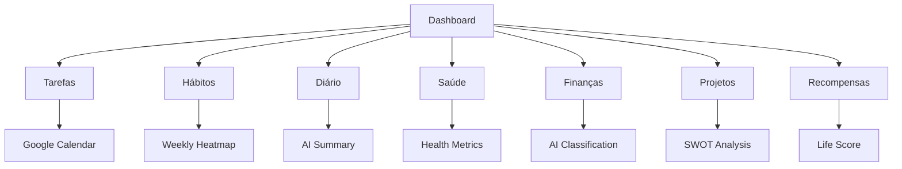

## 1. Product Overview

Life OS é um sistema operacional pessoal que centraliza todas as áreas da vida em um único dashboard brutalista. O app organiza hábitos, tarefas, saúde, finanças, projetos e diário pessoal com integração de IA via Groq para otimização e análises inteligentes.

O produto resolve o problema da fragmentação de informações pessoais em múltiplos apps, proporcionando uma visão unificada e inteligente da rotina, saúde e produtividade do usuário.

## 2. Core Features

### 2.1 User Roles

| Role        | Registration Method | Core Permissions                              |
| ----------- | ------------------- | --------------------------------------------- |
| Single User | Email + password    | Full access to all personal data and features |

### 2.2 Feature Module

O Life OS consiste nas seguintes páginas principais:

1. **Dashboard**: Hub principal com Life Score, resumos de hábitos, agenda do dia, saúde e finanças.
2. **Tarefas & Calendário**: Gerenciamento de tarefas com visualização calendário e integração Google Calendar.
3. **Hábitos & Rotinas**: Controle de hábitos individuais e rotinas agrupadas com heatmap semanal.
4. **Diário Pessoal**: Entradas diárias com formatação simples, tags e resumos por IA.
5. **Saúde**: Métricas de saúde (sono, passos, frequência cardíaca) e medicamentos com alertas.
6. **Finanças**: Controle de receitas/despesas, gráficos por categoria e análise por IA.
7. **Projetos & FOFA**: Gerenciamento de projetos com análise SWOT/FOFA auxiliada por IA.
8. **Recompensas & Score**: Sistema de pontuação de vida e recompensas personalizadas.
9. **Configurações**: Tema, notificações, integrações, exportação de dados e modo dev/logs.

### 2.3 Page Details

| Page Name     | Module Name            | Feature description                                                             |
| ------------- | ---------------------- | ------------------------------------------------------------------------------- |
| Dashboard     | Life Score Card        | Exibir pontuação 0-100 com tendência (subindo/estável/caindo) e status textual. |
| Dashboard     | Habit Consistency      | Mostrar percentual de hábitos completos hoje com gráfico de barras semanal.     |
| Dashboard     | Today's Agenda         | Listar eventos do dia com timeline, horários e tags coloridas.                  |
| Dashboard     | Health Snapshot        | Cards com sono, passos, frequência cardíaca e status geral.                     |
| Dashboard     | Finance Summary        | Exibir balanço mensal, gastos e progresso de orçamento.                         |
| Dashboard     | Quick Actions          | Botões para criar tarefa, hábito, entrada no diário e lançamento financeiro.    |
| Tarefas       | Task List/List View    | Alternar entre visualização de lista e calendário com filtros por tags.         |
| Tarefas       | Calendar Integration   | Conectar com Google Calendar para sincronização bidirecional de eventos.        |
| Tarefas       | Task Creation          | Criar tarefas com título, descrição, data/hora, tags e associação a projetos.   |
| Tarefas       | Task Completion        | Marcar tarefas como concluídas com registro de data/hora.                       |
| Hábitos       | Daily Habit View       | Listar hábitos do dia com checkboxes ou contadores numéricos.                   |
| Hábitos       | Weekly Heatmap         | Exibir heatmap de conclusão de hábitos nos últimos 7 dias.                      |
| Hábitos       | Routine Groups         | Agrupar hábitos em rotinas (manhã, tarde, noite) com horários.                  |
| Hábitos       | Habit Statistics       | Mostrar streaks atuais, recordes e taxa de sucesso por hábito.                  |
| Diário        | Date Navigation        | Navegar entre datas com calendário ou date picker.                              |
| Diário        | Entry Creation         | Criar múltiplas entradas por dia com título opcional e corpo de texto.          |
| Diário        | Entry Formatting       | Suporte a formatação básica (negrito, itálico, listas).                         |
| Diário        | AI Summary             | Gerar resumo diário automático com 3-5 bullet points (opcional).                |
| Saúde         | Health Metrics         | Exibir IMC, sono, passos, frequência cardíaca e SpO2 quando disponíveis.        |
| Saúde         | Health Charts          | Gráficos de linha para métricas de 7 dias (sono, passos, FC).                   |
| Saúde         | Medication Tracking    | Cadastrar medicamentos com dosagem, horários e alertas.                         |
| Saúde         | Health Habits          | Integrar hábitos de saúde (treinar, meditar, tomar água) com métricas.          |
| Finanças      | Transaction Management | Registrar receitas/despesas com valor, data, descrição e tags.                  |
| Finanças      | Monthly Summary        | Exibir receitas, despesas e balanço do mês com comparação anterior.             |
| Finanças      | Category Charts        | Gráfico de pizza/barras por categorias de gastos.                               |
| Finanças      | AI Classification      | IA sugere tags/categorias para transações novas.                                |
| Projetos      | Project Management     | Criar projetos com nome, descrição, área da vida e tags.                        |
| Projetos      | Task Association       | Vincular tarefas existentes a projetos específicos.                             |
| Projetos      | SWOT Analysis          | Criar análise FOFA com forças, fraquezas, oportunidades e ameaças.              |
| Projetos      | AI SWOT Helper         | IA sugere pontos para FOFA baseado em tarefas e notas do projeto.               |
| Recompensas   | Life Score Calculation | Calcular pontuação baseada em hábitos, tarefas, saúde e finanças.               |
| Recompensas   | Custom Rewards         | Usuário define recompensas com critérios e progresso.                           |
| Recompensas   | Achievement System     | Conquistas automáticas por streaks e metas alcançadas.                          |
| Recompensas   | Progress Tracking      | Barras de progresso para recompensas e conquistas.                              |
| Configurações | Theme Toggle           | Alternar entre tema escuro e claro com brutalista preservado.                   |
| Configurações | Notification Settings  | Configurar alertas para tarefas, hábitos e medicações.                          |
| Configurações | AI Settings            | Controlar uso de IA (modo low-IA, limites de tokens, funcionalidades).          |
| Configurações | Data Export            | Exportar todos os dados em JSON e CSV (finanças, tarefas, hábitos).             |
| Configurações | Dev Mode               | Visual terminal com logs de IA, erros e estatísticas de uso.                    |

## 3. Core Process

### User Flow Principal

1. Usuário acessa o dashboard e vê seu Life Score com visão geral do dia
2. Navega entre seções para gerenciar diferentes áreas da vida
3. Cria e acompanha hábitos, tarefas e projetos
4. Registra métricas de saúde e finanças
5. Usa IA para análises e sugestões quando necessário
6. Acompanha progresso através de recompensas e conquistas

## 4. User Interface Design

### 4.1 Design Style

* **Cores Primárias**: Fundo escuro (#0a0f0a), verde limão (#0df20d), verde escuro (#102310)

* **Cores Secundárias**: Bordas (#224922), textos brancos com opacidades variadas

* **Tipografia**: Fonte display para títulos, fonte mono para elementos técnicos/logs

* **Botões**: Estilo brutalista com bordas marcadas, poucos arredondamentos

* **Layout**: Grid base, cards com sombras neon sutis, fundo com padrão de grid técnico

* **Ícones**: Material Symbols com variações filled/outline para estados ativos

### 4.2 Page Design Overview

| Page Name | Module Name     | UI Elements                                                                                                 |
| --------- | --------------- | ----------------------------------------------------------------------------------------------------------- |
| Dashboard | Life Score Card | Card com fundo escuro/transparente, borda verde neon, número grande em verde limão com glow effect          |
| Dashboard | Habit Chart     | Gráfico de barras com barras verdes para dias ativos, cinza para inativos, labels em fonte mono             |
| Dashboard | Agenda Timeline | Timeline vertical com linha tracejada, bolinhas verdes como marcadores, cards de eventos com tags coloridas |
| Sidebar   | Navigation      | Menu lateral escuro com items com borda lateral esquerda indicando estado ativo, ícones Material Symbols    |
| Cards     | General         | Fundo escuro semi-transparente, borda sólida, sombras neon sutis, pouco ou nenhum border-radius             |

### 4.3 Responsiveness

* Desktop-first approach com breakpoints para tablets e mobile

* Sidebar vira hamburger menu em telas pequenas

* Grid adaptativo de 3 colunas para 1 coluna conforme tamanho da tela

* Cards empilham verticalmente em mobile

* Mantém estética brutalista em todas as resoluções

