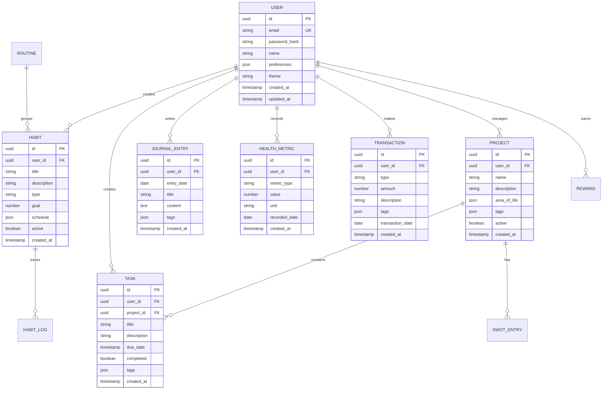

## 1. Architecture design


## 2. Technology Description

* **Frontend**: React\@19 + TypeScript + TailwindCSS + Vite

* **Initialization Tool**: vite-init (já configurado)

* **Backend**: Node.js + Express\@4 + TypeScript

* **Database**: Supabase (PostgreSQL)

* **Authentication**: JWT com Supabase Auth

* **Charts**: Recharts\@3 (já incluído)

* **Icons**: Material Symbols (já incluído)

* **AI Integration**: Groq API com otimização de tokens

* **External APIs**: Google Calendar, Google Fit

## 3. Route definitions

| Route            | Purpose                                          |
| ---------------- | ------------------------------------------------ |
| /                | Dashboard principal com Life Score e visão geral |
| /tasks           | Gerenciamento de tarefas e calendário            |
| /habits          | Controle de hábitos e rotinas                    |
| /journal         | Diário pessoal com entradas diárias              |
| /health          | Métricas de saúde e medicamentos                 |
| /finance         | Controle financeiro e gráficos                   |
| /projects        | Gerenciamento de projetos e análise FOFA         |
| /rewards         | Sistema de recompensas e conquistas              |
| /settings        | Configurações, tema, exportação de dados         |
| /api/auth/\*     | Rotas de autenticação                            |
| /api/user/\*     | CRUD de usuário e preferências                   |
| /api/habits/\*   | CRUD de hábitos e rotinas                        |
| /api/tasks/\*    | CRUD de tarefas e eventos                        |
| /api/journal/\*  | CRUD de entradas do diário                       |
| /api/health/\*   | Métricas de saúde e medicamentos                 |
| /api/finance/\*  | Transações e relatórios financeiros              |
| /api/projects/\* | Projetos e análise FOFA                          |
| /api/rewards/\*  | Recompensas e conquistas                         |
| /api/ai/\*       | Endpoints de IA (otimizados)                     |
| /api/calendar/\* | Integração Google Calendar                       |

## 4. API definitions

### 4.1 Authentication APIs

```
POST /api/auth/register
```

Request:

```json
{
  "email": "usuario@example.com",
  "password": "senha123",
  "name": "João Silva"
}
```

```
POST /api/auth/login
```

Request:

```json
{
  "email": "usuario@example.com",
  "password": "senha123"
}
```

Response:

```json
{
  "token": "jwt_token_aqui",
  "user": {
    "id": "uuid",
    "email": "usuario@example.com",
    "name": "João Silva"
  }
}
```

### 4.2 Core Entity APIs

```
GET /api/habits
POST /api/habits
PUT /api/habits/:id
DELETE /api/habits/:id
```

```
GET /api/tasks
POST /api/tasks
PUT /api/tasks/:id
DELETE /api/tasks/:id
```

```
GET /api/finance/transactions
POST /api/finance/transactions
PUT /api/finance/transactions/:id
DELETE /api/finance/transactions/:id
GET /api/finance/summary
```

### 4.3 AI APIs (Otimizados)

```
POST /api/ai/swot-analysis
```

Request:

```json
{
  "projectId": "uuid",
  "context": {
    "tasks": [...],
    "notes": "...",
    "journalEntries": [...]
  }
}
```

```
POST /api/ai/classify-transaction
```

Request:

```json
{
  "description": "Compra no mercado",
  "amount": 150.50
}
```

## 5. Server architecture diagram


## 6. Data model

### 6.1 Data model definition



### 6.2 Data Definition Language

```sql
-- Users table
CREATE TABLE users (
    id UUID PRIMARY KEY DEFAULT gen_random_uuid(),
    email VARCHAR(255) UNIQUE NOT NULL,
    password_hash VARCHAR(255) NOT NULL,
    name VARCHAR(100) NOT NULL,
    preferences JSONB DEFAULT '{}',
    theme VARCHAR(20) DEFAULT 'dark',
    created_at TIMESTAMP WITH TIME ZONE DEFAULT NOW(),
    updated_at TIMESTAMP WITH TIME ZONE DEFAULT NOW()
);

-- Habits table
CREATE TABLE habits (
    id UUID PRIMARY KEY DEFAULT gen_random_uuid(),
    user_id UUID REFERENCES users(id) ON DELETE CASCADE,
    title VARCHAR(255) NOT NULL,
    description TEXT,
    type VARCHAR(20) DEFAULT 'binary' CHECK (type IN ('binary', 'numeric')),
    goal INTEGER DEFAULT 1,
    schedule JSONB DEFAULT '{"frequency": "daily"}',
    active BOOLEAN DEFAULT true,
    created_at TIMESTAMP WITH TIME ZONE DEFAULT NOW(),
    updated_at TIMESTAMP WITH TIME ZONE DEFAULT NOW()
);

-- Tasks table
CREATE TABLE tasks (
    id UUID PRIMARY KEY DEFAULT gen_random_uuid(),
    user_id UUID REFERENCES users(id) ON DELETE CASCADE,
    project_id UUID REFERENCES projects(id) ON DELETE SET NULL,
    title VARCHAR(255) NOT NULL,
    description TEXT,
    due_date TIMESTAMP,
    completed BOOLEAN DEFAULT false,
    tags JSONB DEFAULT '[]',
    created_at TIMESTAMP WITH TIME ZONE DEFAULT NOW(),
    updated_at TIMESTAMP WITH TIME ZONE DEFAULT NOW()
);

-- Journal entries table
CREATE TABLE journal_entries (
    id UUID PRIMARY KEY DEFAULT gen_random_uuid(),
    user_id UUID REFERENCES users(id) ON DELETE CASCADE,
    entry_date DATE NOT NULL,
    title VARCHAR(255),
    content TEXT,
    tags JSONB DEFAULT '[]',
    created_at TIMESTAMP WITH TIME ZONE DEFAULT NOW(),
    updated_at TIMESTAMP WITH TIME ZONE DEFAULT NOW()
);

-- Transactions table
CREATE TABLE transactions (
    id UUID PRIMARY KEY DEFAULT gen_random_uuid(),
    user_id UUID REFERENCES users(id) ON DELETE CASCADE,
    type VARCHAR(20) NOT NULL CHECK (type IN ('income', 'expense')),
    amount DECIMAL(10,2) NOT NULL,
    description VARCHAR(255) NOT NULL,
    tags JSONB DEFAULT '[]',
    transaction_date DATE NOT NULL,
    created_at TIMESTAMP WITH TIME ZONE DEFAULT NOW()
);

-- Health metrics table
CREATE TABLE health_metrics (
    id UUID PRIMARY KEY DEFAULT gen_random_uuid(),
    user_id UUID REFERENCES users(id) ON DELETE CASCADE,
    metric_type VARCHAR(50) NOT NULL,
    value DECIMAL(10,2) NOT NULL,
    unit VARCHAR(20),
    recorded_date DATE NOT NULL,
    created_at TIMESTAMP WITH TIME ZONE DEFAULT NOW()
);

-- Projects table
CREATE TABLE projects (
    id UUID PRIMARY KEY DEFAULT gen_random_uuid(),
    user_id UUID REFERENCES users(id) ON DELETE CASCADE,
    name VARCHAR(255) NOT NULL,
    description TEXT,
    area_of_life JSONB DEFAULT '[]',
    tags JSONB DEFAULT '[]',
    active BOOLEAN DEFAULT true,
    created_at TIMESTAMP WITH TIME ZONE DEFAULT NOW(),
    updated_at TIMESTAMP WITH TIME ZONE DEFAULT NOW()
);

-- SWOT entries table
CREATE TABLE swot_entries (
    id UUID PRIMARY KEY DEFAULT gen_random_uuid(),
    project_id UUID REFERENCES projects(id) ON DELETE CASCADE,
    category VARCHAR(20) CHECK (category IN ('strength', 'weakness', 'opportunity', 'threat')),
    content TEXT NOT NULL,
    created_at TIMESTAMP WITH TIME ZONE DEFAULT NOW()
);

-- AI usage logs table
CREATE TABLE ai_logs (
    id UUID PRIMARY KEY DEFAULT gen_random_uuid(),
    user_id UUID REFERENCES users(id) ON DELETE CASCADE,
    function_name VARCHAR(100) NOT NULL,
    tokens_used INTEGER,
    response_time_ms INTEGER,
    success BOOLEAN DEFAULT true,
    error_message TEXT,
    created_at TIMESTAMP WITH TIME ZONE DEFAULT NOW()
);

-- Grant permissions
GRANT SELECT ON ALL TABLES TO anon;
GRANT ALL PRIVILEGES ON ALL TABLES TO authenticated;

-- Create indexes for performance
CREATE INDEX idx_habits_user_id ON habits(user_id);
CREATE INDEX idx_tasks_user_id ON tasks(user_id);
CREATE INDEX idx_journal_entries_user_id ON journal_entries(user_id);
CREATE INDEX idx_transactions_user_id ON transactions(user_id);
CREATE INDEX idx_health_metrics_user_id ON health_metrics(user_id);
CREATE INDEX idx_projects_user_id ON projects(user_id);
CREATE INDEX idx_ai_logs_user_id ON ai_logs(user_id);
CREATE INDEX idx_ai_logs_created_at ON ai_logs(created_at DESC);
```

