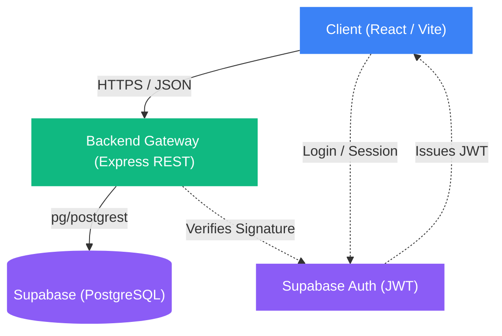

# Life OS - Architecture Overview

Este documento descreve as decisões lógicas, bibliotecas e o fluxo de dados em alto-nível do **Life OS**.

## 1. High-Level System Architecture

O sistema opera em uma arquitetura robusta cliente-servidor (SPA) desconectada.

## 2. Frontend Layer (React / Vite)

O cliente foca no paradigma de "Feature-Sliced Design", isolando contextos (ex: Finances, Habits, Tasks) e comunicando-se unicamente via hooks em React Query para gestão asíncrona robusta.

**Principais Tecnologias:**
- **Build Tool:** Vite + TypeScript
- **State Management:** Zustand (Stores locais e Side-pane UI) e React Query (Server-State e cache invalidation).
- **Styling:** Tailwind CSS integrado via classes utils (`cn`).
- **Componentes Base:** Lucide React (Ícones), Radix/Shadcn UI patterns, e Storybook (Documentação nativa).

## 3. Backend Layer (Express / Node.js)

O Express encarrega-se da governança central, sanitização e rate-limiting (proteção ativa anti-bot) antes de despachar a carga via SDK para o Supabase.

**Pipeline de Segurança (Middlewares):**
1. **Helmet:** Protege headers (Strict CSP bloqueando XSS e iframes maliciosos).
2. **Rate Limit:** Restringindo floods DDoS em requisições de Login (15/janela) e Signup (10/janela).
3. **XSS Sanitizer:** Um parser recursivo limpa campos contendo injeções JS (`javascript:` ou `<script>`).
4. **Anti-CSRF:** O `X-App-Client` atua contra Request Forgeries de terceiros.
5. **Auth Verification:** Verificação em tempo de execução dos tokens emitidos.

## 4. Estruturação Modular de Domínio

O código não acopla as features no nível raíz. Se você navegar dentro de `src/features/` ou `api/routes/`, notará segregação por escopo de negócios:

* `auth`: Controle de Sessão e perfis.
* `habits`: Geração de streaks e frequências periódicas.
* `tasks`: Todo's orientados a data final de entrega (`due_date`).
* `finances`: Despesas, transações pendentes, dashboards gerenciais.
* `onboarding`: Configuração de sistema, Tutoriais e Starter Templates prefabricados.
