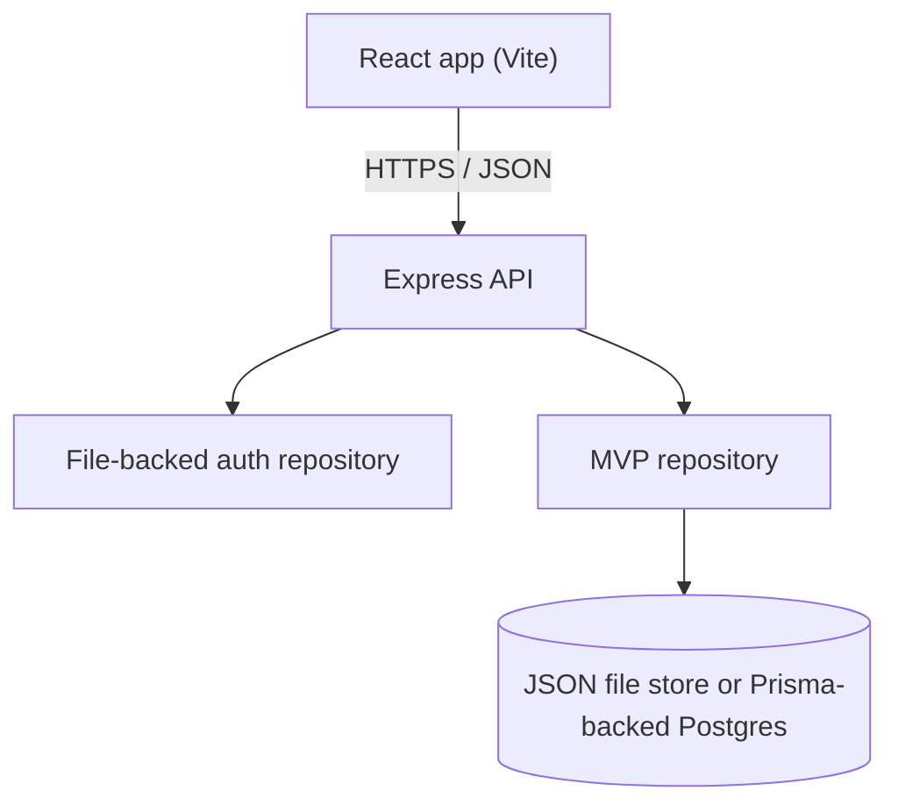

# LifeOS Architecture Overview

This document reflects the current default runtime and product boundary in the repository. The canonical MVP framing is `docs/mvp/canonical-mvp.md`.

## Architecture Decision

Treat the current application as a React + Express product with one canonical MVP slice: the invite-only weekly operating loop under `/mvp`.

Electron code and the broader productivity suite remain present in the repo, but they are not the authoritative product boundary for current MVP planning.

## High-Level Runtime

```mermaid
graph TD
    Client["React app (Vite)"]
    API["Express API"]
    Auth["File-backed auth repository"]
    MVP["MVP repository"]
    Store[("JSON file store or Prisma-backed Postgres")]

    Client -- "HTTPS / JSON" --> API
    API --> Auth
    API --> MVP
    MVP --> Store
```

## Frontend

Default frontend runtime:

- React 18
- Vite
- React Router
- Zustand for local state
- Tailwind CSS for styling

Product structure:

- `src/features/mvp/` contains the canonical MVP loop
- the rest of `src/features/*` is legacy or broader-suite product surface
- current navigation still exposes that broader suite, which is why product framing has drifted

## Backend

Default backend runtime:

- Express in `api/app.ts`
- invite-gated auth endpoints in `/api/auth/*`
- weekly-loop endpoints in `/api/mvp/*`

Persistence behavior:

- file-backed repositories are the default local path
- Prisma-backed MVP storage becomes active when `DATABASE_URL` is configured or `LIFEOS_MVP_REPOSITORY=prisma`

## Canonical MVP Surface

In scope:

- `/mvp`
- `/mvp/onboarding`
- `/mvp/weekly-review`
- `/mvp/today`
- `/mvp/reflection`
- `/mvp/admin` as an internal-only intent, even though the route is not yet access-gated

Out of scope for canonical MVP framing:

- the broader suite as the primary product story
- Electron as the default release story
- sync, cloud, or production-grade analytics claims beyond the implemented contract

## Documentation Precedence

Use this order when documents conflict:

1. `docs/mvp/canonical-mvp.md`
2. `docs/mvp/route-map.md`
3. `api/app.ts` and `src/config/routes/index.tsx`
4. historical docs marked as superseded
