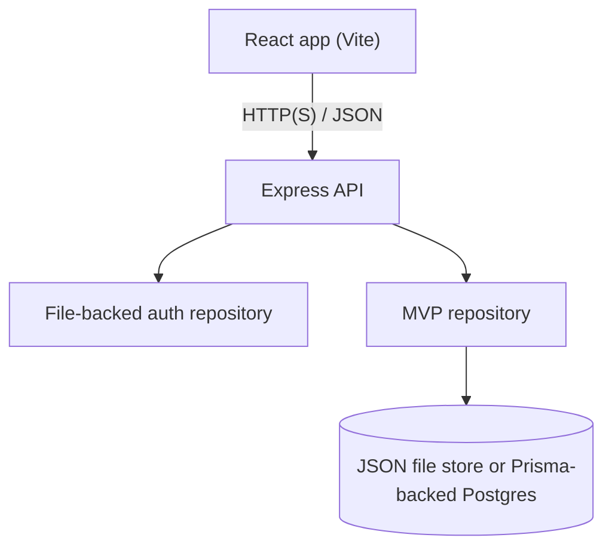

# LifeOS Architecture Overview

Status: ACTIVE_SUPPORTING \
Authority: derived current architecture under ADR-0001 and #85 \
Audience: contributor; AI agent \
Owner: repository maintainer \
Last reviewed: 2026-07-18 \
Review by: 2026-10-16 \
Update trigger: ADR, runtime, schema, route, authentication or persistence boundary change \
Supersedes: none \
Superseded by: none \
Authorizes implementation: no

This document reflects the current default runtime and product boundary in the repository. The canonical MVP framing is `docs/product/canonical-mvp.md`.

## Architecture Decision

Treat the current application as a React + Express product with one canonical MVP slice: the invite-only weekly operating loop under `/mvp`.

Electron code and the broader productivity suite remain present in the repo, but they are not the authoritative product boundary for current MVP planning.

## High-Level Runtime

## Frontend

Default frontend runtime:

- React 18
- Vite
- React Router
- Zustand for local state
- Tailwind CSS for styling

Product structure:

- `src/features/mvp/` contains the canonical MVP loop
- the rest of `src/features/*` is legacy or broader-suite product surface
- retained modules and Electron IPC still exist, while legacy browser aliases redirect to `/mvp`

## Backend

Default backend runtime:

- Express in `api/app.ts`
- invite-gated auth endpoints in `/api/auth/*`
- weekly-loop endpoints in `/api/mvp/*`

Persistence behavior:

- web auth remains file-backed in every mode; local scripts explicitly select file-backed MVP persistence
- direct server startup requires `LIFEOS_MVP_REPOSITORY=file|prisma`; there is no implicit repository default
- Prisma-backed MVP storage becomes active only with `LIFEOS_MVP_REPOSITORY=prisma` and a non-empty `DATABASE_URL`; `DATABASE_URL` alone never changes repository mode
- File-backed auth and MVP stores use strict schemas, a process-wide queue per resolved path, and same-directory fsync/rename replacement with a last-known-good backup. They remain single-process/local-only; Prisma is the durable MVP target.

## Canonical MVP Surface

In scope:

- `/mvp`
- `/mvp/onboarding`
- `/mvp/weekly-review`
- `/mvp/today`
- `/mvp/reflection`
- `/mvp/admin` as an internal-only surface: client visibility is presentation and the backend requires an exact configured admin email

Out of scope for canonical MVP framing:

- the broader suite as the primary product story
- Electron as the default release story
- sync, cloud, or production-grade analytics claims beyond the implemented contract

## Documentation Precedence

Use `AGENTS.md` then `docs/README.md`, followed by the assigned human decision/ADR, the exact canonical or supporting document, and the applicable executable contract. Equal- or higher-authority conflicts are stop-and-report conditions. Historical documents never authorize implementation.
