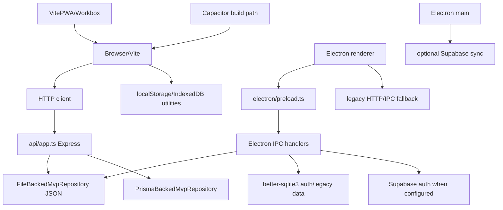

# LifeOS Forensic Architecture and AI-Bloat Audit

Status: working draft for independent review
Authority: issue #83 under recovery program #82; delivery authorized by draft PR #101
Owner: repository maintainer  
Executor: read-only terminal analysis agent  
Branch: `agent/forensic-audit-83`  
Audited commit: `50245cec055d294d33257ea4fbbaa2d8d5effa80`
Baseline: `main` at `727ad712ca33e5b3f9d185acb0536d8d8a36dc99`
Last reviewed: 2026-07-13

> This is an evidence report. It does not choose a product, runtime, persistence technology, dependency set, or implementation plan as approved.

## 1. Executive Summary

### 1.1 Scope and method

**Observed fact — high confidence.** The audit branch contains three documentation-only commits above `main`; its only tracked file differing from `main` is this report. The repository was inspected statically, through Git history, and through GitHub issue/PR metadata. Existing checks were attempted without secrets or remote mutations.

**Observed fact — high confidence.** The checked-out code exposes a narrow current route surface (`/login`, `/register`, `/reset-password`, `/settings`, and invite-gated `/mvp/*`), while many legacy feature modules remain in `src/features/**` and are exercised by unit/integration tests or legacy IPC handlers.

**Inference — high confidence.** The repository is not one simple product with one adapter. It is a coexistence of a current invite-only MVP, a retained web/Express path, an Electron path, an older broad feature suite, and documentation for several incompatible or unfinished product contracts.

### 1.2 Five largest complexity sources

| Severity | Finding | Classification | Decision dependency |
|---|---|---|---|
| P0 | Web HTTP and Electron IPC both implement the current MVP API; their parity is tested only partially. | Observed fact | Human runtime and support decision |
| P0 | JSON MVP persistence, Prisma/Postgres MVP persistence, SQLite desktop auth/data, Supabase auth/sync, and browser storage coexist. | Observed fact | Human identity, persistence, and migration decisions |
| P0 | Release smoke is Electron-only; browser E2E is quarantined/skipped and does not establish web release confidence. | Observed fact | Human release contract |
| P1 | `src/features/**` retains a broad suite hidden by the router, while tests and IPC still reference parts of it. | Observed fact | Product-surface decision before removal |
| P1 | Direct dependencies and scripts cover multiple historical capabilities, including AI providers, PWA/Workbox, Capacitor commands, Storybook, charts, monitoring, and two persistence approaches. | Observed fact | Dependency and product decisions |

### 1.3 Five principal risks

| Severity | Risk | Classification | Evidence |
|---|---|---|---|
| Critical | Docker image healthcheck expects port 3001 while compose publishes/configures port 3000. | Observed fact | `Dockerfile`, `docker-compose.yml` |
| Critical | Local/demo auth bypasses use development mode, localhost, flags, invite metadata, and a default invite repository path. | Observed fact | `src/config/routes/access.ts`, `api/authRepository.ts` |
| High | A browser or packaged-desktop release claim can be inferred from checks that exercise a different runtime or a mock service. | Inference | `playwright*.ts`, `.github/workflows/**`, `scripts/electron-auth-smoke.mjs` |
| High | JSON repository rewrites complete state and has no demonstrated cross-process locking, backup, or migration protocol. | Observed fact | `api/mvpRepository.ts`, desktop smoke |
| High | The repository has no current human decision selecting canonical runtime, identity, persistence, operational mode, or release authority. | Human decision required | `AGENTS.md`, `docs/adr/README.md`, issues #82-#99 |

### 1.4 Highest-impact simplification opportunities

These are recommendations, not approvals and not implementation tickets.

1. **Recommendation.** Decide the product and supported runtime set before removing hidden features or dependencies. This is reversible at the decision stage and prevents deleting still-required IPC/test consumers.
2. **Recommendation.** Define one evidence contract per supported release lane; label Electron smoke, web build, advisory browser tests, and RLS tests by the behavior they actually prove.
3. **Recommendation.** Choose an identity and persistence contract, then document migration/rollback before consolidating JSON, Prisma, SQLite, and Supabase paths.
4. **Recommendation.** After the decisions, classify the broad feature suite by reachable behavior and retained consumers, not by file count or static import absence.
5. **Recommendation.** Separate local development/demo fallbacks from publishable configuration and prohibit accidental production activation.

## 2. Authority and Scope

**Observed fact.** Issue #82 freezes code changes until product, experience, architecture, governance, documentation, migration, and implementation gates are satisfied. Issue #83 requires a reproducible inventory and explicitly forbids treating hidden code as dead. PR #101 authorizes only this report and keeps it draft until independent review and maintainer authorization.

**Observed fact.** The required reading order was followed: issue #82, issue #83, `AGENTS.md`, `docs/governance/**`, this report, then the complete PR #101 description. Remote issue/PR bodies were read with `gh api`.

**Human decision required.** `AGENTS.md` declares a conflict between higher-authority sources a stop condition. This report preserves the conflict; it does not make the architecture decision.

## 3. Product Reachability Matrix

| Surface | Route/entrypoint | Navigation | Direct reachability | Runtime | Current status | Classification and evidence |
|---|---|---:|---|---|---|---|
| Login | `/login` | Public | Yes | Browser/Electron renderer | Active | **Observed fact.** Lazy route in `src/config/routes/index.tsx`. |
| Registration | `/register` | Public | Yes | Browser/Electron renderer | Active | **Observed fact.** Lazy route in `src/config/routes/index.tsx`. |
| Password reset | `/reset-password` | Public | Yes | Browser/Electron renderer | Active | **Observed fact.** Lazy route and auth API path. |
| Settings | `/settings` | Yes | Yes after auth | Browser/Electron renderer | Active | **Observed fact.** `src/app/layout/navItems.ts`, routes. |
| MVP home | `/mvp` | Yes | Invite/runtime gate | Browser/Electron renderer | Active | **Observed fact.** Route is gated by `canAccessMvpInviteOnly`. |
| MVP onboarding | `/mvp/onboarding` | Via MVP | Invite/runtime gate | Browser/Electron renderer | Active | **Observed fact.** `MvpSurfacePage` and `mvpApi`. |
| Weekly review | `/mvp/weekly-review` | Via MVP | Invite/runtime gate | Browser/Electron renderer | Active | **Observed fact.** Registered route and API operation. |
| Daily execution | `/mvp/today` | Via MVP | Invite/runtime gate | Browser/Electron renderer | Active | **Observed fact.** Registered route and API operation. |
| Reflection | `/mvp/reflection` | Via MVP | Invite/runtime gate | Browser/Electron renderer | Active | **Observed fact.** Registered route and API operation. |
| Internal MVP admin | `/mvp/admin` | Dev/internal only | Runtime/admin gate | Browser/Electron renderer | Active but internal | **Observed fact.** `canAccessInternalMvpAdmin` allows dev, localhost, or explicit flag. |
| Legacy suite | `/tasks`, `/habits`, `/ai-assistant`, `/focus`, `/gamification`, `/design`, `/projects`, `/university`, `/calendar`, `/journal`, `/health`, `/finances` | No | Redirects to authenticated landing route | Renderer | Hidden, not dead | **Observed fact.** `HIDDEN_MVP_ROUTES` redirects. **Inference.** Consumers remain in code/tests. |
| Feature modules | `src/features/**` | Usually no | Import/test/IPC dependent | Browser/Electron | Residual or retained | **Observed fact.** Many modules and tests remain. Removal is not justified by router hiding. |
| Electron IPC | `window.api.auth`, `window.api.mvp`, legacy/resource/tasks handlers | No browser navigation | Electron preload only | Electron main/renderer | Active for desktop | **Observed fact.** `electron/preload.ts`, `electron/main.ts`. |
| Service worker/PWA | VitePWA-generated assets | No direct route | Browser build only | Browser/PWA | Configured, runtime evidence absent | **Observed fact.** `vite.config.ts` enables PWA except Electron mode. |
| Android/Capacitor | `android/`, `android:*` scripts | No | Requires external tooling | Mobile | Build path only | **Observed fact.** `package.json` has scripts; no `capacitor.config.*` found in checkout. |
| Storybook | stories and `storybook` scripts | No | Manual command | Tooling | Configured but not release evidence | **Observed fact.** Story files and scripts exist. |

**Inference.** The current user-facing product surface is the MVP loop plus settings, but the repository still has retained legacy consumers. The safe state for all hidden modules is `DECISION_REQUIRED`, not `REMOVE`.

## 4. Runtime, Transport, Identity, and Persistence Matrix

| Runtime | UI | Transport | Identity/session | MVP persistence | Other persistence | Release evidence | Status |
|---|---|---|---|---|---|---|---|
| Browser web | Vite browser | HTTP `/api/*` | Express auth repository, JWT/cookie paths, profile/Supabase references | File-backed JSON or Prisma repository selected by API setup | Browser `localStorage`, IndexedDB utilities, Supabase | Web build command only; advisory browser E2E is skipped/quarantined | Decision required |
| Electron renderer | Vite renderer, hash/file URL behavior | Preload IPC for MVP/auth; legacy HTTP fallback exists | Desktop Supabase when configured; local session fallback otherwise; Electron Store configuration | File-backed JSON under user data or `LIFEOS_DESKTOP_MVP_DATA_FILE` | SQLite auth/session and legacy data; Electron Store | `playwright.release.config.ts` + `tests/e2e/smoke.spec.ts`; package smoke requires build | Decision required |
| Express server | Node server | HTTP | `api/authRepository.ts`, JWT/cookies, environment secrets | `FileBackedMvpRepository` by default; Prisma path available | Supabase helpers and server dependencies | `build:server` is a compile path; no successful runtime proof in this audit | Decision required |
| Electron main | `electron/main.ts` | IPC handlers | `desktopSession.ts` | Electron MVP JSON repository | SQLite via `better-sqlite3`, `electron-store`, Supabase sync | Unit handlers and intended packaged smoke; package not built | Decision required |
| PWA/service worker | Browser build | Browser fetch/cache | Same browser auth contract, not separately proven | Browser storage only by observed utilities | Workbox-generated service worker | Vite config only; no successful browser runtime validation | Decision required |
| Android/Capacitor | External wrapper | Unverified | Unverified | Unverified | `android/` artifact only | `android:build` not run; config file absent | Decision required |

### 4.1 Adapter and transport graph

**Inference.** The graph has duplicate transport and persistence contracts, but this audit cannot establish that all combinations are supported or intended. A runtime winner would be a human architecture decision, so none is selected.

## 5. Persistence and Data Safety

| Mechanism | Implementation/evidence | Stored data | Activation | Atomicity/concurrency | Migration/backup/delete | Test/release evidence | Classification |
|---|---|---|---|---|---|---|---|
| MVP JSON | `api/mvpRepository.ts`; Electron handler uses it | Per-user MVP workspace and event-like state | API default path or desktop user data/env path | Whole-file read/modify/write observed; cross-process lock not observed | Delete endpoint exists; backup, schema versioning, migration, corruption recovery not observed | API and Electron MVP tests; Electron smoke reads file | Decision required |
| Prisma/Postgres | `prisma/schema.prisma`, `api/prismaMvpRepository.ts`, migration | MVP relational data/events | Repository can be injected; `DATABASE_URL`/Prisma setup | Database transactions used in repository code | One init migration observed; rollback, live compatibility, backup ownership not proven | Unit/static references; no DB-backed run in this audit | Decision required |
| SQLite | `electron/db/database.ts`, `electron/db/BaseRepository.ts`, auth session paths | Desktop auth/session and legacy resource data | Electron runtime | `better-sqlite3` transactions in BaseRepository; lifecycle/locking not independently tested here | Schema creation is local; migration/backup/export/delete contract not proven | Unit tests and smoke helper inspect SQLite | Decision required |
| Supabase/Postgres | `src/shared/lib/supabase.ts`, `electron/auth/desktopSession.ts`, `electron/sync/engine.ts`, migrations | Auth/profile, cloud sync and historical feature data | Environment/configuration dependent | Provider semantics; RLS scripts/workflow exist | SQL migrations exist; no remote service was contacted | RLS workflow requires secrets; not run | Decision required |
| Browser localStorage | `tests/e2e/smoke.spec.ts`, auth/onboarding references | Browser flags/session/onboarding state | Browser/Electron DOM context | Browser storage semantics; no cross-tab contract | Clear calls observed; backup/migration not observed | Tests clear it; no browser E2E passed | Decision required |
| IndexedDB/idb-keyval | `idb-keyval` dependency and browser utilities/tests | Legacy/offline feature state, exact active scope unresolved | Consumer-specific | Browser storage semantics | No repository-wide migration map observed | Static references only; no successful browser E2E | Decision required |
| Electron Store | `electron/auth/desktopSession.ts`, package dependency | Desktop configuration and Supabase credentials | Electron main | Store library semantics; access policy not independently validated | No export/rotation/delete contract observed | Unit references; packaged smoke not run | Decision required |

**Observed fact.** No single migration contract connects JSON MVP files, Prisma/Postgres records, SQLite records, Supabase profiles, and browser storage. **Recommendation.** Do not remove or migrate a persistence layer until ownership, data inventory, compatibility, rollback, corruption handling, and user export/delete behavior are approved.

## 6. Component Decision Matrix

States are preliminary only: `KEEP`, `SIMPLIFY`, `MERGE`, `REMOVE_CANDIDATE`, `REWRITE_CANDIDATE`, `ARCHIVE`, `DECISION_REQUIRED`.

| Item | Category | Location | Consumers | Runtime | Preliminary state | Evidence | Removal risk | Required test/decision |
|---|---|---|---|---|---|---|---|---|
| MVP route and loop | Feature | `src/features/mvp/**` | Router, store, API, tests, smoke | Browser/Electron | DECISION_REQUIRED | Routes and `MvpLoop.int.test.tsx` | High: core behavior | Product/runtime decision plus parity tests |
| Legacy feature modules | Features | `src/features/{tasks,habits,finance,health,journal,...}` | Tests, imports, legacy IPC/API | Renderer/Electron | DECISION_REQUIRED | `rg` consumers; hidden route list | High: hidden consumers/data | Surface-by-surface product decision |
| Route redirect list | Routing | `src/config/routes/access.ts` | Router/tests | Renderer | KEEP | Current gate behavior and tests | High: changes reachability | Acceptance matrix for every route |
| HTTP MVP API | Service/transport | `api/app.ts`, `api/mvpRepository.ts` | Web client, API tests | Express/web | DECISION_REQUIRED | `/api/mvp/*` handlers | High: web contract/data | Contract and runtime decision |
| Electron MVP IPC | Service/transport | `electron/ipc/mvpHandler.ts`, preload | MVP client, IPC tests/smoke | Electron | DECISION_REQUIRED | `window.api.mvp` operations | High: desktop contract | HTTP/IPC parity test |
| Shared MVP state/types | Shared contract | `shared/mvp/**`, feature types | API, IPC, UI | All | KEEP pending decision | Imports from both adapters | High: type/schema drift | Contract tests and schema version |
| File-backed repository | Persistence | `api/mvpRepository.ts` | API and Electron | Web/Electron | SIMPLIFY candidate | Both adapters instantiate/use it | High: data loss/concurrency | Fixture, lock, corruption, migration tests |
| Prisma repository/schema | Persistence | `api/prismaMvpRepository.ts`, `prisma/**` | API configuration, build | Server | DECISION_REQUIRED | Import and schema references | High: data migration | Human persistence decision and DB test |
| SQLite generic repository | Persistence/abstraction | `electron/db/BaseRepository.ts` | Resource/tasks handlers | Electron | DECISION_REQUIRED | PR #72 and imports | High: data/auth | Table/transaction/security tests |
| Legacy IPC fallback | Adapter | `electron/ipc/legacyHandler.ts`, shared HTTP | Hidden feature APIs/tests | Electron | SIMPLIFY candidate | Legacy tests and allowlist | Medium/high: hidden feature breakage | Consumer inventory and route decision |
| Supabase sync/auth | Integration | `electron/sync`, `electron/auth`, `src/shared/lib` | Desktop auth/sync | Electron/browser | DECISION_REQUIRED | Config-dependent paths | High: auth/data | Realistic non-production integration test |
| PWA/Workbox | Packaging | `vite.config.ts`, `src/shared/components/PWAManager.tsx` | Vite web build | Browser | DECISION_REQUIRED | Plugin config and type refs | Medium: offline/browser behavior | Browser build/runtime test |
| Capacitor/Android path | Packaging | `android/`, `package.json` | Script only; config not found | Mobile | DECISION_REQUIRED | `android:*` scripts | Medium: unsupported claim | Confirm supported target before action |
| AI integrations | Integration | `src/features/ai-assistant/**`, `groq-sdk`, Gemini/Google references | Hidden feature/tests/docs | Renderer/server | DECISION_REQUIRED | Feature files, package/docs references | High: product/security/provider | AI role and secret-boundary decision |
| Developer tooling | Tooling | Storybook, Lighthouse, bundle scripts | Manual scripts/config | Development/CI | SIMPLIFY candidate | Scripts and stories; some script files absent | Low/medium: release workflow assumptions | Tool ownership and CI authority decision |

## 7. Dependency Inventory

Static counts below count repository text matches outside `package.json`, `package-lock.json`, docs, and `node_modules`. A count of zero is **not** proof of no consumer; package exports, generated files, config, scripts, and dynamic loading remain possible.

| Dependency or group | Static evidence | Runtime/build use | Classification | Evidence before removal |
|---|---|---|---|---|
| `react`, `react-dom`, `react-router-dom`, `vite`, `@vitejs/plugin-react`, `vite-tsconfig-paths`, `typescript`, `tsx` | Many source/config consumers | Core build/runtime | ACTIVE_REQUIRED | Keep |
| `express`, `cookie-parser`, `cors`, `helmet`, `express-rate-limit`, `jsonwebtoken`, `bcryptjs`, `axios`, `supertest`, `@types/*` for these | API/server/tests/imports | Web server/auth/tests | ACTIVE_REQUIRED | Web support decision; server test |
| `electron`, `electron-builder`, `vite-plugin-electron`, `electron-store`, `electron-window-state`, `better-sqlite3`, related types | Electron source/config/tests | Desktop runtime/build | ACTIVE_REQUIRED for Electron path | Runtime decision and packaged test |
| `@prisma/client`, `prisma` | API/schema/migration/config | Server persistence/generation | ACTIVE_REQUIRED for Prisma path | DB-backed build/test and persistence decision |
| `@supabase/supabase-js`, `@supabase/auth-helpers-react`, `supabase` CLI | Auth/sync/shared types/migrations/scripts/docs | Auth/sync/RLS/type generation | ACTIVE_REQUIRED or DECISION_REQUIRED | Provider/identity decision and secret-free integration test |
| `@google/generative-ai` | No static non-doc consumer found | No proven runtime consumer | NO_CONSUMER_FOUND, not removal-approved | Search dynamic/config/generated consumers; AI decision |
| `groq-sdk` | Vite manual chunk and source/docs references | AI path/config-dependent | ACTIVE_REPLACEABLE or DECISION_REQUIRED | Trace AI call path and secret boundary |
| `googleapis` | Script/source references only | Script/tooling or legacy integration | DECISION_REQUIRED | Identify executed command and API boundary |
| `@sentry/react`, `@sentry/node` | React init; no node consumer found | Optional monitoring | ACTIVE_REPLACEABLE / NO_CONSUMER_FOUND respectively | Build env and operational monitoring decision |
| `vite-plugin-pwa`, `workbox-*`, `workbox-window` | PWA config/type refs; several Workbox package names no source import | Web build generation/config | ACTIVE_REQUIRED for PWA path; individual packages DECISION_REQUIRED | Inspect generated dependency graph and PWA support decision |
| `@tanstack/react-query`, persistence packages, `zustand`, `idb-keyval` | Multiple source consumers | State/cache/browser persistence | ACTIVE_REQUIRED for legacy/current consumers | Feature ownership and persistence decision |
| `@dnd-kit/*`, `@headlessui/react`, `@radix-ui/*`, `@remixicon/react`, `cmdk`, `tremor` | Some packages have no direct source consumer | Legacy UI/possible broad suite | DECISION_REQUIRED | Build graph and reachable-surface decision |
| `recharts`, `date-fns`, `framer-motion`, `canvas-confetti`, `sonner`, `lucide-react`, form/i18n/markdown packages | Multiple source consumers | Active UI features | ACTIVE_REQUIRED for retained consumers | Per-feature reachability before consolidation |
| `@chromatic-com/storybook`, Storybook addons, `storybook`, `eslint-plugin-storybook` | Config/story references; some addon names not directly found | Storybook tooling | BUILD_OR_TOOLING_ONLY | Run build-storybook in Node 20 and decide tooling support |
| `@playwright/test`, `playwright`, `@vitest/*`, `vitest`, Testing Library, `msw`, `coverage-v8` | Tests/config/scripts | Validation tooling | BUILD_OR_TOOLING_ONLY | Node 20 install and full test matrix |
| `lighthouse`, `web-vitals` | Script/config/source references; `scripts/lighthouse.js` absent in file list | Performance/manual measurement | BUILD_OR_TOOLING_ONLY / DECISION_REQUIRED | Confirm script existence and CI ownership |
| `concurrently`, `dotenv`, `node-schedule`, `fractional-indexing`, `react-helmet-async`, `class-variance-authority`, `clsx`, Tailwind/PostCSS plugins | Source/config/script consumers vary | Tooling or feature-specific | ACTIVE_REPLACEABLE or DECISION_REQUIRED | Per-package consumer and build trace |
| `@types/*` packages with zero text matches | Type declarations may be ambient/transitive | Compile support possible | DECISION_REQUIRED | Node 20 typecheck; do not remove by grep |

**Inference.** The package set is historical and multi-runtime, but the static scan is insufficient to call a package dead. The only safe removals at this stage are none; classification is a decision aid.

## 8. Workflows and Release Evidence Matrix

| Workflow/command | Trigger | Runtime | What it proves | What it does not prove | Current state | Recommendation |
|---|---|---|---|---|---|---|
| `.github/workflows/ci.yml` quality gate | Push/PR to main | Node 20, compile/lint/build as configured | CI lane executes declared quality commands if secrets/tooling are available | Product intent, runtime parity, production deployment | Configured; not run locally successfully | Recommendation: make lane authority explicit |
| `.github/workflows/ci-rls.yml` | Push/PR to main | Node 20 + Supabase secrets | Test suite under configured RLS environment | Local fallback, Electron, actual remote health, absence of secrets | Not run; requires secrets | Recommendation: document secret and data isolation contract |
| `.github/workflows/test.yml` | Push/PR main/staging | Node 20 unit tests/coverage | Unit/integration test execution | Browser/Electron packaged behavior | Not run locally | Recommendation: distinguish test confidence from release confidence |
| `.github/workflows/docker-acceptance-smoke.yml` | Workflow-defined/manual or PR | Docker production image | Intended container acceptance path | Local container can pass while port wiring is wrong without actual run | Not run; Docker not verified in this environment | Recommendation: run only with non-production fixtures after port decision |
| `.github/workflows/lighthouse-scheduled.yml` | Schedule | Browser/performance tooling | Scheduled performance measurement if script/config exists | Functional correctness, supported runtime, release readiness | Not run; script reference needs verification | Recommendation: classify advisory vs blocking |
| `.github/workflows/sync-labels.yml` | Manual dispatch | GitHub API | Governance label synchronization | Product behavior | Governance-only | Keep separate from product release authority |
| `npm run typecheck` / `check` | Manual/CI | TypeScript | Would prove typecheck for available toolchain | Runtime behavior | Exit 127: `tsc` unavailable locally | Re-run in Node 20 clean environment |
| `npm run lint` | Manual/CI | ESLint | Would prove lint for configured toolchain | Runtime behavior | Exit 2; fallback system ESLint 6 could not find project config | Re-run with lockfile toolchain |
| `npm run test` | Manual/CI | Vitest | Would prove configured tests | Browser/Electron release | Exit 127: `vitest` unavailable locally | Re-run in Node 20 clean environment |
| `npm run build` | Manual/CI | Web Vite build | Would prove web bundle compilation | Express runtime, browser E2E, Electron package | Exit 127 in prebuild because `tsc` unavailable | Re-run in Node 20 |
| `npm run build:server` | Manual/CI | Server TypeScript | Would prove server compilation | DB connectivity, HTTP runtime, release | Exit 127 because `tsc` unavailable | Run with isolated fixture DB |
| `npm run electron:build` | Manual/CI | Electron/Vite/electron-builder | Would prove packaged build | Installed app behavior, auth, sync, migration | Exit 127 because `tsc` unavailable | Run in supported Node/OS with package validation |
| `npm run test:e2e` / `test:e2e:smoke` | Manual/CI | Electron release Playwright config | Declared desktop smoke path; test file reads local JSON and uses IPC | Browser web, HTTP, Prisma, Supabase production | Not run; dependencies/package unavailable | Keep as desktop-specific evidence only |
| `npm run test:e2e:advisory` | Manual | Browser Chromium/Firefox/WebKit | Would exercise browser client if server/tooling available | Backend auth/persistence when only client server is started; release readiness | Test files are skipped/quarantined | Recommendation: either restore contract or label historical |
| `npm run android:build` | Manual | Web build + Capacitor CLI | Would prove packaging command only | Android device behavior and supported product | Not run; no config found | Human supported-target decision first |
| `npm run storybook` / `build-storybook` | Manual | Storybook | Component documentation/build | Product route/runtime | Not run | Tooling-only unless explicitly made a gate |

**Observed fact.** `Dockerfile` exposes and healthchecks `3001`, while `docker-compose.yml` publishes/configures `3000` and its healthcheck calls `3000`. **Inference.** The production container path is likely non-functional without an external port override or unobserved server behavior; this remains to be reproduced with Docker.

## 9. Documentation Authority Matrix

| Document | Claim/role | Relevance | Conflict or hazard | Classification | Proposed action |
|---|---|---|---|---|---|
| `AGENTS.md` | Neutral governance and freeze | Current execution contract | Explicitly says runtime is undecided | CANONICAL | Keep; decisions must be recorded elsewhere |
| `docs/governance/**` | Agent, readiness, policy, labels | Current governance | Requires human approval and evidence | CANONICAL | Keep |
| `docs/adr/README.md` | ADR lifecycle | Required for durable decisions | No approved runtime ADR observed | CANONICAL; MISSING_REQUIRED for runtime ADR | Human decision then ADR |
| `README.md` | Product/setup overview | Current retrieval entrypoint | Must be checked against runtime decision; broad historical claims remain possible | ACTIVE_SUPPORTING / DECISION_PENDING | Reconcile after decisions |
| `docs/mvp/canonical-mvp.md` | Weekly MVP contract | Strong product evidence | It is not a human architecture decision | ACTIVE_SUPPORTING | Keep pending product decision |
| `docs/mvp/route-map.md` | MVP route mapping | Reachability evidence | Must be verified against router | ACTIVE_SUPPORTING | Keep and reconcile |
| `docs/MVP_DESKTOP_*` | Desktop launch/readiness/release | Desktop evidence | Can be read as canonical despite runtime freeze | DECISION_PENDING / CONTRADICTORY where claims exceed tests | Mark authority after release decision |
| `docs/ARCHITECTURE-FINAL.md`, `docs/architecture-overview.md` | Supabase/offline/AI architecture | Historical design context | Competes with current neutral governance and Prisma/Express paths | CONTRADICTORY / HISTORICAL | Human archive/reconcile decision |
| `docs/prd/prd_v2.2.md` | Broad product proposal | Explains legacy feature/dependency origins | Contains future intent and old Supabase/AI assumptions | PROPOSAL / HISTORICAL | Do not use as current requirement |
| `plans/*.md` | Prior implementation plans | Coupling and audit evidence | Plans are not requirements under governance | HISTORICAL / ACTIVE SUPPORTING per file | Add explicit status/authority before reuse |
| `CHANGELOG.md`, `DESIGN.md`, `docs/setup-guide.md` | Delivered behavior/setup narrative | User/developer retrieval | Claims offline-first, Supabase, AI and broad features without one release contract | CONTRADICTORY / DECISION_PENDING | Reconcile after decisions |
| `docs/audits/2026-07-13-lifeos-forensic-audit.md` | This evidence report | Audit output | Must not become architecture authority | ACTIVE SUPPORTING | Independent review, then maintainer disposition |
| Issue #68 | Dependency/feature proposal | Backlog context | `size:XL`, blocked, not an authorization | PROPOSAL / BLOCKED | Classify under recovery program; do not implement |

**Inference.** Retrieval risk is high: an agent reading README, old architecture docs, PR summaries, or plans can infer a canonical runtime that governance explicitly says is undecided.

## 10. Security and Operational-Mode Matrix

| Mechanism/fallback | Local development | Controlled demo | Partner beta | Public production | Evidence | Decision required |
|---|---|---|---|---|---|---|
| `import.meta.env.DEV` / localhost MVP gate | Permitted by code | Possible | Must be explicit | Must be impossible or formally controlled | `src/config/routes/access.ts` | Human environment policy |
| `VITE_BYPASS_MVP_INVITE_GATE` | Available | Possible with deliberate flag | Risky | Unsafe unless controlled deployment boundary | Route access code | Human approval and deployment guard |
| `VITE_ENABLE_INTERNAL_MVP_ADMIN` | Available | Possible | Restricted | Restricted | Route access code | Admin authorization model |
| Default known invite in `api/authRepository.ts` | Useful for local fixture | Possible | Risky | Not acceptable without explicit secret/config policy | Auth repository | Human auth/ops decision |
| Local desktop auth/session fallback | Useful offline | Useful for synthetic demo | Requires identity policy | Cannot be assumed equivalent to production auth | `desktopSession.ts`, auth tests | Supported offline identity decision |
| Supabase anon client | Configured cloud auth | Mockable in smoke | Possible | Requires RLS and key policy | Supabase files/workflows | Provider and RLS decision |
| Supabase service role env in compose | Not needed in client | Not needed | High risk | Must never be exposed to client/container without policy | `docker-compose.yml` | Secret boundary review |
| JWT/cookie server auth | Web/server candidate | Fixture candidate | Candidate | Needs key rotation, session, CSRF, and deployment policy | `api/**`, env references | Identity model |
| JSON full-state write | Local single-user candidate | Synthetic demo | Data-loss risk | Not proven suitable | `api/mvpRepository.ts` | Data safety and concurrency |
| Docker default Redis password | Local fixture | Demo only | Unsafe default | Not acceptable | `docker-compose.yml` | Secret/config policy |
| Smoke mock auth server | Tests only | Tests only | Not evidence | Not production | `scripts/electron-auth-smoke.mjs` | Keep clearly test-only |

**Observed fact.** No real secrets or remote services were used. **Recommendation.** Every fallback should be assigned an explicit operational mode and have a fail-closed rule for unsupported modes before release claims are made.

## 11. AI and Tool Bloat Findings

| Finding | Classification | Evidence | Risk/limit |
|---|---|---|---|
| Broad AI assistant feature remains in source while its route is hidden. | Observed fact | `src/features/ai-assistant/**`, hidden route list | Does not prove product irrelevance; requires product decision |
| Gemini package has no static consumer outside package metadata/docs scan. | Observed fact | Dependency scan | Dynamic/config/generated use not ruled out |
| Groq is manually forced into a Vite backend chunk while AI reachability is undecided. | Observed fact | `vite.config.ts` | Could be intentional build optimization; no removal conclusion |
| Storybook, Lighthouse, bundle-analysis, PWA, Capacitor, and multiple AI/provider packages coexist. | Observed fact | `package.json`, scripts/config/docs | Maintenance cost is visible; necessity is not decided |
| PR #81 reports removal of large bloat and dead files, while current tree still contains broad historical paths and multiple runtimes. | Observed fact | PR #81 body, current tree/history | PR summaries are lower authority than current code and tests |
| Generated/agent summaries in PRs describe architecture as complete even when current governance leaves it undecided. | Inference | PRs #71-#81 and #99 | Retrieval hazard, not proof of intentional deception |

## 12. Human Decision Queue

Decisions below are ordered by dependency. They are not recommendations to implement.

| Order | Decision | Why blocking | Evidence |
|---:|---|---|---|
| 1 | Product problem, intended user, promise, and canonical loop | Determines whether hidden modules are legacy or required | #82, #83, MVP docs |
| 2 | Canonical runtime and supported secondary runtimes | Determines transport, packaging, and release evidence | `AGENTS.md`, PRs #71-#75 |
| 3 | Identity/auth model and authorization boundaries | Determines local fallback, Supabase, JWT, invite/admin behavior | auth files and access gates |
| 4 | Persistence ownership and migration contract | Determines JSON/SQLite/Prisma/Supabase fate and data safety | repositories/schema/migrations |
| 5 | Release authority per runtime | Determines which CI/E2E/build lanes block release | workflows and Playwright configs |
| 6 | Operational modes and allowed fallbacks | Prevents demo bypasses becoming production behavior | access/auth/compose files |
| 7 | Legacy surface disposition | Determines keep/merge/archive/remove for broad modules | route map, imports, tests, IPC |
| 8 | AI capability role and provider policy | Determines SDKs, secret boundary, privacy, and feature surface | AI files/dependencies/docs |
| 9 | Documentation authority map | Prevents agents retrieving old architecture as current truth | docs and plans |
| 10 | Backlog sequencing and issue labels | Makes implementation independently executable | #82, #83, governance labels |

## 13. Recommended Bounded Backlog

| Order | Proposed issue | Type | Blocked by | Risk | Suggested size | Why separate |
|---:|---|---|---|---|---|---|
| 1 | Decide product promise, user, MVP boundary, and vocabulary | decision | None | High | S | Product intent must precede code |
| 2 | Record canonical runtime and supported runtime matrix | decision/ADR | 1 | Critical | S | Durable architecture decision |
| 3 | Define identity, invite/admin, local fallback, and session threat model | decision/ADR | 1-2 | Critical | M | Auth boundary is independent |
| 4 | Define persistence ownership, migration, backup, export, delete, and rollback | decision/ADR | 1-3 | Critical | M | Data risk requires isolated review |
| 5 | Define release evidence ladder for web/Electron/PWA/mobile | governance | 2-4 | High | S | Prevent false confidence |
| 6 | Reconcile Docker port/process/healthcheck contract | bug/implementation | 2 and release contract | High | S | Bounded infra fix, not runtime selection |
| 7 | Classify each hidden legacy surface and its live consumers | audit | 1-2 | High | M | Avoid deleting retained behavior |
| 8 | Classify direct dependencies and scripts against the decided surface | audit | 1-2, 7 | Medium | M | Package removals require consumer evidence |
| 9 | Reconcile authoritative documentation and archive hazards | documentation | 1-5 | Medium | M | Separate truth maintenance |
| 10 | Create small recoding/migration slices with rollback contracts | planning | 1-9 | Critical | M | No implementation before gates |

**Recommendation.** Do not open these issues automatically from this audit; the table is a maintainer backlog proposal only.

## 14. Evidence Register

| Conclusion | Classification | Evidence | Confidence | Limitation |
|---|---|---|---|---|
| Current route surface is MVP/settings/auth plus internal MVP. | Observed fact | `src/config/routes/index.tsx`, `access.ts`, `navItems.ts` | High | Does not cover deep links from external deployment or packaged app beyond router code |
| Hidden feature code is not proven dead. | Inference | Hidden redirects plus imports/tests/IPC | High | Full runtime call graph not generated |
| MVP has HTTP and IPC adapters. | Observed fact | `src/features/mvp/api/mvp.api.ts`, `api/app.ts`, `electron/ipc/mvpHandler.ts` | High | Parity behavior was not executed |
| Multiple persistence mechanisms coexist. | Observed fact | repositories, Prisma, SQLite, Supabase, storage refs | High | Activation in each deployment is partly config-dependent |
| Release smoke proves Electron-local JSON behavior, not web/HTTP/Prisma. | Observed fact | `playwright.release.config.ts`, `tests/e2e/smoke.spec.ts` | High | Smoke could not run because toolchain/package was incomplete |
| Browser E2E does not currently provide release evidence. | Observed fact | `playwright.config.ts`, all advisory specs marked `describe.skip` | High | A future untracked test/config path could differ |
| Docker port contract is inconsistent. | Observed fact | `Dockerfile` 3001 vs compose 3000 | High | Docker acceptance was not run |
| Auth has development/demo bypass surfaces. | Observed fact | access gates, auth repository, desktop fallback | High | Production environment values were not inspected or used |
| Dependency set is multi-product and cannot yet be safely pruned. | Inference | package inventory plus consumer scan | High | Static scan cannot prove dynamic/build/generated use |
| Canonical runtime is undecided. | Human decision required | `AGENTS.md`, governance, #82/#99, no approved ADR | High | Maintainer may have an unobserved external decision |

## 15. Commands Executed

All commands below were run read-only against the checkout except dependency installation, which wrote only ignored `/tmp/life-os-forensic/node_modules`. No migrations, remote service writes, real secrets, or production data were used.

| Command | Exit code | Result summary | Proves | Does not prove | Environment limitation |
|---|---:|---|---|---|---|
| `pwd && git status --short --branch` in the supplied workspace | 128 | Supplied `lifeOS` directory had an empty `.git`; not a usable checkout | Local workspace mismatch | Anything about remote repository state | Required clone to `/tmp` |
| `git ls-remote https://github.com/RenyEnnos/life-os.git 'refs/heads/agent/forensic-audit-83' 'refs/pull/101/head' 'refs/pull/101/merge'` | 0 | Branch and PR head both `50245cec`; merge ref `8680aced` | Remote refs | PR approval/merge readiness | Network required escalation |
| `git clone --branch agent/forensic-audit-83 https://github.com/RenyEnnos/life-os.git /tmp/life-os-forensic` | 0 | Checkout created | Source availability and branch | Clean production environment | Clone is temporary |
| `gh api repos/RenyEnnos/life-os/issues/82 --jq ...` | 0 | Issue body/labels read | #82 scope/freeze | Hidden maintainer decisions | GitHub API access |
| `gh api repos/RenyEnnos/life-os/issues/83 --jq ...` | 0 | Issue body/labels read | #83 evidence/coverage rules | Runtime behavior | GitHub API access |
| `sed -n '1,260p' AGENTS.md; find docs/governance ...; sed ...` | 0 | Governance files read | Local authority and stop rules | Whether humans will approve decisions | None material |
| `sed -n '1,320p' docs/audits/2026-07-13-lifeos-forensic-audit.md; sed -n '321,760p' ...` | 0 | Draft placeholders and baseline findings read | Required deliverable shape | Truth of preliminary findings | None material |
| `gh api repos/RenyEnnos/life-os/pulls/101 --jq ...` | 0 | Full PR description read | Allowed file and completion gate | Independent review outcome | GitHub API access |
| `git status --short --branch; git rev-parse HEAD; git log ...; rg --files ...` | 0 | Branch clean at audit commit; tree inventory collected | Baseline/history/tree | Runtime reachability by itself | None material |
| `rg -n 'createBrowserRouter|RouteObject|path:|Navigate|...' src/config ...` | 0 | Routes, redirects, and MVP consumers found | Static route/consumer map | Dynamic/external links | Static search |
| `sed -n ... package.json; find ... config files` | 0 | Scripts/dependencies/configs inventoried | Declared build/runtime surface | Actual execution | None material |
| `rg -n -i 'prisma|supabase|sqlite|indexeddb|localstorage|...' ...` | 0 | Persistence references collected | Static persistence map | Activation and data contents in deployments | Static search |
| `find .github/workflows ... -exec sed ...` | 0 | Workflows read | Declared CI/release lanes | Successful GitHub execution | Secrets unavailable |
| `gh api .../issues/68` and PRs `71-81,99` | 0 | Recovery/backlog/history bodies read | Historical claims and authority hazards | Claims being true now | GitHub API access |
| `npm ci --ignore-scripts` | not captured by supervisor; observed incomplete | Engine warnings and incomplete package tree | Attempted dependency reproduction | Successful install | Node 18.19.1 vs project/CI Node 20; tar entry errors |
| `npm ci --ignore-scripts --foreground-scripts=false` | not captured by supervisor; observed incomplete | `node_modules/.bin` absent; many TAR_ENTRY_ERROR lines | Attempted second install | Valid toolchain | Same Node/sandbox issue |
| `npm ci --ignore-scripts --prefer-offline` | not captured by supervisor; observed incomplete | More TAR_ENTRY_ERROR lines; `tsc` bin absent | Attempted final install | Valid toolchain | Same Node/sandbox issue |
| `npm run typecheck` | 127 | `tsc: not found` | Only that local toolchain was unavailable | Type correctness | Incomplete install/Node mismatch |
| `npm run lint` | 2 | System ESLint 6.4 could not find project config | Only unusable fallback executable was invoked | Project lint state | Local `.bin` absent |
| `npm run test` | 127 | `vitest: not found` | Only that local test toolchain was unavailable | Test correctness | Incomplete install |
| `npm run build` | 127 | `prebuild` failed at missing `tsc` | Build could not start | Web build correctness | Node/dependencies unavailable |
| `npm run build:server` | 127 | Missing `tsc` | Server build could not start | Server build correctness | Node/dependencies unavailable |
| `npm run electron:build` | 127 | Missing `tsc` | Electron build could not start | Packaged app correctness | Node/dependencies unavailable |
| `node -e ... package dependencies ...; rg -l ...` | 0 | Per-package static match counts collected | Candidate consumer evidence | Dynamic/config/generated consumers | Heuristic text scan |
| `git status --short` after inspection/install attempts | 0 | No tracked changes outside report before edit | Workspace safety before report edit | Remote branch state | Ignored temp files are not shown |

## 16. What Could Not Be Proven

1. **Observed limitation.** A clean Node 20 dependency install and any project check could not be completed in this environment. The available Node is `18.19.1`; repeated `npm ci` attempts left an incomplete package tree with no local executable shims and TAR entry errors.
2. **Observed limitation.** No web server, browser E2E, Electron packaged build, Docker acceptance, Storybook build, Lighthouse run, Android/Capacitor build, or Prisma/Supabase integration test was successfully executed.
3. **Observed limitation.** No remote Supabase, Postgres, Redis, production endpoint, or GitHub Actions runner was contacted for behavior. Secrets were not requested or used.
4. **Observed limitation.** The audit did not establish data volume, real user migration obligations, backup quality, corruption recovery, cross-process concurrency, or production performance.
5. **Observed limitation.** Static dependency search cannot rule out dynamic imports, package export use, Vite/electron-builder generated consumers, ambient types, CLI-only use, or provider loading by configuration.
6. **Observed limitation.** Hidden feature reachability through external links, stale packaged bundles, background jobs, service-worker caches, or remote deployment configuration was not proven.
7. **Human decision required.** Product intent, canonical runtime, supported runtimes, auth model, persistence owner, release authority, operational modes, AI role, and documentation authority remain unresolved by this audit.

## 17. Completion Gate

- [x] Baseline commit and audit branch recorded.
- [x] Issues #82, #83, #68 and structural PRs #71-#81/#99 inspected.
- [x] Required route, runtime, transport, identity, persistence, dependency, script, workflow, documentation, security, AI/tooling, decision, backlog, evidence, and command matrices completed.
- [x] Web, Electron, PWA, Android/Capacitor, Express, HTTP, IPC, JSON, Prisma, SQLite, Supabase, browser storage, and Electron storage explicitly covered.
- [x] Material conclusions labeled as observed fact, inference, recommendation, or human decision required.
- [x] No product code, tests, snapshots, workflows, configuration, dependencies, schemas, migrations, assets, or canonical docs changed.
- [x] No implementation recommendation was executed.
- [ ] Independent review completed.
- [ ] Maintainer authorized merge.

The report is ready for independent review, not ready to merge by process.
