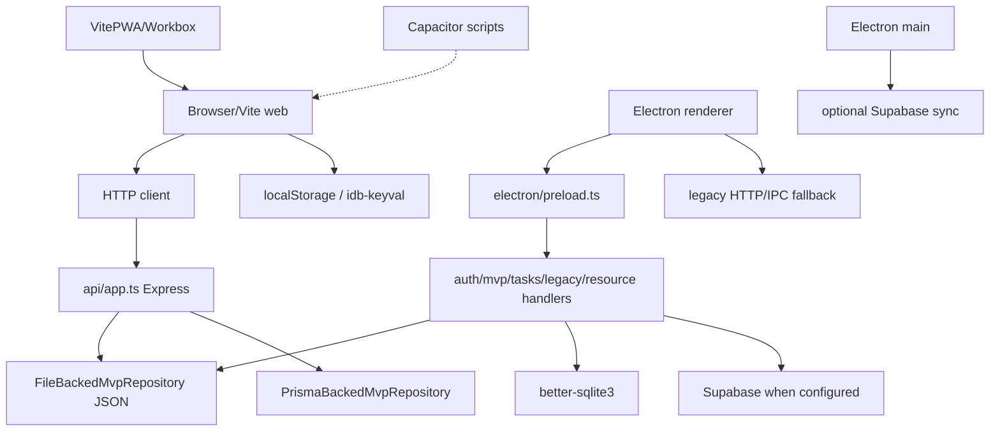

# LifeOS Forensic Architecture and AI-Bloat Audit

Status: ready for human review; not authorized to merge
Authority: issue #83 under recovery program #82; delivery authorized by draft PR #101
Owner: repository maintainer
Executor: read-only terminal analysis agent
Branch: `agent/forensic-audit-83`
Audited product tree: `7d8093fdf588e99d0893f7b66940b402457bcf22`; subsequent branch commits change only this report
Baseline: `main` at `727ad712ca33e5b3f9d185acb0536d8d8a36dc99`
Last reviewed: 2026-07-16

> This is an evidence report. It does not choose a product, runtime, persistence technology, dependency set, or implementation plan as approved. It does not authorize debloat, recoding, rebranding, or dependency removal.

## 1. Executive Summary

### 1.1 Scope and method

**Observed fact — high confidence.** The audit branch contains six documentation-only commits above `main`; its only tracked file differing from `main` is this report. The repository was inspected statically, through Git history, and through GitHub issue/PR metadata. Existing checks were attempted without production secrets or remote mutations.

**Observed fact — high confidence.** The checked-out product route surface is narrow: public `/login`, `/register`, `/reset-password`; authenticated `/settings`; invite-gated `/mvp` plus `/mvp/onboarding`, `/mvp/weekly-review`, `/mvp/today`, `/mvp/reflection`; and internal `/mvp/admin`. Twelve legacy paths in `HIDDEN_MVP_ROUTES` redirect to the authenticated landing route. Twenty-one feature modules remain under `src/features/**` and many still have unit/integration tests or Electron IPC consumers.

**Observed fact — high confidence.** With Node 22, `npm ci --ignore-scripts`, then `npx prisma generate`:

| Command | Exit | Result |
|---|---:|---|
| `npm run typecheck` (after Prisma generate) | 0 | Pass |
| `npm run lint` | 0 | 0 errors, 9 warnings |
| `npm run test` (no session secret, after Prisma generation) | 1 | 607 passed, 62 skipped; 2 API suites fail because the required session secret is absent |
| `LIFEOS_SESSION_SECRET=… JWT_SECRET=… npx vitest run api/__tests__/` | 0 | 139 passed, 41 skipped (includes API auth + MVP contract) |
| `npm run build` (web) | 0 | Vite web build + PWA service worker generated |
| `npm run build:server` | 0 | Server compile succeeded |

**Inference — high confidence.** The repository is not one simple product with one adapter. It is a coexistence of: (1) an invite-only weekly MVP framed as React + Express; (2) an Electron desktop path with IPC, SQLite, and optional Supabase; (3) a retained broad feature suite hidden by the router; (4) packaging stubs for PWA and Android/Capacitor; and (5) documentation that partially conflicts with governance freeze rules.

### 1.2 Five largest complexity sources

| No. | Severity | Confidence | Finding | Classification | Decision dependency |
|---:|---|---|---|---|---|
| 1 | P0 | High | Web HTTP and Electron IPC both implement the current MVP API; their parity is tested only partially. | Observed fact | Human runtime and support decision |
| 2 | P0 | High | JSON MVP persistence, Prisma/Postgres MVP persistence, SQLite desktop auth/data, Supabase auth/sync, and browser storage coexist. | Observed fact | Human identity, persistence, and migration decisions |
| 3 | P0 | High | Release smoke is Electron-only; browser E2E is quarantined/skipped and does not establish web release confidence. | Observed fact | Human release contract |
| 4 | P1 | High | `src/features/**` retains a broad suite hidden by the router, while tests and IPC still reference parts of it. | Observed fact | Product-surface decision before removal |
| 5 | P1 | High | Direct dependencies and scripts cover multiple historical capabilities, including AI providers, PWA/Workbox, Capacitor commands, Storybook, charts, monitoring, and two persistence approaches. | Observed fact | Dependency and product decisions |

### 1.3 Five principal risks

| No. | Severity | Confidence | Risk | Classification | Evidence |
|---:|---|---|---|---|---|
| 6 | High | High on mismatch; low on impact | Docker image healthcheck expects port 3001 while compose publishes/configures port 3000; runtime failure was not reproduced. | Observed fact (configuration), inference (runtime impact) | `Dockerfile`, `docker-compose.yml` |
| 7 | Critical | High on code path; deployment exposure unproven | Local/demo auth bypasses use development mode, localhost, flags, invite metadata, and a default invite repository path. | Observed fact | `src/config/routes/access.ts`, `api/authRepository.ts` |
| 8 | High | High | A browser or packaged-desktop release claim can be inferred from checks that exercise a different runtime or a mock service. | Inference | `playwright*.ts`, `.github/workflows/**`, `scripts/electron-auth-smoke.mjs` |
| 9 | High | High on implementation; production impact unproven | JSON repository rewrites complete state and has no demonstrated cross-process locking, backup, or migration protocol. | Observed fact | `api/mvpRepository.ts`, desktop smoke |
| 10 | High | High | The repository has no current human decision selecting canonical runtime, identity, persistence, operational mode, or release authority. | Human decision required | `AGENTS.md`, `docs/adr/README.md`, issues #82-#100 |

### 1.4 Highest-impact simplification opportunities

These are **recommendations**, not approvals and not implementation tickets.

| No. | Severity | Confidence | Recommendation | Benefit | Cost | Risk | Reversibility |
|---:|---|---|---|---|---|---|---|
| 11 | P0 | High | Decide the product and supported runtime set before removing hidden features or dependencies. | Prevents deleting retained IPC/test consumers and bounds later work. | Human decision work and an ADR. | Delay while the decision is unresolved. | Clean at decision stage; code migration later may not be. |
| 12 | P0 | High | Define one evidence contract per supported release lane. | Stops Electron, web build, browser, and RLS checks from being overclaimed. | CI inventory and governance documentation. | Incorrect gates can block or falsely approve release. | Clean if initially advisory. |
| 13 | P0 | High | Choose identity and persistence ownership, then document migration and rollback. | Makes consolidation and data safety review possible. | Threat model, data inventory, migration design, and tests. | Data loss or account inconsistency if rushed. | Decision is reversible; migrated data may not be without backups. |
| 14 | P1 | High | Classify broad feature surfaces by reachability and retained consumers after product/runtime decisions. | Enables evidence-based debloat. | Per-surface consumer and data tracing. | Hidden behavior may be missed. | Clean while classification-only. |
| 15 | P0 | High | Assign every local/demo fallback to an explicit operational mode and fail closed elsewhere. | Reduces accidental production bypasses. | Deployment and auth contract work. | Lockout if modes are misconfigured. | Reversible with documented configuration rollback. |

## 2. Authority and Scope

**Observed fact.** Issue #82 freezes product code changes until product, experience, architecture, governance, documentation, migration, and implementation gates are satisfied. Issue #83 requires a reproducible inventory and forbids treating hidden code as dead. PR #101 authorizes only this report and keeps it draft until independent review and maintainer merge authorization.

**Observed fact.** The required reading order was followed: issue #82, issue #83, `AGENTS.md`, `docs/governance/**`, this report, then the complete PR #101 description. Remote issue/PR bodies were read through the public GitHub API.

**Observed process deviation — high confidence.** Issue #83 prohibited dependency installation, while the earlier audit attempt and concurrent maintainer verification commit `692e12c` both used `npm ci` in temporary/local checkouts. No product source was changed, but the installations were outside the issue's stated audit method. This report preserves the resulting command evidence, labels the deviation, and does not treat installation success or `npm audit` counts as product safety or release authority.

**Human decision required — authority conflict.** Higher-authority sources partially conflict:

| Source | Claim | Authority rank |
|---|---|---|
| Explicit freeze in #82 / `AGENTS.md` | Do not choose web/Electron/PWA/Android as canonical | Highest operational rule for agents |
| `README.md` + `docs/mvp/canonical-mvp.md` | Canonical MVP is invite-only weekly loop in React + Express; Electron is not the default shipped runtime | Canonical product docs (rank 4) |
| CI Quality Gate + release smoke | `electron:build` + Electron Playwright smoke are the release path | Current automation / tests (rank 5–6) |
| Historical architecture docs / PRD / plans | Supabase offline-first suite, broad features, AI | Historical / proposal (rank 7) |

This report **preserves** the conflict. It does not pick a winner.

### 2.1 Structural inventory index

The inventory is normalized across the matrices below to avoid duplicating evidence with inconsistent classifications.

| Required category | Item-level inventory location | Observed-purpose/consumer fields |
|---|---|---|
| Route | Section 3 | Surface, entrypoint, navigation, reachability, runtime, evidence |
| Feature | Section 6.3 | Purpose, concrete consumer, runtime, state |
| Service/transport | Sections 4 and 6 | Transport, identity, consumers, runtime, state |
| Persistence | Section 5 | Stored data, activation, atomicity, migration, tests, state |
| Integration | Sections 6, 10, and 11 | Consumer, trust boundary, operational mode, state |
| Script | Section 8 | Trigger, runtime, proof boundary, current state |
| Direct dependency | Section 7.2 | One row per package, locator, required evidence |
| Test/lane | Sections 8 and 15 | Exact config/test evidence, proof and non-proof |
| Document | Section 9 | Claim, authority hazard, classification, action |
| Workflow | Section 8 | Trigger, runtime, proof boundary, state, recommendation |

## 3. Product Reachability Matrix

| Surface | Route/entrypoint | In primary nav | Direct reachability | Runtime | Current status | Classification and evidence |
|---|---|---:|---|---|---|---|
| Login | `/login` | Public | Yes | Browser/Electron renderer | Active | **Observed fact.** Lazy route in `src/config/routes/index.tsx`. |
| Registration | `/register` | Public | Yes | Browser/Electron renderer | Active | **Observed fact.** Lazy route. |
| Password reset | `/reset-password` | Public | Yes | Browser/Electron renderer | Active | **Observed fact.** Lazy route. |
| Settings | `/settings` | Yes | After auth | Browser/Electron renderer | Active | **Observed fact.** `navItems.ts` secondaryNav. |
| MVP home | `/mvp` | Yes | Invite/runtime gate | Browser/Electron renderer | Active | **Observed fact.** Gated by `canAccessMvpInviteOnly`. |
| MVP onboarding | `/mvp/onboarding` | Via MVP | Invite gate | Browser/Electron renderer | Active | **Observed fact.** `MvpSurfacePage`. |
| Weekly review | `/mvp/weekly-review` | Via MVP | Invite gate | Browser/Electron renderer | Active | **Observed fact.** Registered route + API. |
| Daily execution | `/mvp/today` | Via MVP | Invite gate | Browser/Electron renderer | Active | **Observed fact.** Registered route + API. |
| Reflection | `/mvp/reflection` | Via MVP | Invite gate | Browser/Electron renderer | Active | **Observed fact.** Registered route + API. |
| Internal MVP admin | `/mvp/admin` | Secondary nav “Interno” | Invite + admin gate | Browser/Electron renderer | Active, internal | **Observed fact.** `canAccessInternalMvpAdmin`; nav always lists it. |
| Legacy suite | `/tasks`, `/habits`, `/ai-assistant`, `/focus`, `/gamification`, `/design`, `/projects`, `/university`, `/calendar`, `/journal`, `/health`, `/finances` | No | Redirect to landing | Renderer | Hidden, not dead | **Observed fact.** `HIDDEN_MVP_ROUTES` mapped to `<Navigate>`. |
| Feature modules | `src/features/**` (21 modules) | Usually no | Import/test/IPC | Browser/Electron | Residual/retained | **Observed fact.** File and test inventory below. |
| Electron IPC | `window.api.auth`, `window.api.mvp`, `window.api.tasks`, legacy/resource | N/A | Preload only | Electron | Active desktop | **Observed fact.** `electron/preload.ts`, `electron/main.ts` registers 5 handler setups. |
| Service worker/PWA | VitePWA assets | No | Browser build | Browser/PWA | Configured; built | **Observed fact.** Web build emitted `dist/sw.js`, workbox, `manifest.webmanifest`. |
| Android/Capacitor | `android/`, `android:*` scripts | No | Requires external tooling | Mobile | Incomplete path | **Observed fact.** Scripts call `npx cap`; no `capacitor.config.*` in tree; only `android/app` present. |
| Storybook | `storybook` scripts | No | Manual | Tooling | Configured | **Observed fact.** Scripts and `.storybook/` exist. |

**Inference.** User-facing product surface is the MVP loop + settings (+ auth). Hidden modules are **DECISION_REQUIRED**, not **REMOVE**.

### 3.1 Feature module inventory (structural)

| Module | Approx. TS/TSX files | Test files observed | Router status | Notes |
|---|---:|---:|---|---|
| `mvp` | 13 | 3 | Active routes | Canonical loop UI |
| `auth` | 11 | 5 | Active public routes | Login/register/reset |
| `settings` | 6 | 1 | Active | Settings page |
| `tasks` | 19 | 4 | Hidden redirect | Electron `tasks` IPC remains |
| `habits` | 17 | 3 | Hidden | Broad suite residue |
| `journal` | 19 | 4 | Hidden | Integration tests still run |
| `gamification` | 22 | 10 | Hidden | Heavy test surface |
| `dashboard` | 22 | 2 | Not in active routes | Residual |
| `finances` | 16 | 2 | Hidden | Residual |
| `university` | 17 | 1 | Hidden | Residual |
| `ai-assistant` | 10 | 3 | Hidden | AI surface + tests |
| `health` | 9 | 1 | Hidden | Residual |
| `analytics` | 9 | 0 | No route | Widget/residual |
| `rewards` | 10 | 2 | No active route | Integration test remains |
| `calendar` | 5 | 1 | Hidden | Integration test remains |
| `focus` | 5 | 0 | Hidden | Residual |
| `projects` | 5 | 0 | Hidden | Residual |
| `onboarding` | 5 | 1 | Not MVP onboarding routes | Separate from `/mvp/onboarding` |
| `user` | 3 | 0 | N/A | Residual |
| `legal` | 2 | 0 | N/A | Residual |
| `design-system` | 1 | 0 | Hidden `/design` | Residual |

### 3.2 Implicit audience and product claims

| Observed claim | Concrete evidence | Implied audience | Classification | Conflict/limitation |
|---|---|---|---|---|
| The product is a weekly operating loop rather than a general productivity suite. | `MvpWorkspacePage.tsx`, text under `Current Product Constraint`; `docs/mvp/canonical-mvp.md` | Design partners/operators using a focused planning loop | Observed fact about current copy; product intent still needs human approval | Hidden broad-suite modules remain. |
| The workspace is a usable client-side MVP. | `MvpWorkspacePage.tsx`, `PageTitle.subtitle` | Internal evaluator or early user | Observed claim, not independently validated | Release smoke proves only the Electron-local lane. |
| The operator progresses through intake, planning, and execution. | `MvpWorkspacePage.tsx`, `workspaceMetrics[0].helper` | Individual operator | Observed claim | The exact persona and problem are unresolved in #88. |
| Invite-only access is intended for design partners. | `mvpFoundationChecklist`, unfinished invite/auth item and seed-demo item | Selected design partners | Observed intended audience | Production provider and seed flow are explicitly incomplete. |
| All five surfaces are `ready`. | `src/features/mvp/data.ts`, `allMvpSurfaces[*].status` | Internal evaluator | Observed claim | Same file marks production auth, analytics, and demo seed incomplete; `ready` is not release readiness. |
| Time to first plan should be under 30 minutes and weekly completion at least 70%. | `src/features/mvp/data.ts`, `mvpMetrics` | Product/analytics operator | Observed target claim | No production analytics evidence was observed. |
| Immediate next work is final Postgres persistence, invite access, and telemetry mirroring. | `MvpWorkspacePage.tsx`, `Immediate next work` list | Internal developer/operator | Observed roadmap claim | UI copy is lower authority and cannot authorize these architecture changes. |

## 4. Runtime, Transport, Identity, and Persistence Matrix

| Runtime | UI | Transport | Identity/session | MVP persistence | Other persistence | Release evidence | Status |
|---|---|---|---|---|---|---|---|
| Browser web | Vite `--mode web` | HTTP `/api/*` | Express auth repo, JWT/cookie; needs `LIFEOS_SESSION_SECRET` or `JWT_SECRET` | File-backed JSON default; Prisma when configured | localStorage, idb-keyval, optional Supabase client | `npm run build` succeeds; browser E2E quarantined | Decision required |
| Express server | Node `api/server.ts` | HTTP | Same | Same | Prisma client when generated | `build:server` succeeds; API tests pass with test secret | Decision required |
| Electron renderer | Vite `--mode electron` | IPC via preload; legacy HTTP fallback exists | Desktop session / Supabase when configured; local fallback | JSON under user data / env path | SQLite, electron-store | Smoke intended; not re-run packaged here | Decision required |
| Electron main | `electron/main.ts` | IPC handlers | `desktopSession` | MVP JSON via handler | better-sqlite3, sync engine | Unit IPC tests pass | Decision required |
| PWA | Service worker from VitePWA | Browser fetch/cache | Same browser auth | Browser storage | Workbox caches | Generated on web build; runtime not exercised | Decision required |
| Android/Capacitor | External wrapper | Unverified | Unverified | Unverified | `android/app` only | Scripts present; config absent; not run | Decision required |

### 4.1 Adapter and transport graph

**Inference.** Duplicate transports and persistences are real. Support parity is not proven for all combinations.

## 5. Persistence and Data Safety

| Mechanism | Implementation | Stored data | Activation | Atomicity/concurrency | Migration/backup/delete | Test evidence | Classification |
|---|---|---|---|---|---|---|---|
| MVP JSON | `api/mvpRepository.ts` | Per-user MVP workspace | Default API/desktop path | Whole-file RMW; no lock observed | Delete endpoint exists; no backup/version protocol observed | API MVP test with secret; Electron smoke reads file | DECISION_REQUIRED |
| Prisma/Postgres | `prisma/schema.prisma`, `api/prismaMvpRepository.ts`, migration `20260319_235500_init_mvp_postgres_contract` | Relational MVP | `DATABASE_URL` / repository selection | DB transactions in repository code | One init migration; rollback not proven | Typecheck needs `prisma generate`; no live DB run | DECISION_REQUIRED |
| SQLite | `electron/db/database.ts`, `BaseRepository.ts` | Auth session + legacy resources | Electron runtime; path differs packaged vs dev | WAL pragma; better-sqlite3 | Local schema create; export/delete contract not proven | Smoke helpers; unit paths | DECISION_REQUIRED |
| Supabase | client libs, `electron/sync`, `supabase/migrations/*` (many historical tables) | Auth/profile/sync + legacy suite schema | Env-dependent | Provider + RLS workflow | Many SQL migrations for broad suite | RLS workflow needs secrets; not run | DECISION_REQUIRED |
| Browser storage | localStorage clears in smoke; `idb-keyval` in `src/shared/stores/**`, react-query persister | Flags, offline/query cache | Browser/Electron DOM | Browser semantics | No repo-wide migration map | Unit/static; browser E2E skipped | DECISION_REQUIRED |
| Electron Store | package + desktop session | Config/credentials | Electron main | Library semantics | No rotation/export contract observed | Static/unit | DECISION_REQUIRED |

**Observed fact.** No single migration contract connects all layers. **Recommendation.** Do not remove or migrate a layer until ownership, inventory, compatibility, rollback, and user export/delete are approved.

## 6. Component Decision Matrix

Preliminary states only: `KEEP`, `SIMPLIFY`, `MERGE`, `REMOVE`, `REWRITE`, `ARCHIVE`, `DECISION_REQUIRED`.  
No item is approved for removal by this audit alone.

| Item | Category | Location | Consumers | Runtime | Preliminary | Evidence | Removal risk | Required before action |
|---|---|---|---|---|---|---|---|---|
| MVP route and loop | Feature | `src/features/mvp/**` | Router, store, API, tests, smoke | Browser/Electron | DECISION_REQUIRED | Routes and `MvpLoop.int.test.tsx` | High: core behavior | Product/runtime decision plus parity tests |
| Legacy feature modules | Features | `src/features/{tasks,habits,finance,health,journal,...}` | Tests, imports, legacy IPC/API | Renderer/Electron | DECISION_REQUIRED | `rg` consumers; hidden route list | High: hidden consumers/data | Surface-by-surface product decision |
| Route redirect list | Routing | `src/config/routes/access.ts` | Router/tests | Renderer | KEEP | Current gate behavior and tests | High: changes reachability | Acceptance matrix for every route |
| HTTP MVP API | Service/transport | `api/app.ts`, `api/mvpRepository.ts` | Web client, API tests | Express/web | DECISION_REQUIRED | `/api/mvp/*` handlers | High: web contract/data | Contract and runtime decision |
| Electron MVP IPC | Service/transport | `electron/ipc/mvpHandler.ts`, preload | MVP client, IPC tests/smoke | Electron | DECISION_REQUIRED | `window.api.mvp` operations | High: desktop contract | HTTP/IPC parity test |
| Shared MVP state/types | Shared contract | `shared/mvp/**`, feature types | API, IPC, UI | All | KEEP | Imports from both adapters | High: type/schema drift | Contract tests and schema version |
| File-backed repository | Persistence | `api/mvpRepository.ts` | API and Electron | Web/Electron | SIMPLIFY | Both adapters instantiate/use it | High: data loss/concurrency | Fixture, lock, corruption, migration tests |
| Prisma repository/schema | Persistence | `api/prismaMvpRepository.ts`, `prisma/**` | API configuration, build | Server | DECISION_REQUIRED | Import and schema references | High: data migration | Human persistence decision and DB test |
| SQLite generic repository | Persistence/abstraction | `electron/db/BaseRepository.ts` | Resource/tasks handlers | Electron | DECISION_REQUIRED | PR #72 and imports | High: data/auth | Table/transaction/security tests |
| Legacy IPC fallback | Adapter | `electron/ipc/legacyHandler.ts`, shared HTTP | Hidden feature APIs/tests | Electron | SIMPLIFY | Legacy tests and allowlist | Medium/high: hidden feature breakage | Consumer inventory and route decision |
| Supabase sync/auth | Integration | `electron/sync`, `electron/auth`, `src/shared/lib` | Desktop auth/sync | Electron/browser | DECISION_REQUIRED | Config-dependent paths | High: auth/data | Realistic non-production integration test |
| PWA/Workbox | Packaging | `vite.config.ts`, `src/shared/components/PWAManager.tsx` | Vite web build | Browser | DECISION_REQUIRED | Plugin config and type refs | Medium: offline/browser behavior | Browser build/runtime test |
| Capacitor/Android path | Packaging | `android/`, `package.json` | Script only; config not found | Mobile | DECISION_REQUIRED | `android:*` scripts | Medium: unsupported claim | Confirm supported target before action |
| AI integrations | Integration | `src/features/ai-assistant/**`, `groq-sdk`, Gemini/Google references | Hidden feature/tests/docs | Renderer/server | DECISION_REQUIRED | Feature files, package/docs references | High: product/security/provider | AI role and secret-boundary decision |
| Developer tooling | Tooling | Storybook, Lighthouse, bundle scripts | Manual scripts/config | Development/CI | SIMPLIFY | Scripts and stories; some script files absent | Low/medium: release workflow assumptions | Tool ownership and CI authority decision |

### 6.1 Decision dependencies, justification, and suggested order

| Item | Justification for preliminary state | Blocking dependencies | Suggested order |
|---|---|---|---:|
| MVP route and loop | It is the only current product loop, but product intent is not approved. | #83 review, #88 product decision | 1 |
| Shared MVP state/types | Both HTTP and IPC consume the contract; removing it would immediately duplicate types. | Runtime and transport decisions | 2 |
| HTTP MVP API | Required only if web/Express remains supported. | #85 runtime, #87 identity, persistence ADR | 3 |
| Electron MVP IPC | Required only if Electron remains supported. | #85 runtime, #87 identity, persistence ADR | 3 |
| File-backed repository | It serves both API fallback and Electron MVP but lacks a proven production data contract. | Runtime, operational mode, data ownership | 4 |
| Prisma repository/schema | It is a concrete server persistence path with migration obligations. | Web/server and persistence decisions | 4 |
| SQLite repository | It stores desktop auth/legacy data and cannot be treated as equivalent to MVP JSON. | Electron, identity, migration decisions | 4 |
| Supabase sync/auth | It crosses identity, secret, cloud, RLS, and data boundaries. | #85, #87, threat model | 4 |
| Legacy feature modules | Hidden routing does not erase tests, imports, IPC, or stored data. | #88 product surface, #85 runtime, data inventory | 5 |
| Legacy IPC fallback | It may be removable only after every legacy consumer has a disposition. | Legacy feature inventory | 6 |
| Route redirects | They preserve bookmarks/deep links while features are hidden. | Legacy surface disposition and compatibility policy | 7 |
| PWA/Workbox | Configuration exists but supported offline/browser behavior is unproven. | #85 and release evidence decision | 7 |
| Capacitor/Android | Scripts/artifacts exist without an observed supported mobile contract. | #85 and product target decision | 7 |
| AI integrations | Hidden feature and provider SDKs create privacy/secret/product obligations. | #88 product and provider/security decision | 8 |
| Developer tooling | Tool value can be decided only after supported lanes and owners are known. | #86 release/CI audit | 9 |

### 6.2 Removal-risk matrix

No row authorizes removal. The required test is the minimum evidence before a later ready implementation issue could propose it.

| Candidate | Data/migration risk | Compatibility/hidden behavior risk | Required test before removal | Rollback boundary |
|---|---|---|---|---|
| Hidden legacy feature module | Browser/SQLite/Supabase records may remain | Tests, IPC, imports, bookmarks, or cached bundles may consume it | Per-feature import, route, IPC, storage, and packaged-build trace | Restore module and route compatibility; preserve stored data |
| HTTP MVP adapter | JSON/Prisma users may lose access | Web clients and external API callers are not inventoried | Contract tests plus deployment/access-log evidence | Restore endpoints and compatible repository schema |
| Electron MVP IPC adapter | Desktop JSON workspace becomes inaccessible | Preload bridge and packaged renderer depend on it | Packaged Electron smoke and data-upgrade fixture | Restore IPC channel and prior preload contract |
| File-backed MVP repository | Existing JSON workspaces may be orphaned or overwritten | API fallback and Electron both instantiate it | Corruption, concurrency, import/export, and migration fixtures | Retain reader/exporter and backup until migration verified |
| Prisma/Postgres repository | Relational MVP data and migrations may be stranded | Server environment may select it through configuration | DB-backed parity, migration, backup, and rollback test | Keep compatible schema and reversible migration |
| SQLite desktop repositories | Auth/session and legacy data may be lost | Desktop session and IPC handlers use SQLite | Upgrade from representative prior DB plus export/restore | Preserve DB copy and old reader until post-upgrade verification |
| Supabase auth/sync | Cloud identity and synchronized data may diverge | RLS, remote sessions, and desktop sync are config-dependent | Isolated-project auth/RLS/sync and account-mapping tests | Provider rollback plus reconciliation plan |
| Browser localStorage/IndexedDB | Local preferences, session, or offline data may disappear | Cross-tab/PWA/cache behavior is not mapped | Storage version migration and offline/browser tests | Versioned reader and user-visible recovery/export |
| PWA/Workbox | Cached state and old service workers can outlive code | Installed PWAs may retain stale assets/routes | Upgrade/unregister test from a prior service worker | Controlled unregister and cache migration |
| Capacitor/Android path | Device-local data and installed clients are unknown | External mobile consumers were not observed, not disproved | Supported-device inventory and upgrade test | Keep last distributable artifact and data export path |
| AI provider SDK/path | Stored prompts/results or provider keys may be affected | Hidden AI route, dynamic loading, and build chunks may consume it | Provider call-path, secret-boundary, and data-retention audit | Feature flag off plus compatible stored-data reader |
| Tooling/check integration | No product data expected | Required statuses, review automation, or release evidence may depend on it | Branch-rules inventory and trial on a non-protected branch | Restore integration/check as advisory before required use |
| Trae production badge plugin | No user data expected | Production layout/build may include injected markup | Web build and rendered-page comparison | Re-add plugin if an approved attribution requirement exists |

### 6.3 Feature/module decision ledger

File counts are scope indicators only. State follows reachability and concrete consumers, never size. Each row includes every decision field required by #83.

| Module | Purpose and concrete evidence | Consumers/runtime | State and justification | Dependencies | Removal risk | Required test | Order |
|---|---|---|---|---|---|---|---:|
| ai-assistant (10 files) | Assistant/provider/cache types in src/features/ai-assistant/types.ts; route listed in HIDDEN_MVP_ROUTES | Hidden renderer/provider path | DECISION_REQUIRED: product and provider role unresolved | #88, security/provider decision | Prompts/results/secrets and hidden imports | Provider call-path, secret, retention, and route trace | 8 |
| analytics (9) | Analytics widgets, including AIInsightsWidget.tsx | Renderer; broad-suite consumers require trace | DECISION_REQUIRED: distinct from current MVP admin | #88 and telemetry decision | Historical metrics/widgets may be retained | Import, event-source, route, and data-store trace | 5 |
| auth (11) | Login/register/reset components used by public routes in routes/index.tsx | Browser/Electron renderer | KEEP: currently reachable identity UI | #87 identity model | Lockout/session incompatibility | Auth flow, cookie/JWT, desktop session, reset tests | 1 |
| calendar (5) | Calendar components; /calendar hidden redirect | Renderer | DECISION_REQUIRED: code present, product ownership absent | #88 | Calendar data/bookmarks may persist | Import, route, storage, and deep-link trace | 5 |
| dashboard (22) | Broad dashboard components and DashboardPage tests | Renderer/tests; no current nav entry | DECISION_REQUIRED: tested does not mean supported | #88 | Hidden summaries may consume other feature stores | Render/import/store and persisted-state trace | 5 |
| design-system (1) | src/features/design-system/index.ts feature-local export | Renderer/tooling consumer not proven | MERGE: likely overlaps src/shared/ui, but proof is incomplete | #88 UI ownership | Import-path breakage | Exact import graph and Storybook/build test | 7 |
| finances (16) | Transaction/forms/charts; Tremor/Recharts source consumers; hidden route | Renderer | DECISION_REQUIRED: broad-suite surface | #88, data ownership | Financial records/privacy | Import, storage/schema, route, export/delete tests | 5 |
| focus (5) | Focus store in useFocusStore.ts; hidden route | Renderer/browser storage | DECISION_REQUIRED | #88 | Local session history | Store version, route, timer/background trace | 5 |
| gamification (22) | XP/achievement components referenced by dashboard/rewards | Renderer/tests | DECISION_REQUIRED | #88 | Cross-feature XP state and UI contracts | Import/store/test trace | 5 |
| habits (17) | Habit form, contribution graph, tests; hidden route | Renderer/storage | DECISION_REQUIRED | #88, data ownership | Habit history/local/cloud data | Import, route, storage, migration tests | 5 |
| health (9) | Health feature files; hidden route | Renderer | DECISION_REQUIRED | #88, privacy/data decision | Sensitive health records | Data inventory, privacy, route, migration tests | 5 |
| journal (19) | Journal editor/state/tests; hidden route | Renderer/storage | DECISION_REQUIRED | #88, data ownership | Private text records | Import, storage/export/delete, migration tests | 5 |
| legal (2) | Privacy/legal pages under feature directory | Renderer reachability not proven | DECISION_REQUIRED: compliance ownership absent | Product/legal review | Removing disclosures may create compliance risk | Route/link and release-content review | 4 |
| mvp (13) | Current onboarding/plan/today/reflection/admin routes and MvpLoop.int.test.tsx | Browser HTTP and Electron IPC | DECISION_REQUIRED: current loop, but human product/runtime decisions absent | #88, #85, #87 | Core behavior and workspace data | HTTP/IPC contract and both runtime lanes | 1 |
| onboarding (5) | General onboarding distinct from mvp/onboarding | Renderer consumer not proven | MERGE: overlap is observed by purpose/name, not approved | #88 | Existing onboarding state/deep links | Exact imports, routes, storage, UX contract | 6 |
| projects (5) | Project feature files; hidden route | Renderer | DECISION_REQUIRED | #88 | Project records and links | Import, route, storage, migration trace | 5 |
| rewards (10) | Level/reward UI imported by gamification/dashboard paths | Renderer/tests | DECISION_REQUIRED | #88 and gamification disposition | Cross-feature state and animations | Import/store/component test trace | 6 |
| settings (6) | Current /settings route/nav and identity UI | Browser/Electron | KEEP: reachable current surface | #87 for identity semantics | User preferences/profile display | Route, persistence, auth-mode tests | 2 |
| tasks (19) | List/Kanban/calendar, dnd-kit consumers, tests, legacy IPC; hidden route | Browser/Electron | DECISION_REQUIRED | #88, #85, data ownership | Task data/order and IPC compatibility | Route/import/IPC/storage/migration tests | 5 |
| university (17) | Assignment/Kanban components and tests; hidden route | Browser/Electron | DECISION_REQUIRED | #88, data ownership | Assignment/course data | Route/import/storage/migration tests | 5 |
| user (3) | User feature exports around settings/auth require exact trace | Renderer | DECISION_REQUIRED | #87 | Profile/session compatibility | Exact import graph and auth/settings tests | 3 |

**Recommendation.** MERGE is a preliminary audit disposition only. The two MERGE rows require the stated import/state tests and a later ready issue; #83 authorizes no move or deletion.

### 6.4 Service, transport, persistence, and integration decision ledger

| Item | Purpose/consumer evidence | State and justification | Dependencies | Removal risk | Required test | Order |
|---|---|---|---|---|---|---:|
| Shared MVP contract | `shared/mvp/**` imported by UI, API, and IPC | KEEP: prevents immediate type divergence | Product/schema version | All adapters break together | Contract/schema compatibility | 2 |
| HTTP MVP API | `mvp.api.ts` fallback calls `/api/mvp/**`; handlers in `api/app.ts` | DECISION_REQUIRED: web support unresolved | #85, #87, persistence | Web/API users and JSON/Prisma data | HTTP contract with both repositories | 3 |
| Electron MVP IPC | `window.api.mvp` through preload and `mvpHandler.ts` | DECISION_REQUIRED: Electron support unresolved | #85, #87 | Packaged desktop and JSON workspace | Packaged IPC smoke/data fixture | 3 |
| File-backed MVP repository | Instantiated by Express fallback and Electron handler | SIMPLIFY: shared implementation, weak production safety evidence | Operational mode/data ADR | JSON loss/corruption/concurrency | Lock/corruption/migration/export tests | 4 |
| Prisma repository | `api/prismaMvpRepository.ts`, schema and migration | DECISION_REQUIRED: server persistence ownership unresolved | Web/runtime/data ADR | Relational records/migrations | DB parity, backup, migration, rollback | 4 |
| SQLite repository | Electron DB/auth/resource handlers | DECISION_REQUIRED: desktop identity/legacy ownership unresolved | Electron/identity/data ADR | Session and legacy records | Prior-DB upgrade/export/restore | 4 |
| Supabase auth/sync | Desktop session/sync and shared Supabase client | DECISION_REQUIRED: cloud identity and sync unresolved | #85, #87, threat model | Accounts, RLS, cloud/local divergence | Isolated auth/RLS/sync/reconciliation | 4 |
| Browser storage | React Query persistence, sync log, local flags | DECISION_REQUIRED: offline/browser data ownership unresolved | Web/PWA/data ADR | Local preferences/offline records | Versioned storage migration/cross-tab test | 4 |
| Electron Store | Desktop session/provider configuration | DECISION_REQUIRED: secret/config ownership unresolved | #87 | Credentials/config/session continuity | Rotation/delete/upgrade test | 4 |
| Legacy IPC fallback | Legacy handler/allowlist serves hidden feature paths | SIMPLIFY: parallel adapter retained for unresolved consumers | Feature decisions | Hidden desktop features break | Exact channel/caller and packaged trace | 6 |
| Route redirects | `HIDDEN_MVP_ROUTES` preserves old paths | KEEP: current compatibility behavior | Legacy disposition | Bookmarks/deep links break | Route acceptance matrix | 7 |
| PWA/Workbox | VitePWA config and PWAManager | DECISION_REQUIRED: installed/offline web contract absent | #85, #86 | Stale service workers/caches | Install/upgrade/unregister/offline test | 7 |
| Capacitor/Android | `android/` plus `android:*` scripts; config absent | DECISION_REQUIRED: support unproven | #85/product target | Installed clients/local data unknown | Config, device inventory, upgrade build | 7 |
| AI integrations | Hidden assistant, Groq chunk, Gemini dependency | DECISION_REQUIRED: product/provider/privacy unresolved | #88/security/provider | Prompts, outputs, keys, privacy | Call path, secret, retention, provider test | 8 |
| Developer tooling | Storybook, Lighthouse, bundle/SEO scripts, review apps | SIMPLIFY: several lanes lack owner or runnable target | #86 | CI/status/release evidence ambiguity | Exact script/check inventory on nonprotected branch | 9 |

## 7. Dependency and Script Inventory

### 7.1 Conservative group summary

| Dependency or group | Static evidence | Runtime/build use | Classification | Evidence before removal |
|---|---|---|---|---|
| `react`, `react-dom`, `react-router-dom`, `vite`, `@vitejs/plugin-react`, `vite-tsconfig-paths`, `typescript`, `tsx` | Many source/config consumers | Core build/runtime | USED_AND_NECESSARY | Successful core checks before any change |
| `express`, `cookie-parser`, `cors`, `helmet`, `express-rate-limit`, `jsonwebtoken`, `bcryptjs`, `axios`, `supertest`, `@types/*` for these | API/server/tests/imports | Web server/auth/tests | IMPOSSIBLE_TO_DECIDE_WITHOUT_TEST | Web support decision; server test |
| `electron`, `electron-builder`, `vite-plugin-electron`, `electron-store`, `electron-window-state`, `better-sqlite3`, related types | Electron source/config/tests | Desktop runtime/build | IMPOSSIBLE_TO_DECIDE_WITHOUT_TEST | Runtime decision and packaged test |
| `@prisma/client`, `prisma` | Exact client imports plus `package.json#scripts.prisma:*` CLI commands | Server persistence/generation | IMPOSSIBLE_TO_DECIDE_WITHOUT_TEST | DB-backed build/test and persistence decision |
| `@supabase/supabase-js`, `@supabase/auth-helpers-react`, `supabase` CLI | Exact JS client imports; CLI consumer is only `package.json#scripts.types:generate`; auth-helper consumer not proved | Auth/sync/RLS/type generation | IMPOSSIBLE_TO_DECIDE_WITHOUT_TEST | Provider/identity decision and secret-free integration test |
| `@google/generative-ai` | No static non-doc consumer found | No proven runtime consumer | APPARENTLY_UNUSED, not removal-approved | Search dynamic/config/generated consumers; AI decision |
| `groq-sdk` | Vite manual chunk and source/docs references | AI path/config-dependent | IMPOSSIBLE_TO_DECIDE_WITHOUT_TEST | Trace AI call path and secret boundary |
| `googleapis` | Only unrelated `fonts.googleapis.com` hostname matches were found | No proven package consumer | APPARENTLY_UNUSED, not removal-approved | Rule out dynamic/generated/external integration |
| `@sentry/react`, `@sentry/node` | React init; no node consumer found | Optional monitoring | IMPOSSIBLE_TO_DECIDE_WITHOUT_TEST | Build env and operational monitoring decision |
| `vite-plugin-pwa`, `workbox-*`, `workbox-window` | PWA config/type refs; several Workbox package names no source import | Web build generation/config | IMPOSSIBLE_TO_DECIDE_WITHOUT_TEST | Inspect generated dependency graph and PWA support decision |
| `@tanstack/react-query`, persistence packages, `zustand`, `idb-keyval` | Multiple source consumers | State/cache/browser persistence | IMPOSSIBLE_TO_DECIDE_WITHOUT_TEST | Feature ownership and persistence decision |
| `@dnd-kit/*`, `@headlessui/react`, `@radix-ui/*`, `@remixicon/react`, `cmdk`, `tremor` | Some packages have no direct source consumer | Legacy UI/possible broad suite | DECISION_REQUIRED | Build graph and reachable-surface decision |
| `recharts`, `date-fns`, `framer-motion`, `canvas-confetti`, `sonner`, `lucide-react`, form/i18n/markdown packages | Multiple source consumers | Active/hidden UI features | USED_ONLY_BY_REMOVAL_CANDIDATE or IMPOSSIBLE_TO_DECIDE_WITHOUT_TEST per section 7.2 | Per-feature reachability before consolidation |
| `@chromatic-com/storybook`, Storybook addons, `storybook`, `eslint-plugin-storybook` | Config/story references; some addon names not directly found | Storybook tooling | IMPOSSIBLE_TO_DECIDE_WITHOUT_TEST | Run build-storybook in Node 20 and decide tooling support |
| `@playwright/test`, `playwright`, `@vitest/*`, `vitest`, Testing Library, `msw`, `coverage-v8` | Exact imports and CLI scripts where listed in section 7.2; otherwise consumer not proved | Validation tooling | USED_AND_NECESSARY or DUPLICATED_OR_COMPLEMENTARY_UNVERIFIED per section 7.2 | Node 20 install and full test matrix |
| `lighthouse`, `web-vitals` | Script/config/source references; `scripts/lighthouse.js` absent in file list | Performance/manual measurement | IMPOSSIBLE_TO_DECIDE_WITHOUT_TEST | Confirm script existence and CI ownership |
| `concurrently`, `dotenv`, `node-schedule`, `fractional-indexing`, `react-helmet-async`, `class-variance-authority`, `clsx`, Tailwind/PostCSS plugins | Source/config/script consumers vary | Tooling or feature-specific | IMPOSSIBLE_TO_DECIDE_WITHOUT_TEST | Per-package consumer and build trace |
| `@types/*` packages with zero text matches | Type declarations may be ambient/transitive | Compile support possible | DECISION_REQUIRED | Node 20 typecheck; do not remove by grep |

Direct package counts: **69** `dependencies`, **55** `devDependencies` (124 total).

**Install-time observation from maintainer commit `692e12c`.** `npm ci --ignore-scripts` exited 0 under Node 22, installed 1647 packages, and reported 69 advisories (1 low, 39 moderate, 24 high, 5 critical). This was a method deviation under #83 and does not establish exploitability, production exposure, or release safety.

### 7.2 Direct dependency itemization

Every direct dependency declared in `package.json` has an issue-#83 disposition. `APPARENTLY_UNUSED`, `USED_ONLY_BY_REMOVAL_CANDIDATE`, and `DUPLICATED_OR_COMPLEMENTARY_UNVERIFIED` are audit classifications, never removal authorization. `IMPOSSIBLE_TO_DECIDE_WITHOUT_TEST` preserves uncertainty where the owning runtime, feature, generated consumer, or build lane is unresolved. Evidence below is limited to exact imports, exact package configuration, or a real script/CLI declaration. A hostname, filename, comment, documentation mention, larger identifier, or reference to a differently scoped package is not consumer evidence. Where none of the accepted forms was found, the row says **consumidor não comprovado**.

| Direct dependency | Runtime/role | Criticality | Issue #83 disposition | Exact consumer evidence | Evidence required before removal or retention decision |
|---|---|---|---|---|---|
| `@chromatic-com/storybook` | tooling | low | IMPOSSIBLE_TO_DECIDE_WITHOUT_TEST | **consumidor não comprovado** | run owning tooling command and decide lane ownership |
| `@dnd-kit/core` | hidden/legacy feature | low | USED_ONLY_BY_REMOVAL_CANDIDATE | `src/features/tasks/components/KanbanBoard.tsx,src/features/tasks/index.tsx` | owning feature decision and consumer/runtime test |
| `@dnd-kit/sortable` | hidden/legacy feature | low | USED_ONLY_BY_REMOVAL_CANDIDATE | `src/features/tasks/components/KanbanColumn.tsx,src/features/tasks/components/TaskItem.tsx` | owning feature decision and consumer/runtime test |
| `@dnd-kit/utilities` | hidden/legacy feature | low | USED_ONLY_BY_REMOVAL_CANDIDATE | `src/features/university/components/AssignmentKanban.tsx,src/features/tasks/components/TaskItem.tsx` | owning feature decision and consumer/runtime test |
| `@eslint/js` | current core/build | high | USED_AND_NECESSARY | `eslint.config.js` | successful Node 20 typecheck/lint/build plus current-route test |
| `@google/generative-ai` | unproven | low | APPARENTLY_UNUSED | **consumidor não comprovado** | rule out dynamic/generated/config use |
| `@headlessui/react` | unproven | low | APPARENTLY_UNUSED | **consumidor não comprovado** | rule out dynamic/generated/config use |
| `@hookform/resolvers` | decision-dependent | medium | IMPOSSIBLE_TO_DECIDE_WITHOUT_TEST | `src/features/auth/components/LoginPage.tsx,src/features/auth/components/RegisterPage.tsx` | trace supported consumer and run owning lane |
| `@playwright/test` | E2E tooling | high | DUPLICATED_OR_COMPLEMENTARY_UNVERIFIED | exact imports: `playwright.release.config.ts`, `playwright.config.ts`, `tests/e2e/smoke.spec.ts` | dependency graph plus release/advisory Playwright runs |
| `@prisma/client` | decision-dependent | medium | IMPOSSIBLE_TO_DECIDE_WITHOUT_TEST | exact imports: `api/prisma.ts`, `api/prismaMvpRepository.ts` | trace supported consumer and run owning lane |
| `@radix-ui/react-separator` | decision-dependent | medium | IMPOSSIBLE_TO_DECIDE_WITHOUT_TEST | `src/shared/ui/Separator.tsx` | trace supported consumer and run owning lane |
| `@radix-ui/react-slot` | decision-dependent | medium | IMPOSSIBLE_TO_DECIDE_WITHOUT_TEST | `src/shared/ui/Button.tsx` | trace supported consumer and run owning lane |
| `@remixicon/react` | unproven | low | APPARENTLY_UNUSED | **consumidor não comprovado** | rule out dynamic/generated/config use |
| `@sentry/node` | unproven | low | APPARENTLY_UNUSED | **consumidor não comprovado** | rule out dynamic/generated/config use |
| `@sentry/react` | decision-dependent | medium | IMPOSSIBLE_TO_DECIDE_WITHOUT_TEST | `src/app/main.tsx` | trace supported consumer and run owning lane |
| `@storybook/addon-a11y` | tooling | low | IMPOSSIBLE_TO_DECIDE_WITHOUT_TEST | exact import: `.storybook/vitest.setup.ts` | run owning tooling command and decide lane ownership |
| `@storybook/addon-docs` | tooling | low | IMPOSSIBLE_TO_DECIDE_WITHOUT_TEST | **consumidor não comprovado** | run owning tooling command and decide lane ownership |
| `@storybook/addon-onboarding` | tooling | low | IMPOSSIBLE_TO_DECIDE_WITHOUT_TEST | **consumidor não comprovado** | run owning tooling command and decide lane ownership |
| `@storybook/react-vite` | tooling | low | IMPOSSIBLE_TO_DECIDE_WITHOUT_TEST | exact imports/config: `.storybook/main.ts`, `.storybook/vitest.setup.ts`, `src/shared/ui/Input.stories.tsx` | run owning tooling command and decide lane ownership |
| `@supabase/auth-helpers-react` | unproven | low | APPARENTLY_UNUSED | **consumidor não comprovado** | rule out dynamic/generated/config use |
| `@supabase/supabase-js` | decision-dependent | medium | IMPOSSIBLE_TO_DECIDE_WITHOUT_TEST | exact imports: `electron/auth/desktopSession.ts`, `electron/ipc/authHandler.ts`, `src/shared/lib/supabase.ts` | trace supported consumer and run owning lane |
| `@tailwindcss/container-queries` | decision-dependent | medium | IMPOSSIBLE_TO_DECIDE_WITHOUT_TEST | `tailwind.config.js` | trace supported consumer and run owning lane |
| `@tailwindcss/forms` | decision-dependent | medium | IMPOSSIBLE_TO_DECIDE_WITHOUT_TEST | `tailwind.config.js` | trace supported consumer and run owning lane |
| `@tanstack/query-async-storage-persister` | decision-dependent | medium | IMPOSSIBLE_TO_DECIDE_WITHOUT_TEST | `src/shared/lib/react-query.ts` | trace supported consumer and run owning lane |
| `@tanstack/react-query` | decision-dependent | medium | IMPOSSIBLE_TO_DECIDE_WITHOUT_TEST | `src/app/App.tsx,vite.config.ts` | trace supported consumer and run owning lane |
| `@tanstack/react-query-persist-client` | decision-dependent | medium | IMPOSSIBLE_TO_DECIDE_WITHOUT_TEST | `vite.config.ts,src/app/App.tsx` | trace supported consumer and run owning lane |
| `@testing-library/jest-dom` | test | medium | USED_AND_NECESSARY | `tsconfig.json,vitest.setup.ts` | successful configured test lane |
| `@testing-library/react` | test | medium | USED_AND_NECESSARY | `src/__tests__/LineChart.test.tsx,src/features/rewards/__tests__/RewardsPage.int.test.tsx` | successful configured test lane |
| `@testing-library/user-event` | test | medium | USED_AND_NECESSARY | `src/features/auth/__tests__/AuthFlow.int.test.tsx,src/features/finances/__tests__/FinancesPage.int.test.tsx` | successful configured test lane |
| `@tremor/react` | hidden/legacy feature | low | USED_ONLY_BY_REMOVAL_CANDIDATE | `tailwind.config.js,src/features/finances/components/FinanceCharts.tsx` | owning feature decision and consumer/runtime test |
| `@types/bcryptjs` | typecheck | medium | IMPOSSIBLE_TO_DECIDE_WITHOUT_TEST | **consumidor não comprovado** | successful Node 20 typecheck plus owning package decision |
| `@types/better-sqlite3` | typecheck | medium | IMPOSSIBLE_TO_DECIDE_WITHOUT_TEST | **consumidor não comprovado** | successful Node 20 typecheck plus owning package decision |
| `@types/canvas-confetti` | typecheck | medium | IMPOSSIBLE_TO_DECIDE_WITHOUT_TEST | **consumidor não comprovado** | successful Node 20 typecheck plus owning package decision |
| `@types/cookie-parser` | typecheck | medium | IMPOSSIBLE_TO_DECIDE_WITHOUT_TEST | **consumidor não comprovado** | successful Node 20 typecheck plus owning package decision |
| `@types/cors` | typecheck | medium | IMPOSSIBLE_TO_DECIDE_WITHOUT_TEST | **consumidor não comprovado** | successful Node 20 typecheck plus owning package decision |
| `@types/electron-window-state` | typecheck | medium | IMPOSSIBLE_TO_DECIDE_WITHOUT_TEST | **consumidor não comprovado** | successful Node 20 typecheck plus owning package decision |
| `@types/express` | typecheck | medium | IMPOSSIBLE_TO_DECIDE_WITHOUT_TEST | **consumidor não comprovado** | successful Node 20 typecheck plus owning package decision |
| `@types/express-rate-limit` | typecheck | medium | IMPOSSIBLE_TO_DECIDE_WITHOUT_TEST | **consumidor não comprovado** | successful Node 20 typecheck plus owning package decision |
| `@types/jsonwebtoken` | typecheck | medium | IMPOSSIBLE_TO_DECIDE_WITHOUT_TEST | **consumidor não comprovado** | successful Node 20 typecheck plus owning package decision |
| `@types/node` | typecheck | medium | IMPOSSIBLE_TO_DECIDE_WITHOUT_TEST | **consumidor não comprovado** | successful Node 20 typecheck plus owning package decision |
| `@types/node-schedule` | typecheck | medium | IMPOSSIBLE_TO_DECIDE_WITHOUT_TEST | **consumidor não comprovado** | successful Node 20 typecheck plus owning package decision |
| `@types/react` | typecheck | medium | IMPOSSIBLE_TO_DECIDE_WITHOUT_TEST | **consumidor não comprovado** | successful Node 20 typecheck plus owning package decision |
| `@types/react-dom` | typecheck | medium | IMPOSSIBLE_TO_DECIDE_WITHOUT_TEST | **consumidor não comprovado** | successful Node 20 typecheck plus owning package decision |
| `@types/supertest` | typecheck | medium | IMPOSSIBLE_TO_DECIDE_WITHOUT_TEST | **consumidor não comprovado** | successful Node 20 typecheck plus owning package decision |
| `@vitejs/plugin-react` | current core/build | high | USED_AND_NECESSARY | `vite.config.ts` | successful Node 20 typecheck/lint/build plus current-route test |
| `@vitest/browser` | test | medium | IMPOSSIBLE_TO_DECIDE_WITHOUT_TEST | **consumidor não comprovado** | prove exact configured consumer before retention decision |
| `@vitest/coverage-v8` | test | medium | USED_AND_NECESSARY | exact coverage provider config: `vitest.config.ts` (`provider: 'v8'`) | successful configured test lane |
| `autoprefixer` | decision-dependent | medium | IMPOSSIBLE_TO_DECIDE_WITHOUT_TEST | `postcss.config.js` | trace supported consumer and run owning lane |
| `axios` | decision-dependent | medium | IMPOSSIBLE_TO_DECIDE_WITHOUT_TEST | exact import: `scripts/verify_login.ts` | trace supported consumer and run owning lane |
| `babel-plugin-react-dev-locator` | unproven | low | APPARENTLY_UNUSED | **consumidor não comprovado** | rule out dynamic/generated/config use |
| `baseline-browser-mapping` | unproven | low | APPARENTLY_UNUSED | **consumidor não comprovado** | rule out dynamic/generated/config use |
| `bcryptjs` | decision-dependent | medium | IMPOSSIBLE_TO_DECIDE_WITHOUT_TEST | `api/app.ts,scripts/seed_test_user.ts` | trace supported consumer and run owning lane |
| `better-sqlite3` | decision-dependent | medium | IMPOSSIBLE_TO_DECIDE_WITHOUT_TEST | exact Vite externalization/config: `vite.config.ts` | trace supported consumer and run owning lane |
| `canvas-confetti` | hidden/legacy feature | low | USED_ONLY_BY_REMOVAL_CANDIDATE | `src/features/habits/components/HabitItem.tsx,src/features/focus/components/FocusOverlay.tsx` | owning feature decision and consumer/runtime test |
| `class-variance-authority` | decision-dependent | medium | IMPOSSIBLE_TO_DECIDE_WITHOUT_TEST | exact import: `src/shared/ui/Button.tsx` | trace supported consumer and run owning lane |
| `clsx` | decision-dependent | medium | IMPOSSIBLE_TO_DECIDE_WITHOUT_TEST | exact import: `src/shared/lib/cn.ts` | trace supported consumer and run owning lane |
| `cmdk` | unproven | low | APPARENTLY_UNUSED | **consumidor não comprovado** | rule out dynamic/generated/config use |
| `concurrently` | decision-dependent | medium | IMPOSSIBLE_TO_DECIDE_WITHOUT_TEST | `package.json#scripts.dev:web` | trace supported consumer and run owning lane |
| `cookie-parser` | decision-dependent | medium | IMPOSSIBLE_TO_DECIDE_WITHOUT_TEST | `api/app.ts` | trace supported consumer and run owning lane |
| `cors` | decision-dependent | medium | IMPOSSIBLE_TO_DECIDE_WITHOUT_TEST | `api/app.ts` | trace supported consumer and run owning lane |
| `date-fns` | decision-dependent | medium | IMPOSSIBLE_TO_DECIDE_WITHOUT_TEST | exact import: `src/features/habits/components/HabitContributionGraph.tsx` | trace supported consumer and run owning lane |
| `dotenv` | decision-dependent | medium | IMPOSSIBLE_TO_DECIDE_WITHOUT_TEST | `scripts/seed_test_user.ts` | trace supported consumer and run owning lane |
| `electron` | decision-dependent | medium | IMPOSSIBLE_TO_DECIDE_WITHOUT_TEST | exact imports: `electron/main.ts`, `electron/preload.ts`, `electron/ipc/authHandler.ts` | trace supported consumer and run owning lane |
| `electron-builder` | decision-dependent | medium | IMPOSSIBLE_TO_DECIDE_WITHOUT_TEST | `package.json#scripts.electron:build` | trace supported consumer and run owning lane |
| `electron-store` | decision-dependent | medium | IMPOSSIBLE_TO_DECIDE_WITHOUT_TEST | exact import: `electron/auth/desktopSession.ts` | trace supported consumer and run owning lane |
| `electron-window-state` | decision-dependent | medium | IMPOSSIBLE_TO_DECIDE_WITHOUT_TEST | exact import: `electron/main.ts` | trace supported consumer and run owning lane |
| `eslint` | current core/build | high | USED_AND_NECESSARY | CLI: `package.json#scripts.lint` | successful Node 20 typecheck/lint/build plus current-route test |
| `eslint-plugin-react-hooks` | decision-dependent | medium | IMPOSSIBLE_TO_DECIDE_WITHOUT_TEST | `eslint.config.js` | trace supported consumer and run owning lane |
| `eslint-plugin-react-refresh` | decision-dependent | medium | IMPOSSIBLE_TO_DECIDE_WITHOUT_TEST | `eslint.config.js` | trace supported consumer and run owning lane |
| `eslint-plugin-storybook` | decision-dependent | medium | IMPOSSIBLE_TO_DECIDE_WITHOUT_TEST | `eslint.config.js` | trace supported consumer and run owning lane |
| `express` | decision-dependent | medium | IMPOSSIBLE_TO_DECIDE_WITHOUT_TEST | exact imports: `api/app.ts`, `api/response.ts`, `api/server.ts` | trace supported consumer and run owning lane |
| `express-rate-limit` | decision-dependent | medium | IMPOSSIBLE_TO_DECIDE_WITHOUT_TEST | `api/app.ts` | trace supported consumer and run owning lane |
| `fractional-indexing` | hidden/legacy feature | low | USED_ONLY_BY_REMOVAL_CANDIDATE | `src/features/tasks/components/KanbanBoard.tsx,src/features/tasks/index.tsx` | owning feature decision and consumer/runtime test |
| `framer-motion` | decision-dependent | medium | IMPOSSIBLE_TO_DECIDE_WITHOUT_TEST | exact import: `src/features/rewards/components/LevelUpModal.tsx` | trace supported consumer and run owning lane |
| `globals` | decision-dependent | medium | IMPOSSIBLE_TO_DECIDE_WITHOUT_TEST | exact import: `eslint.config.js` | trace supported consumer and run owning lane |
| `googleapis` | unproven integration | low | APPARENTLY_UNUSED | **consumidor não comprovado** | rule out dynamic/generated/external integration |
| `groq-sdk` | decision-dependent | medium | IMPOSSIBLE_TO_DECIDE_WITHOUT_TEST | `vite.config.ts` | trace supported consumer and run owning lane |
| `helmet` | decision-dependent | medium | IMPOSSIBLE_TO_DECIDE_WITHOUT_TEST | exact import: `api/app.ts` | trace supported consumer and run owning lane |
| `i18next` | decision-dependent | medium | IMPOSSIBLE_TO_DECIDE_WITHOUT_TEST | `vite.config.ts,src/app/App.tsx` | trace supported consumer and run owning lane |
| `i18next-browser-languagedetector` | decision-dependent | medium | IMPOSSIBLE_TO_DECIDE_WITHOUT_TEST | `vite.config.ts,src/shared/i18n/index.ts` | trace supported consumer and run owning lane |
| `idb-keyval` | decision-dependent | medium | IMPOSSIBLE_TO_DECIDE_WITHOUT_TEST | `src/shared/stores/useSyncLogStore.ts,src/shared/stores/storage.ts` | trace supported consumer and run owning lane |
| `jsdom` | test | medium | USED_AND_NECESSARY | `vitest.config.ts,vitest.setup.ts` | successful configured test lane |
| `jsonwebtoken` | decision-dependent | medium | IMPOSSIBLE_TO_DECIDE_WITHOUT_TEST | `api/app.ts` | trace supported consumer and run owning lane |
| `lighthouse` | tooling | low | IMPOSSIBLE_TO_DECIDE_WITHOUT_TEST | `.github/workflows/lighthouse-scheduled.yml` | run owning tooling command and decide lane ownership |
| `lucide-react` | decision-dependent | medium | IMPOSSIBLE_TO_DECIDE_WITHOUT_TEST | exact imports: `src/features/rewards/components/AchievementCard.tsx`, `src/features/rewards/components/AchievementGallery.tsx` | trace supported consumer and run owning lane |
| `msw` | test | medium | USED_AND_NECESSARY | `vitest.setup.ts,api/__tests__/mvp.test.ts` | successful configured test lane |
| `node-schedule` | decision-dependent | medium | IMPOSSIBLE_TO_DECIDE_WITHOUT_TEST | exact import: `electron/main.ts` | trace supported consumer and run owning lane |
| `playwright` | E2E tooling | high | DUPLICATED_OR_COMPLEMENTARY_UNVERIFIED | exact imports: `scripts/generate-png-icons.js`, `scripts/electron-auth-smoke.mjs`; CLI: `package.json#scripts.test:e2e`, `test:e2e:smoke`, `test:e2e:advisory` | dependency graph plus release/advisory Playwright runs |
| `postcss` | web build convention | high | USED_AND_NECESSARY | `postcss.config.js` | successful web build and direct-declaration check |
| `prisma` | decision-dependent | medium | IMPOSSIBLE_TO_DECIDE_WITHOUT_TEST | CLI: `package.json#scripts.prisma:generate`, `prisma:migrate:dev`, `prisma:migrate:deploy` | trace supported consumer and run owning lane |
| `react` | current core/build | high | USED_AND_NECESSARY | exact imports: `src/app/main.tsx`, `src/app/App.tsx` | successful Node 20 typecheck/lint/build plus current-route test |
| `react-dom` | current core/build | high | USED_AND_NECESSARY | exact imports: `src/app/main.tsx`, `src/shared/ui/Modal.tsx` | successful Node 20 typecheck/lint/build plus current-route test |
| `react-helmet-async` | decision-dependent | medium | IMPOSSIBLE_TO_DECIDE_WITHOUT_TEST | `src/shared/seo/MetaTags.tsx,src/shared/seo/SEOProvider.tsx` | trace supported consumer and run owning lane |
| `react-hook-form` | decision-dependent | medium | IMPOSSIBLE_TO_DECIDE_WITHOUT_TEST | `src/features/tasks/components/CreateTaskForm.tsx,src/features/finances/components/TransactionForm.tsx` | trace supported consumer and run owning lane |
| `react-i18next` | decision-dependent | medium | IMPOSSIBLE_TO_DECIDE_WITHOUT_TEST | exact import: `src/shared/components/LanguageSelector.tsx` | trace supported consumer and run owning lane |
| `react-markdown` | hidden/legacy feature | low | USED_ONLY_BY_REMOVAL_CANDIDATE | `src/features/analytics/components/AIInsightsWidget.tsx` | owning feature decision and consumer/runtime test |
| `react-router-dom` | current core/build | high | USED_AND_NECESSARY | exact import: `src/config/routes/index.tsx` | successful Node 20 typecheck/lint/build plus current-route test |
| `recharts` | hidden/legacy feature | low | USED_ONLY_BY_REMOVAL_CANDIDATE | exact imports: `src/__tests__/LineChart.test.tsx`, `src/shared/ui/charts/BarChart.tsx` | owning feature decision and consumer/runtime test |
| `sonner` | decision-dependent | medium | IMPOSSIBLE_TO_DECIDE_WITHOUT_TEST | `src/app/App.tsx,src/features/journal/components/JournalEditor.tsx` | trace supported consumer and run owning lane |
| `storybook` | tooling | low | IMPOSSIBLE_TO_DECIDE_WITHOUT_TEST | CLI: `package.json#scripts.storybook`, `package.json#scripts.build-storybook` | run owning tooling command and decide lane ownership |
| `supabase` | decision-dependent | medium | IMPOSSIBLE_TO_DECIDE_WITHOUT_TEST | CLI: `package.json#scripts.types:generate` | trace supported consumer and run owning lane |
| `supertest` | test | medium | USED_AND_NECESSARY | `api/__tests__/mvp.test.ts,api/__tests__/auth.test.ts` | successful configured test lane |
| `tailwind-merge` | decision-dependent | medium | IMPOSSIBLE_TO_DECIDE_WITHOUT_TEST | exact import: `src/shared/lib/cn.ts` | trace supported consumer and run owning lane |
| `tailwindcss` | decision-dependent | medium | IMPOSSIBLE_TO_DECIDE_WITHOUT_TEST | `postcss.config.js,tailwind.config.js` | trace supported consumer and run owning lane |
| `tailwindcss-animate` | decision-dependent | medium | IMPOSSIBLE_TO_DECIDE_WITHOUT_TEST | `tailwind.config.js` | trace supported consumer and run owning lane |
| `tsx` | developer scripts | medium | USED_AND_NECESSARY | `package.json#scripts.server:dev,package.json#scripts.test:seed-perf-data` | run owning scripts with fixtures |
| `typescript` | current core/build | high | USED_AND_NECESSARY | CLI: `package.json#scripts.check`, `package.json#scripts.typecheck`, `package.json#scripts.build` (`tsc`) | successful Node 20 typecheck/lint/build plus current-route test |
| `typescript-eslint` | current core/build | high | USED_AND_NECESSARY | exact import/config: `eslint.config.js` | successful Node 20 typecheck/lint/build plus current-route test |
| `vite` | current core/build | high | USED_AND_NECESSARY | exact import: `vite.config.ts`; CLI: `package.json#scripts.client:dev`, `build`, `preview` | successful Node 20 typecheck/lint/build plus current-route test |
| `vite-plugin-electron` | decision-dependent | medium | IMPOSSIBLE_TO_DECIDE_WITHOUT_TEST | `vite.config.ts` | trace supported consumer and run owning lane |
| `vite-plugin-pwa` | decision-dependent | medium | IMPOSSIBLE_TO_DECIDE_WITHOUT_TEST | `vite-env.d.ts,vite.config.ts` | trace supported consumer and run owning lane |
| `vite-plugin-trae-solo-badge` | decision-dependent | medium | IMPOSSIBLE_TO_DECIDE_WITHOUT_TEST | `vite.config.ts` | trace supported consumer and run owning lane |
| `vite-tsconfig-paths` | current core/build | high | USED_AND_NECESSARY | `vite.config.ts` | successful Node 20 typecheck/lint/build plus current-route test |
| `vitest` | test | medium | USED_AND_NECESSARY | `vitest.config.ts,vitest.setup.ts` | successful configured test lane |
| `web-vitals` | decision-dependent | medium | IMPOSSIBLE_TO_DECIDE_WITHOUT_TEST | `src/shared/performance/index.ts` | trace supported consumer and run owning lane |
| `workbox-background-sync` | decision-dependent | medium | APPARENTLY_UNUSED | **consumidor não comprovado** | rule out dynamic/generated/external use |
| `workbox-cacheable-response` | decision-dependent | medium | APPARENTLY_UNUSED | **consumidor não comprovado** | rule out dynamic/generated/external use |
| `workbox-expiration` | decision-dependent | medium | APPARENTLY_UNUSED | **consumidor não comprovado** | rule out dynamic/generated/external use |
| `workbox-precaching` | decision-dependent | medium | APPARENTLY_UNUSED | **consumidor não comprovado** | rule out dynamic/generated/external use |
| `workbox-routing` | decision-dependent | medium | APPARENTLY_UNUSED | **consumidor não comprovado** | rule out dynamic/generated/external use |
| `workbox-strategies` | decision-dependent | medium | APPARENTLY_UNUSED | **consumidor não comprovado** | rule out dynamic/generated/external use |
| `workbox-window` | decision-dependent | medium | APPARENTLY_UNUSED | **consumidor não comprovado** | rule out dynamic/generated/external use |
| `zod` | current core/build | high | USED_AND_NECESSARY | exact imports: `api/app.ts`, `src/shared/schemas/auth.ts` | successful Node 20 typecheck/lint/build plus current-route test |
| `zustand` | decision-dependent | medium | IMPOSSIBLE_TO_DECIDE_WITHOUT_TEST | exact imports: `src/features/mvp/store/useMvpStore.ts`, `src/shared/stores/accessibilityStore.ts` | trace supported consumer and run owning lane |

## 8. Workflows and Release Evidence Matrix

| Workflow/command | Trigger | Runtime | Proves when green | Does not prove | Observed state | Recommendation |
|---|---|---|---|---|---|---|
| `.github/workflows/ci.yml` quality gate | Push/PR to main | Node 20, compile/lint/build as configured | CI lane executes declared quality commands if secrets/tooling are available | Product intent, runtime parity, production deployment | No `quality-gate` check appeared on PR #101; the Node22 typecheck/lint/web/server results were local maintainer verification, not `ci.yml` evidence | Recommendation: make lane authority explicit |
| `.github/workflows/ci-rls.yml` | Push/PR to main | Node 20 + Supabase secrets | Test suite under configured RLS environment | Local fallback, Electron, actual remote health, absence of secrets | Not run; requires secrets | Recommendation: document secret and data isolation contract |
| `.github/workflows/test.yml` | Push/PR main/staging | Node 20 unit tests/coverage | Unit/integration test execution | Browser/Electron packaged behavior | Concurrent Node22 broad test exited 1 without required secret; API subset passed with synthetic secrets; PR check `test` succeeded on reviewed predecessor head `3dd1180` | Recommendation: distinguish test confidence from release confidence |
| `.github/workflows/docker-acceptance-smoke.yml` | Workflow-defined/manual or PR | Docker production image | Intended container acceptance path | Local container can pass while port wiring is wrong without actual run | Not run; Docker not verified in this environment | Recommendation: run only with non-production fixtures after port decision |
| `.github/workflows/lighthouse-scheduled.yml` | Schedule | Browser/performance tooling | Scheduled performance measurement if script/config exists | Functional correctness, supported runtime, release readiness | Not run; script reference needs verification | Recommendation: classify advisory vs blocking |
| `.github/workflows/sync-labels.yml` | Manual dispatch | GitHub API | Governance label synchronization | Product behavior | Governance-only | Keep separate from product release authority |
| `npm run typecheck` / `check` | Manual/CI | TypeScript | Typecheck under the installed/generated toolchain | Runtime behavior | Earlier clean Node18 checkout: 127/no `tsc`; concurrent Node22 after Prisma generation: 0 | Re-run in CI-target Node 20 |
| `npm run lint` | Manual/CI | ESLint | Project lint under the installed toolchain | Runtime behavior | Earlier clean Node18 checkout: ambient ESLint exit 2; concurrent Node22: 0 with 9 warnings | Re-run in CI-target Node 20; triage warnings separately |
| `npm run test` | Manual/CI | Vitest | Configured unit/integration tests | Browser/Electron release | Earlier clean Node18 checkout: 127; concurrent Node22: exit 1 with 607 pass/62 skip/two missing-secret failures; API subset with synthetic secrets: 0 | Run full suite with documented CI test env |
| `npm run build` | Manual/CI | Web Vite build | Web/PWA bundle compilation | Express runtime, browser E2E, Electron package | Earlier clean Node18 checkout: 127; concurrent Node22: 0 | Re-run in CI-target Node 20 and runtime-test output |
| `npm run build:server` | Manual/CI | Server TypeScript | Server compilation | DB connectivity, HTTP runtime, release | Earlier clean Node18 checkout: 127; concurrent Node22: 0 | Run server/health with isolated fixture DB |
| `npm run electron:build` | Manual/CI | Electron/Vite/electron-builder | Would prove packaged build | Installed app behavior, auth, sync, migration | Earlier clean Node18 checkout: 127; not rerun in concurrent Node22 verification | Run in supported Node/OS with package validation |
| `npm run test:e2e` / `test:e2e:smoke` | Manual/CI | Electron release Playwright config | Declared desktop smoke path; test file reads local JSON and uses IPC | Browser web, HTTP, Prisma, Supabase production | Not run; dependencies/package unavailable | Keep as desktop-specific evidence only |
| `npm run test:e2e:advisory` | Manual | Browser Chromium/Firefox/WebKit | Would exercise browser client if server/tooling available | Backend auth/persistence when only client server is started; release readiness | Test files are skipped/quarantined | Recommendation: either restore contract or label historical |
| `npm run android:build` | Manual | Web build + Capacitor CLI | Would prove packaging command only | Android device behavior and supported product | Not run; no config found | Human supported-target decision first |
| `npm run storybook` / `build-storybook` | Manual | Storybook | Component documentation/build | Product route/runtime | Not run | Tooling-only unless explicitly made a gate |
| PR #101 check `test` | Pull request | GitHub Actions | The repository `test.yml` workflow completed successfully for reviewed predecessor head `3dd1180` | `ci.yml` quality-gate execution, independent review, runtime release behavior, or correctness of every audit claim | Success on 2026-07-16 | Retain as historical lane-specific CI evidence; refresh after each report revision |
| PR #101 check `rls` | Pull request | GitHub Actions/RLS lane | The configured RLS workflow completed successfully for reviewed predecessor head `3dd1180` | Production Supabase security or unrelated runtime behavior | Success on 2026-07-16 | Retain as historical lane-specific CI evidence; refresh after each report revision |
| PR #101 check `Sourcery review` | Pull request | Review bot | Nothing; the check did not run | Review quality or approval | Skipped | Do not count as review evidence |
| PR #101 status `TestSprite Pre-Check` | Pull request | External status | The status provider reported `No tests detected` | That repository tests are absent or failing | Failure on reviewed predecessor head `3dd1180` | Treat as historical external status/configuration evidence; refresh after each report revision |

**Observed fact.** Dockerfile EXPOSE/healthcheck **3001**; compose publishes **3000:3000** and healthchecks **3000**; docker smoke runs `-p 3000:3000` without setting `PORT`; server defaults to **3001**. **Inference.** Default compose/smoke path is very likely unhealthy unless an unobserved entrypoint overrides port.

### 8.1 Declared script decision ledger

Every script in `package.json` is classified with the same preliminary decision vocabulary used by #83. Commands that can mutate databases, generated files, remote types, or device state were intentionally not run under #83.

| Script | Exact declaration | Role | Preliminary state | Dependencies | Risk | Required evidence | Suggested order |
|---|---|---|---|---|---|---|---:|
| `server:dev` | `tsx watch api/server.ts` | web development | DECISION_REQUIRED | #85 web/Express | medium | local web/API fixture | 4 |
| `client:dev` | `vite --host 0.0.0.0 --mode web` | web development | DECISION_REQUIRED | #85 web/Express | medium | local web/API fixture | 4 |
| `dev:web` | `concurrently "npm run server:dev" "npm run client:dev"` | web development | DECISION_REQUIRED | #85 web/Express | medium | local web/API fixture | 4 |
| `electron:dev` | `vite --host 0.0.0.0 --mode electron` | Electron development | DECISION_REQUIRED | #85 Electron | medium | Electron boot/IPC fixture | 4 |
| `electron:full` | `npm run electron:dev` | Electron development | DECISION_REQUIRED | #85 Electron | medium | Electron boot/IPC fixture | 4 |
| `electron:build` | `tsc -b && vite build --mode electron && electron-builder` | build | DECISION_REQUIRED | #85 runtime | high | successful artifact build and runtime-specific smoke | 3 |
| `android:dev` | `npm run build && npx cap sync && npx cap open android` | mobile packaging | DECISION_REQUIRED | #85 mobile support | high | Capacitor config and supported-device build | 7 |
| `android:build` | `npm run build && npx cap sync` | mobile packaging | DECISION_REQUIRED | #85 mobile support | high | Capacitor config and supported-device build | 7 |
| `build` | `tsc -b && vite build --mode web` | build | DECISION_REQUIRED | #85 runtime | high | successful artifact build and runtime-specific smoke | 3 |
| `build:server` | `tsc -p tsconfig.server.json && node -e "require('node:fs').mkdirSync('dist-server',{recursive:true});require('node:fs').writeFileSync('dist-server/package.json','{\"type\":\"commonjs\"}\n')"` | build | DECISION_REQUIRED | #85 runtime | high | successful artifact build and runtime-specific smoke | 3 |
| `lint` | `eslint .` | quality | KEEP | Node 20 install | medium | successful CI/local lane with exact scope | 1 |
| `preview` | `vite preview` | web development | DECISION_REQUIRED | #85 web/Express | medium | local web/API fixture | 4 |
| `check` | `tsc --noEmit` | quality | KEEP | Node 20 install | medium | successful CI/local lane with exact scope | 1 |
| `typecheck` | `tsc --noEmit` | quality | KEEP | Node 20 install | medium | successful CI/local lane with exact scope | 1 |
| `dev` | `npm run dev:web` | web development | DECISION_REQUIRED | #85 web/Express | medium | local web/API fixture | 4 |
| `prebuild` | `npm run check && npm run lint` | tooling | DECISION_REQUIRED | owning runtime/tool | low | run exact command in approved fixture | 9 |
| `test` | `vitest run` | quality | KEEP | Node 20 install | medium | successful CI/local lane with exact scope | 1 |
| `test:watch` | `vitest` | quality | KEEP | Node 20 install | medium | successful CI/local lane with exact scope | 1 |
| `test:integration` | `vitest run src/features/**/__tests__/*.int.test.tsx` | quality | KEEP | Node 20 install | medium | successful CI/local lane with exact scope | 1 |
| `test:e2e` | `playwright test -c playwright.release.config.ts` | Electron release E2E | KEEP | #86 release contract | high | packaged Electron smoke | 2 |
| `test:e2e:smoke` | `playwright test -c playwright.release.config.ts` | Electron release E2E | KEEP | #86 release contract | high | packaged Electron smoke | 2 |
| `test:e2e:advisory` | `playwright test -c playwright.config.ts` | browser advisory E2E | SIMPLIFY | #85/#86 | high | unskipped browser contract with server fixture | 5 |
| `prisma:generate` | `prisma generate` | database generation/migration | DECISION_REQUIRED | persistence ADR | critical | isolated DB migration and rollback | 6 |
| `prisma:migrate:dev` | `prisma migrate dev` | database generation/migration | DECISION_REQUIRED | persistence ADR | critical | isolated DB migration and rollback | 6 |
| `prisma:migrate:deploy` | `prisma migrate deploy` | database generation/migration | DECISION_REQUIRED | persistence ADR | critical | isolated DB migration and rollback | 6 |
| `test:seed-perf-data` | `tsx scripts/seed_perf_test_data.ts` | performance fixture | DECISION_REQUIRED | approved non-production data/runtime | high | isolated seed cleanup and performance run | 8 |
| `test:perf` | `npm run test:e2e -- tests/performance/` | performance fixture | DECISION_REQUIRED | approved non-production data/runtime | high | isolated seed cleanup and performance run | 8 |
| `storybook` | `storybook dev -p 6006` | component tooling | DECISION_REQUIRED | tool owner | low | Storybook build | 9 |
| `build-storybook` | `storybook build` | component tooling | DECISION_REQUIRED | tool owner | low | Storybook build | 9 |
| `types:generate` | `supabase gen types typescript --project-id $PROJECT_ID > src/shared/types/database.ts` | remote type generation | DECISION_REQUIRED | Supabase decision/project ID | high | isolated project diff and typecheck | 6 |
| `lh` | `node scripts/lighthouse.js` | advisory analysis | SIMPLIFY | #86 tooling decision | low | target script exists and command succeeds | 9 |
| `analyze` | `node scripts/analyze-bundle.js` | advisory analysis | SIMPLIFY | #86 tooling decision | low | target script exists and command succeeds | 9 |
| `generate:sitemap` | `node scripts/generate-sitemap.js` | generated web assets | DECISION_REQUIRED | #85 web support | medium | generated diff plus web build | 8 |
| `generate:robots` | `node scripts/generate-robots.js` | generated web assets | DECISION_REQUIRED | #85 web support | medium | generated diff plus web build | 8 |
| `seo:generate` | `npm run generate:sitemap && npm run generate:robots -- --production` | generated web assets | DECISION_REQUIRED | #85 web support | medium | generated diff plus web build | 8 |

### 8.2 Test-file inventory

Every `*.test.*` and `*.spec.*` file under `api/`, `electron/`, `src/`, and `tests/` is listed. `INCLUDED_IN_BROAD_VITEST_RUN_AGGREGATE` means the configured broad Node22 Vitest run included the file set; its retained output is aggregate (607 tests passed, 62 skipped, and two API suites failed because session secrets were absent), so no per-file pass is claimed. `api/__tests__/**` was then run directly with synthetic secrets (139 passed, 41 skipped, exit 0). `NOT_RUN_PLAYWRIGHT` means the Playwright file was inventoried but not executed. The successful PR `test` check on reviewed predecessor head `3dd1180` proves `test.yml` completed, not that Electron or quarantined browser E2E ran.

| Path group | Current execution evidence | Boundary |
|---|---|---|
| `api/__tests__/**` | Broad Vitest run included the suites but failed two suites without secrets; direct API rerun with synthetic secrets exited 0 with 139 passed and 41 skipped | Aggregate output does not assign pass/skip to individual files |
| `electron/**/*.test.*`, `src/**/*.test.*`, `src/**/*.spec.*` | Included by the configured broad Vitest run; aggregate result was 607 passed, 62 skipped, with the two reported failures confined to missing-secret API suites | Aggregate output does not prove every listed file had a passing test |
| `tests/e2e/**` | Not executed | File presence and Playwright configuration only |

| Test file | Lane | Execution state | Proof boundary |
|---|---|---|---|
| `api/__tests__/auth.test.ts` | API | INCLUDED_IN_BROAD_VITEST_RUN_AGGREGATE | Aggregate Vitest inclusion; not standalone per-file pass evidence |
| `api/__tests__/mvp.test.ts` | API | INCLUDED_IN_BROAD_VITEST_RUN_AGGREGATE | Aggregate Vitest inclusion; not standalone per-file pass evidence |
| `electron/auth/__tests__/desktopSession.test.ts` | ELECTRON_UNIT_OR_INTEGRATION | INCLUDED_IN_BROAD_VITEST_RUN_AGGREGATE | Aggregate Vitest inclusion; not standalone per-file pass evidence |
| `electron/ipc/__tests__/authHandler.test.ts` | ELECTRON_UNIT_OR_INTEGRATION | INCLUDED_IN_BROAD_VITEST_RUN_AGGREGATE | Aggregate Vitest inclusion; not standalone per-file pass evidence |
| `electron/ipc/__tests__/legacyHandler.test.ts` | ELECTRON_UNIT_OR_INTEGRATION | INCLUDED_IN_BROAD_VITEST_RUN_AGGREGATE | Aggregate Vitest inclusion; not standalone per-file pass evidence |
| `electron/ipc/__tests__/mvpHandler.test.ts` | ELECTRON_UNIT_OR_INTEGRATION | INCLUDED_IN_BROAD_VITEST_RUN_AGGREGATE | Aggregate Vitest inclusion; not standalone per-file pass evidence |
| `src/__tests__/HeatmapWeekly.test.tsx` | UNIT_OR_COMPONENT | INCLUDED_IN_BROAD_VITEST_RUN_AGGREGATE | Aggregate Vitest inclusion; not standalone per-file pass evidence |
| `src/__tests__/LineChart.test.tsx` | UNIT_OR_COMPONENT | INCLUDED_IN_BROAD_VITEST_RUN_AGGREGATE | Aggregate Vitest inclusion; not standalone per-file pass evidence |
| `src/config/routes/access.test.ts` | UNIT_OR_COMPONENT | INCLUDED_IN_BROAD_VITEST_RUN_AGGREGATE | Aggregate Vitest inclusion; not standalone per-file pass evidence |
| `src/features/ai-assistant/api/__tests__/ai.api.test.ts` | UNIT_OR_COMPONENT | INCLUDED_IN_BROAD_VITEST_RUN_AGGREGATE | Aggregate Vitest inclusion; not standalone per-file pass evidence |
| `src/features/ai-assistant/hooks/__tests__/useAI.extended.test.tsx` | UNIT_OR_COMPONENT | INCLUDED_IN_BROAD_VITEST_RUN_AGGREGATE | Aggregate Vitest inclusion; not standalone per-file pass evidence |
| `src/features/ai-assistant/hooks/__tests__/useAI.test.tsx` | UNIT_OR_COMPONENT | INCLUDED_IN_BROAD_VITEST_RUN_AGGREGATE | Aggregate Vitest inclusion; not standalone per-file pass evidence |
| `src/features/auth/__tests__/AuthFlow.int.test.tsx` | RENDERER_INTEGRATION | INCLUDED_IN_BROAD_VITEST_RUN_AGGREGATE | Aggregate Vitest inclusion; not standalone per-file pass evidence |
| `src/features/auth/__tests__/LoginPage.test.tsx` | UNIT_OR_COMPONENT | INCLUDED_IN_BROAD_VITEST_RUN_AGGREGATE | Aggregate Vitest inclusion; not standalone per-file pass evidence |
| `src/features/auth/__tests__/ThemePersistence.test.tsx` | UNIT_OR_COMPONENT | INCLUDED_IN_BROAD_VITEST_RUN_AGGREGATE | Aggregate Vitest inclusion; not standalone per-file pass evidence |
| `src/features/auth/api/__tests__/auth.api.test.ts` | UNIT_OR_COMPONENT | INCLUDED_IN_BROAD_VITEST_RUN_AGGREGATE | Aggregate Vitest inclusion; not standalone per-file pass evidence |
| `src/features/auth/contexts/__tests__/AuthContext.test.tsx` | UNIT_OR_COMPONENT | INCLUDED_IN_BROAD_VITEST_RUN_AGGREGATE | Aggregate Vitest inclusion; not standalone per-file pass evidence |
| `src/features/calendar/__tests__/CalendarPage.int.test.tsx` | RENDERER_INTEGRATION | INCLUDED_IN_BROAD_VITEST_RUN_AGGREGATE | Aggregate Vitest inclusion; not standalone per-file pass evidence |
| `src/features/dashboard/__tests__/Dashboard.test.tsx` | UNIT_OR_COMPONENT | INCLUDED_IN_BROAD_VITEST_RUN_AGGREGATE | Aggregate Vitest inclusion; not standalone per-file pass evidence |
| `src/features/dashboard/__tests__/DashboardPage.int.test.tsx` | RENDERER_INTEGRATION | INCLUDED_IN_BROAD_VITEST_RUN_AGGREGATE | Aggregate Vitest inclusion; not standalone per-file pass evidence |
| `src/features/finances/__tests__/FinancesPage.int.test.tsx` | RENDERER_INTEGRATION | INCLUDED_IN_BROAD_VITEST_RUN_AGGREGATE | Aggregate Vitest inclusion; not standalone per-file pass evidence |
| `src/features/finances/api/__tests__/finances.api.test.ts` | UNIT_OR_COMPONENT | INCLUDED_IN_BROAD_VITEST_RUN_AGGREGATE | Aggregate Vitest inclusion; not standalone per-file pass evidence |
| `src/features/gamification/__tests__/GamificationFlow.int.test.tsx` | RENDERER_INTEGRATION | INCLUDED_IN_BROAD_VITEST_RUN_AGGREGATE | Aggregate Vitest inclusion; not standalone per-file pass evidence |
| `src/features/gamification/api/__tests__/achievementService.test.ts` | UNIT_OR_COMPONENT | INCLUDED_IN_BROAD_VITEST_RUN_AGGREGATE | Aggregate Vitest inclusion; not standalone per-file pass evidence |
| `src/features/gamification/api/__tests__/xpService.test.ts` | UNIT_OR_COMPONENT | INCLUDED_IN_BROAD_VITEST_RUN_AGGREGATE | Aggregate Vitest inclusion; not standalone per-file pass evidence |
| `src/features/gamification/components/__tests__/AchievementCard.test.tsx` | UNIT_OR_COMPONENT | INCLUDED_IN_BROAD_VITEST_RUN_AGGREGATE | Aggregate Vitest inclusion; not standalone per-file pass evidence |
| `src/features/gamification/components/__tests__/AchievementsPanel.test.tsx` | UNIT_OR_COMPONENT | INCLUDED_IN_BROAD_VITEST_RUN_AGGREGATE | Aggregate Vitest inclusion; not standalone per-file pass evidence |
| `src/features/gamification/components/__tests__/ArchetypeCard.test.tsx` | UNIT_OR_COMPONENT | INCLUDED_IN_BROAD_VITEST_RUN_AGGREGATE | Aggregate Vitest inclusion; not standalone per-file pass evidence |
| `src/features/gamification/components/__tests__/VisualLegacy.test.tsx` | UNIT_OR_COMPONENT | INCLUDED_IN_BROAD_VITEST_RUN_AGGREGATE | Aggregate Vitest inclusion; not standalone per-file pass evidence |
| `src/features/gamification/components/__tests__/XPBar.test.tsx` | UNIT_OR_COMPONENT | INCLUDED_IN_BROAD_VITEST_RUN_AGGREGATE | Aggregate Vitest inclusion; not standalone per-file pass evidence |
| `src/features/gamification/hooks/__tests__/useUserXP.test.tsx` | UNIT_OR_COMPONENT | INCLUDED_IN_BROAD_VITEST_RUN_AGGREGATE | Aggregate Vitest inclusion; not standalone per-file pass evidence |
| `src/features/gamification/logic/__tests__/archetypes.test.ts` | UNIT_OR_COMPONENT | INCLUDED_IN_BROAD_VITEST_RUN_AGGREGATE | Aggregate Vitest inclusion; not standalone per-file pass evidence |
| `src/features/habits/api/__tests__/habits.api.test.ts` | UNIT_OR_COMPONENT | INCLUDED_IN_BROAD_VITEST_RUN_AGGREGATE | Aggregate Vitest inclusion; not standalone per-file pass evidence |
| `src/features/habits/hooks/__tests__/useHabits.test.tsx` | UNIT_OR_COMPONENT | INCLUDED_IN_BROAD_VITEST_RUN_AGGREGATE | Aggregate Vitest inclusion; not standalone per-file pass evidence |
| `src/features/habits/logic/__tests__/streak.test.ts` | UNIT_OR_COMPONENT | INCLUDED_IN_BROAD_VITEST_RUN_AGGREGATE | Aggregate Vitest inclusion; not standalone per-file pass evidence |
| `src/features/health/api/__tests__/health.api.test.ts` | UNIT_OR_COMPONENT | INCLUDED_IN_BROAD_VITEST_RUN_AGGREGATE | Aggregate Vitest inclusion; not standalone per-file pass evidence |
| `src/features/journal/__tests__/JournalPage.int.test.tsx` | RENDERER_INTEGRATION | INCLUDED_IN_BROAD_VITEST_RUN_AGGREGATE | Aggregate Vitest inclusion; not standalone per-file pass evidence |
| `src/features/journal/api/__tests__/journal.api.test.ts` | UNIT_OR_COMPONENT | INCLUDED_IN_BROAD_VITEST_RUN_AGGREGATE | Aggregate Vitest inclusion; not standalone per-file pass evidence |
| `src/features/journal/components/__tests__/InsightCard.test.tsx` | UNIT_OR_COMPONENT | INCLUDED_IN_BROAD_VITEST_RUN_AGGREGATE | Aggregate Vitest inclusion; not standalone per-file pass evidence |
| `src/features/journal/components/__tests__/JournalEntryList.test.tsx` | UNIT_OR_COMPONENT | INCLUDED_IN_BROAD_VITEST_RUN_AGGREGATE | Aggregate Vitest inclusion; not standalone per-file pass evidence |
| `src/features/mvp/__tests__/MvpLoop.int.test.tsx` | RENDERER_INTEGRATION | INCLUDED_IN_BROAD_VITEST_RUN_AGGREGATE | Aggregate Vitest inclusion; not standalone per-file pass evidence |
| `src/features/mvp/__tests__/plan.test.ts` | UNIT_OR_COMPONENT | INCLUDED_IN_BROAD_VITEST_RUN_AGGREGATE | Aggregate Vitest inclusion; not standalone per-file pass evidence |
| `src/features/mvp/api/__tests__/mvp.api.test.ts` | UNIT_OR_COMPONENT | INCLUDED_IN_BROAD_VITEST_RUN_AGGREGATE | Aggregate Vitest inclusion; not standalone per-file pass evidence |
| `src/features/onboarding/__tests__/OnboardingModal.test.tsx` | UNIT_OR_COMPONENT | INCLUDED_IN_BROAD_VITEST_RUN_AGGREGATE | Aggregate Vitest inclusion; not standalone per-file pass evidence |
| `src/features/rewards/__tests__/RewardsPage.int.test.tsx` | RENDERER_INTEGRATION | INCLUDED_IN_BROAD_VITEST_RUN_AGGREGATE | Aggregate Vitest inclusion; not standalone per-file pass evidence |
| `src/features/rewards/api/__tests__/rewards.api.test.ts` | UNIT_OR_COMPONENT | INCLUDED_IN_BROAD_VITEST_RUN_AGGREGATE | Aggregate Vitest inclusion; not standalone per-file pass evidence |
| `src/features/settings/__tests__/SettingsPage.test.tsx` | UNIT_OR_COMPONENT | INCLUDED_IN_BROAD_VITEST_RUN_AGGREGATE | Aggregate Vitest inclusion; not standalone per-file pass evidence |
| `src/features/tasks/api/__tests__/tasks.api.test.ts` | UNIT_OR_COMPONENT | INCLUDED_IN_BROAD_VITEST_RUN_AGGREGATE | Aggregate Vitest inclusion; not standalone per-file pass evidence |
| `src/features/tasks/components/__tests__/CreateTaskDialog.test.tsx` | UNIT_OR_COMPONENT | INCLUDED_IN_BROAD_VITEST_RUN_AGGREGATE | Aggregate Vitest inclusion; not standalone per-file pass evidence |
| `src/features/tasks/components/__tests__/PremiumTaskCard.test.tsx` | UNIT_OR_COMPONENT | INCLUDED_IN_BROAD_VITEST_RUN_AGGREGATE | Aggregate Vitest inclusion; not standalone per-file pass evidence |
| `src/features/tasks/components/__tests__/TaskItem.test.tsx` | UNIT_OR_COMPONENT | INCLUDED_IN_BROAD_VITEST_RUN_AGGREGATE | Aggregate Vitest inclusion; not standalone per-file pass evidence |
| `src/features/university/api/__tests__/university.api.test.ts` | UNIT_OR_COMPONENT | INCLUDED_IN_BROAD_VITEST_RUN_AGGREGATE | Aggregate Vitest inclusion; not standalone per-file pass evidence |
| `src/shared/api/__tests__/authToken.test.ts` | UNIT_OR_COMPONENT | INCLUDED_IN_BROAD_VITEST_RUN_AGGREGATE | Aggregate Vitest inclusion; not standalone per-file pass evidence |
| `src/shared/api/__tests__/http.test.ts` | UNIT_OR_COMPONENT | INCLUDED_IN_BROAD_VITEST_RUN_AGGREGATE | Aggregate Vitest inclusion; not standalone per-file pass evidence |
| `src/shared/lib/__tests__/audio.test.ts` | UNIT_OR_COMPONENT | INCLUDED_IN_BROAD_VITEST_RUN_AGGREGATE | Aggregate Vitest inclusion; not standalone per-file pass evidence |
| `src/shared/lib/__tests__/cn.test.ts` | UNIT_OR_COMPONENT | INCLUDED_IN_BROAD_VITEST_RUN_AGGREGATE | Aggregate Vitest inclusion; not standalone per-file pass evidence |
| `src/shared/lib/__tests__/conflictResolver.test.ts` | UNIT_OR_COMPONENT | INCLUDED_IN_BROAD_VITEST_RUN_AGGREGATE | Aggregate Vitest inclusion; not standalone per-file pass evidence |
| `src/shared/lib/__tests__/dynamicNow.test.ts` | UNIT_OR_COMPONENT | INCLUDED_IN_BROAD_VITEST_RUN_AGGREGATE | Aggregate Vitest inclusion; not standalone per-file pass evidence |
| `src/shared/lib/__tests__/errorHandler.test.ts` | UNIT_OR_COMPONENT | INCLUDED_IN_BROAD_VITEST_RUN_AGGREGATE | Aggregate Vitest inclusion; not standalone per-file pass evidence |
| `src/shared/lib/__tests__/errorMessages.test.ts` | UNIT_OR_COMPONENT | INCLUDED_IN_BROAD_VITEST_RUN_AGGREGATE | Aggregate Vitest inclusion; not standalone per-file pass evidence |
| `src/shared/lib/__tests__/normalize.test.ts` | UNIT_OR_COMPONENT | INCLUDED_IN_BROAD_VITEST_RUN_AGGREGATE | Aggregate Vitest inclusion; not standalone per-file pass evidence |
| `src/shared/lib/__tests__/releaseGate.test.ts` | UNIT_OR_COMPONENT | INCLUDED_IN_BROAD_VITEST_RUN_AGGREGATE | Aggregate Vitest inclusion; not standalone per-file pass evidence |
| `src/shared/schemas/__tests__/auth.schema.test.ts` | UNIT_OR_COMPONENT | INCLUDED_IN_BROAD_VITEST_RUN_AGGREGATE | Aggregate Vitest inclusion; not standalone per-file pass evidence |
| `src/shared/schemas/__tests__/calendar.test.ts` | UNIT_OR_COMPONENT | INCLUDED_IN_BROAD_VITEST_RUN_AGGREGATE | Aggregate Vitest inclusion; not standalone per-file pass evidence |
| `src/shared/schemas/__tests__/dashboard.test.ts` | UNIT_OR_COMPONENT | INCLUDED_IN_BROAD_VITEST_RUN_AGGREGATE | Aggregate Vitest inclusion; not standalone per-file pass evidence |
| `src/shared/schemas/__tests__/habit.test.ts` | UNIT_OR_COMPONENT | INCLUDED_IN_BROAD_VITEST_RUN_AGGREGATE | Aggregate Vitest inclusion; not standalone per-file pass evidence |
| `src/shared/schemas/__tests__/journal.test.ts` | UNIT_OR_COMPONENT | INCLUDED_IN_BROAD_VITEST_RUN_AGGREGATE | Aggregate Vitest inclusion; not standalone per-file pass evidence |
| `src/shared/schemas/__tests__/project.test.ts` | UNIT_OR_COMPONENT | INCLUDED_IN_BROAD_VITEST_RUN_AGGREGATE | Aggregate Vitest inclusion; not standalone per-file pass evidence |
| `src/shared/ui/__tests__/Button.test.tsx` | UNIT_OR_COMPONENT | INCLUDED_IN_BROAD_VITEST_RUN_AGGREGATE | Aggregate Vitest inclusion; not standalone per-file pass evidence |
| `src/shared/ui/__tests__/ErrorBoundary.test.tsx` | UNIT_OR_COMPONENT | INCLUDED_IN_BROAD_VITEST_RUN_AGGREGATE | Aggregate Vitest inclusion; not standalone per-file pass evidence |
| `src/shared/ui/__tests__/ThemeToggle.test.tsx` | UNIT_OR_COMPONENT | INCLUDED_IN_BROAD_VITEST_RUN_AGGREGATE | Aggregate Vitest inclusion; not standalone per-file pass evidence |
| `src/shared/ui/__tests__/button.accessibility.test.tsx` | UNIT_OR_COMPONENT | INCLUDED_IN_BROAD_VITEST_RUN_AGGREGATE | Aggregate Vitest inclusion; not standalone per-file pass evidence |
| `src/shared/ui/__tests__/modal.accessibility.test.tsx` | UNIT_OR_COMPONENT | INCLUDED_IN_BROAD_VITEST_RUN_AGGREGATE | Aggregate Vitest inclusion; not standalone per-file pass evidence |
| `src/shared/ui/__tests__/tabs.advanced.test.tsx` | UNIT_OR_COMPONENT | INCLUDED_IN_BROAD_VITEST_RUN_AGGREGATE | Aggregate Vitest inclusion; not standalone per-file pass evidence |
| `src/shared/ui/charts/__tests__/LineChart.snapshot.test.tsx` | UNIT_OR_COMPONENT | INCLUDED_IN_BROAD_VITEST_RUN_AGGREGATE | Aggregate Vitest inclusion; not standalone per-file pass evidence |
| `src/shared/ui/sanctuary/__tests__/SanctuaryOverlay.test.tsx` | UNIT_OR_COMPONENT | INCLUDED_IN_BROAD_VITEST_RUN_AGGREGATE | Aggregate Vitest inclusion; not standalone per-file pass evidence |
| `tests/e2e/auth.spec.ts` | E2E | NOT_RUN_PLAYWRIGHT | File presence/config inclusion only; not standalone pass evidence |
| `tests/e2e/dashboard.spec.ts` | E2E | NOT_RUN_PLAYWRIGHT | File presence/config inclusion only; not standalone pass evidence |
| `tests/e2e/features.spec.ts` | E2E | NOT_RUN_PLAYWRIGHT | File presence/config inclusion only; not standalone pass evidence |
| `tests/e2e/finances.spec.ts` | E2E | NOT_RUN_PLAYWRIGHT | File presence/config inclusion only; not standalone pass evidence |
| `tests/e2e/habits.spec.ts` | E2E | NOT_RUN_PLAYWRIGHT | File presence/config inclusion only; not standalone pass evidence |
| `tests/e2e/smoke.spec.ts` | E2E | NOT_RUN_PLAYWRIGHT | File presence/config inclusion only; not standalone pass evidence |

### 8.3 Workflow decision ledger

| Workflow | Purpose/evidence | State and justification | Dependencies | Risk | Required test | Order |
|---|---|---|---|---|---|---:|
| `ci.yml` | Node 20 quality commands on push/PR | KEEP: configured quality lane, but no `quality-gate` check appeared on PR #101 and authority needs #86 | #86 gate contract | High | Clean PR run with command-to-check map | 2 |
| `ci-rls.yml` | RLS-configured test lane | KEEP: current check succeeds; production security not proven | #87 and isolated secrets/data policy | Critical | Disposable Supabase project/RLS assertions | 2 |
| `test.yml` | Unit/integration coverage lane | SIMPLIFY: overlaps CI naming/scope until #86 maps checks | #86 | Medium | Compare exact commands/artifacts with ci.yml | 3 |
| `docker-acceptance-smoke.yml` | Production-image container smoke | DECISION_REQUIRED: runtime/port contract unresolved | #85 and #86 | High | Build/run/health fixture on chosen port/process | 5 |
| `lighthouse-scheduled.yml` | Scheduled advisory performance run | SIMPLIFY: referenced `scripts/lighthouse.js` was not found | Web support and tooling owner | Low | Confirm target exists, then advisory run | 8 |
| `sync-labels.yml` | Manual governance label synchronization | KEEP: governance-only and idempotent by policy | Maintainer permissions | Medium | Dry inventory plus manual default-branch run | 1 |

## 9. Documentation Authority Matrix

| Document | Claim/role | Classification | Conflict / hazard | Proposed action |
|---|---|---|---|---|
| `AGENTS.md` | Freeze + authority order | CANONICAL governance | Forbids runtime selection | Keep |
| `docs/governance/**` | DoR/DoD, policies, labels, protocol | CANONICAL | — | Keep |
| `docs/adr/README.md` | ADR lifecycle | CANONICAL; no accepted runtime ADR | MISSING_REQUIRED decisions | Human ADRs |
| `README.md` | Web MVP canonical; Electron not default | ACTIVE_SUPPORTING product | Conflicts with CI Electron gate and agent freeze neutrality | Reconcile after #85/#88 |
| `docs/mvp/canonical-mvp.md` | Weekly loop contract | ACTIVE_SUPPORTING | Strong product claim, not architecture ADR | Keep pending product confirm |
| `docs/mvp/route-map.md`, telemetry map, checklist | MVP maps | ACTIVE_SUPPORTING | Verify vs router | Reconcile |
| `docs/release-verification-ladder.md` | Authoritative vs advisory tests | ACTIVE_SUPPORTING | Must match CI reality | Keep / update after #86 |
| `docs/MVP_DESKTOP_*` | Desktop readiness | DECISION_PENDING | Can be read as shipped truth | Mark after runtime decision |
| `docs/ARCHITECTURE-FINAL.md`, `architecture-overview.md` | Supabase/offline/AI | CONTRADICTORY / HISTORICAL | Competes with MVP docs | Archive plan (#89) |
| `docs/prd/prd_v2.2.md` | Broad suite proposal | PROPOSAL / HISTORICAL | Not current requirement | Do not implement from PRD |
| `plans/*.md` | Prior plans | HISTORICAL / supporting | Not requirements | Status labels |
| `CHANGELOG.md`, `DESIGN.md`, `setup-guide.md` | Narrative | DECISION_PENDING | Mixed claims | Reconcile |
| This audit | Evidence only | ACTIVE_SUPPORTING | Must not become architecture authority | Review then disposition |
| Issue #68 | Gem integration proposal | PROPOSAL / BLOCKED | size XL, expands legacy, human:decision | Do **not** implement; classify under recovery |

### 9.1 Document itemization

This is the bounded inventory of every file under `docs/` and `plans/` in the audited checkout. Classification is preliminary; issue #89 owns any future move, rewrite, or archive plan.

| File | Observed title | Declared status | Audit classification | Proposed action |
|---|---|---|---|---|
| `docs/ARCHITECTURE-FINAL.md` | Life OS - Complete Project Documentation | no Status header observed | DECISION_PENDING_OR_HISTORICAL | inventory in #89 before move/archive |
| `docs/IMPLEMENTATION_SUMMARY.md` | Life OS - Part IA Implementation Summary | no Status header observed | DECISION_PENDING_OR_HISTORICAL | inventory in #89 before move/archive |
| `docs/MVP_DESKTOP_LAUNCH_CHECKLIST.md` | MVP Desktop Launch Checklist | no Status header observed | DECISION_PENDING_OR_HISTORICAL | inventory in #89 before move/archive |
| `docs/MVP_DESKTOP_RELEASE_NOTES.md` | MVP Desktop Release Notes | no Status header observed | DECISION_PENDING_OR_HISTORICAL | inventory in #89 before move/archive |
| `docs/MVP_DESKTOP_RELEASE_READINESS.md` | MVP Desktop Release Readiness | no Status header observed | DECISION_PENDING_OR_HISTORICAL | inventory in #89 before move/archive |
| `docs/MVP_POST_MVP_BACKLOG.md` | Post-MVP Backlog | no Status header observed | DECISION_PENDING_OR_HISTORICAL | inventory in #89 before move/archive |
| `docs/MVP_READINESS.md` | MVP Readiness | no Status header observed | DECISION_PENDING_OR_HISTORICAL | inventory in #89 before move/archive |
| `docs/QA_RELEASE_AUDIT_2026-03-19.md` | QA Release Audit - 2026-03-19 | no Status header observed | DECISION_PENDING_OR_HISTORICAL | inventory in #89 before move/archive |
| `docs/adr/README.md` | Architecture Decision Records | canonical   | CANONICAL | keep under maintainer review |
| `docs/architecture-overview.md` | LifeOS Architecture Overview | no Status header observed | DECISION_PENDING_OR_HISTORICAL | inventory in #89 before move/archive |
| `docs/audits/2026-07-13-lifeos-forensic-audit.md` | LifeOS Forensic Architecture and AI-Bloat Audit | ready for human review; not authorized to merge | ACTIVE_SUPPORTING | review; never architecture authority |
| `docs/governance/README.md` | LifeOS Governance | canonical   | CANONICAL | keep under maintainer review |
| `docs/governance/agent-protocol.md` | AI Agent Protocol | canonical   | CANONICAL | keep under maintainer review |
| `docs/governance/labels.md` | Label Taxonomy | canonical   | CANONICAL | keep under maintainer review |
| `docs/governance/policies.md` | Repository Policies | canonical   | CANONICAL | keep under maintainer review |
| `docs/governance/readiness-and-done.md` | Definition of Ready and Definition of Done | canonical   | CANONICAL | keep under maintainer review |
| `docs/mvp/canonical-mvp.md` | LifeOS Canonical MVP | active source of truth | ACTIVE_SUPPORTING | reconcile after product/runtime decisions |
| `docs/mvp/implementation-checklist.md` | LifeOS MVP Implementation Checklist | no Status header observed | DECISION_PENDING_OR_HISTORICAL | inventory in #89 before move/archive |
| `docs/mvp/route-map.md` | LifeOS MVP Route Map | no Status header observed | ACTIVE_SUPPORTING | reconcile after product/runtime decisions |
| `docs/mvp/telemetry-event-map.md` | MVP Telemetry Event Map | no Status header observed | DECISION_PENDING_OR_HISTORICAL | inventory in #89 before move/archive |
| `docs/prd/prd_v2.2.md` | Product Requirements Document (PRD): Life OS v2.2 (The Ultimate Fusion) | no Status header observed | PROPOSAL_OR_HISTORICAL | archive/reconcile after product decision |
| `docs/release-verification-ladder.md` | Release Verification Ladder | no Status header observed | DECISION_PENDING | reconcile after release decision |
| `docs/setup-guide.md` | Life OS - Developer Setup Guide | no Status header observed | DECISION_PENDING_OR_HISTORICAL | inventory in #89 before move/archive |
| `plans/2026-03-19-mvp-boundary-audit.md` | LifeOS Product Audit: MVP Boundary, Scope Drift, and Docs Trust | Decision memo for CEO + Founding Engineer | HISTORICAL_OR_SUPPORTING | classify per plan; never implementation authority |
| `plans/2026-03-20-canonical-mvp-doc-rewrite.md` | LifeOS Canonical MVP Doc Rewrite | completed | HISTORICAL_OR_SUPPORTING | classify per plan; never implementation authority |
| `plans/2026-03-20-wave-2-legacy-coupling-map.md` | LifeOS Wave 2: Mapa de Acoplamento para Deleção de Legado | pronto para execução por engenharia | HISTORICAL_OR_SUPPORTING | classify per plan; never implementation authority |
| `plans/2026-03-21-mvp-interface-quality-bar.md` | LifeOS MVP: Barra de Qualidade de Interface e Rubric de Decisão | pronto para uso por CEO + Founding Engineer | HISTORICAL_OR_SUPPORTING | classify per plan; never implementation authority |

## 10. Security and Operational-Mode Matrix

| Mechanism | Local dev | Controlled demo | Partner beta | Public production | Evidence | Decision |
|---|---|---|---|---|---|---|
| DEV / localhost MVP invite bypass | Open | Possible | Must be explicit | Must be fail-closed | `access.ts` | #87 |
| `VITE_BYPASS_MVP_INVITE_GATE` | Available | Possible | Risky | Unsafe without boundary | `access.ts` | #87 |
| Internal admin DEV/localhost/flag | Open | Possible | Restricted | Restricted | `access.ts`, nav always shows Interno | #87 |
| Default invite seed `LIFEOS-INVITE` | Fixture | Risky if deployed | Risky | Unacceptable as silent default | `authRepository.ts` | #87 |
| Session secret required at API boot | Fail-fast without secret | Fixture secret | Real secret | Real secret + rotation | `api/app.ts`; CI sets test secrets | Identity ops |
| Desktop local auth fallback | Offline useful | Demo | Policy needed | Not ≡ cloud auth | desktop session paths | #85/#87 |
| Supabase anon + service role in compose | Local | Demo | High risk if leaked | Service role never in client | `docker-compose.yml` | Secret policy |
| JSON full-state write | Single-user local | Demo | Data-loss risk | Not proven multi-writer safe | `mvpRepository.ts` | Persistence ADR |
| Redis default password `lifeosredis` | Local | Demo only | Unsafe default | Unacceptable | compose | Secret policy |
| Trae production badge + external click URL | N/A | Unwanted | Unwanted | Privacy/brand leak | `vite.config.ts`, `dist/index.html` | Explicit allow/deny |
| Missing `nginx/nginx.conf` while compose mounts it | Breaks nginx service | — | — | Broken path | compose vs missing dir | Infra decision |
| Smoke mock auth | Tests only | Tests only | Not evidence | Not production | electron smoke helpers | Keep test-only |

**Observed fact.** No real production secrets were used. Synthetic secrets only for local tests.

## 11. AI and Tool Bloat Findings

| Finding | Classification | Evidence | Limit |
|---|---|---|---|
| Broad AI assistant feature remains in source while its route is hidden. | Observed fact | `src/features/ai-assistant/**`, hidden route list | Does not prove product irrelevance; requires product decision |
| Gemini package has no static consumer outside package metadata/docs scan. | Observed fact | Dependency scan | Dynamic/config/generated use not ruled out |
| Groq is manually forced into a Vite backend chunk while AI reachability is undecided. | Observed fact | `vite.config.ts` | Could be intentional build optimization; no removal conclusion |
| Storybook, Lighthouse, bundle-analysis, PWA, Capacitor, and multiple AI/provider packages coexist. | Observed fact | `package.json`, scripts/config/docs | Maintenance cost is visible; necessity is not decided |
| PR #81 reports removal of large bloat and dead files, while current tree still contains broad historical paths and multiple runtimes. | Observed fact | PR #81 body, current tree/history | PR summaries are lower authority than current code and tests |
| Generated/agent summaries in PRs describe architecture as complete even when current governance leaves it undecided. | Inference | PRs #71-#81 and #99 | Retrieval hazard, not proof of intentional deception |
| A Trae attribution badge is injected into production builds and links to `trae.ai`. | Observed fact | `vite.config.ts`, `traeBadgePlugin({ prodOnly: true, clickable: true, ... })`; `vite-plugin-trae-solo-badge` in `package.json` | Exposes generator/tool identity in the product; removal still requires an authorized implementation issue. |
| Historical Trae material is referenced by the changelog but no `.trae` directory exists in the audited checkout. | Observed fact | `CHANGELOG.md:29`; `find` over top-level tool directories | Historical claim is not a current artifact inventory. |
| Repository-local agent governance exists, but no `.codex`, `.gemini`, or prompt bundle was found in the audited source tree. | Observed fact | `AGENTS.md`, `docs/governance/**`; bounded directory/file search | Does not rule out GitHub Apps, external agent settings, branch-only artifacts, or remote prompts. |
| Sourcery review-guide output and Gemini review text exist only in PR metadata, not product source. | Observed fact | PR #101 comments/reviews | Retrieval noise for reviewers; not shipped product bloat. |
| TestSprite contributed a failing external status (`No tests detected`) despite successful repository `test` and `rls` checks. | Historical observed fact | Commit status and check-runs APIs for historical head `7d8093f`; section 8 records the reviewed predecessor head separately | Tooling/gate ambiguity; #101 cannot change integration configuration. |
| `babel-plugin-react-dev-locator` and the Trae badge plugin are direct tool-origin dependencies. | Observed fact | `package.json`; Vite config for the badge | The dev locator's actual consumer still requires an exact build/config trace before classification. |
| No orphan prompt files or agent-specific source directories were found by the bounded filename/directory scan. | Observed fact | `find` for `.trae`, `.gemini`, `.codex`, and prompt/agent filenames | Absence from this scan is not proof of absence in GitHub configuration or history. |

## 12. Human Decision Queue

Ordered by dependency. Not implementation work.

| Order | Decision | Why blocking | Linked issues |
|---:|---|---|---|
| 1 | Product promise, user, MVP boundary, vocabulary, brand | Defines what “legacy” means | #88, #82 |
| 2 | Canonical runtime + supported secondary runtimes + release evidence per lane | Resolves web docs vs Electron CI gate | #85, #86 |
| 3 | Identity/auth model, invite/admin, local fallbacks, session threat model | Demo vs publishable | #87 |
| 4 | Persistence ownership, migration, backup, export, delete, rollback | JSON/SQLite/Prisma/Supabase fate | #85/#87 follow-ons |
| 5 | Operational modes and fail-closed rules | Prevents bypass leakage | #87 |
| 6 | Legacy surface disposition per module | Keep/merge/archive/remove | After 1–2 |
| 7 | AI capability role and provider policy | SDKs, privacy, secrets | After 1 |
| 8 | Documentation authority map + archive | Agent retrieval safety | #89 |
| 9 | Backlog hygiene and label enforcement | Executable issues only | #90 |
| 10 | Main protection, agent environments, merge gates | Safety of automation | #100 |
| 11 | Issue #68 disposition | Blocked XL feature expansion | #68 under #82 |

## 13. Recommended Bounded Backlog

Do **not** auto-open or implement from this table. Maintainer backlog proposal only.

| Order | Proposed work | Type | Blocked by | Risk | Size | Why separate |
|---:|---|---|---|---|---|---|
| 1 | Product promise / rebrand criteria | decision | None | High | S–M | #88 |
| 2 | Runtime + release ADR | decision/ADR | 1 | Critical | S | #85 |
| 3 | Identity + demo/prod boundary ADR | decision/ADR | 1–2 | Critical | M | #87 |
| 4 | Persistence + migration ADR | decision/ADR | 1–3 | Critical | M | data safety |
| 5 | Reconcile CI/Docker/E2E evidence ladder | audit → small fixes | 2 | High | M | #86; Docker port is a later bounded fix |
| 6 | Hidden surface consumer audit (per module) | audit | 1–2 | High | M | avoid deleting retained behavior |
| 7 | Dependency/script classification vs decided surface | audit | 1–2, 6 | Medium | M | includes Trae badge / empty AI chunk |
| 8 | Documentation authority + archive | docs | 1–5 | Medium | M | #89 |
| 9 | Backlog/PR hygiene | governance | labels exist | Medium | M | #90 in-review |
| 10 | Main protection / agent sandbox policy | governance/decision | human | High | M | #100 |
| 11 | Recoding slices with rollback | planning | 1–10 | Critical | M | only after gates |
| — | #68 open-source “gems” expansion | feature | product+debloat | High | XL | **Do not implement**; recommend supersede or rewrite after debloat |

## 14. Open Issues Snapshot (2026-07-16)

| # | Title | Type / status | Executable code? | Notes |
|---:|---|---|---|---|
| 82 | Recovery program tracking | tracking / in-progress / human:decision | No | Parent program |
| 83 | Forensic audit (this work) | audit / in-progress | Docs-only via PR #101 | Complete inventory; await review |
| 85 | Canonical runtime decision | decision / blocked / human:decision | No | Needs #83 evidence |
| 86 | CI/Docker/release reconcile | audit / blocked | No code until unblocked | Depends on runtime evidence |
| 87 | Demo vs publishable security boundary | security / blocked / human:decision | No | Decision + threat model |
| 88 | Product/rebrand | decision / blocked / human:decision | No | Product gate |
| 89 | Doc authority map | docs / blocked | Documentary after gates | Depends on decisions |
| 90 | Backlog/label hygiene | governance / in-review | Meta; no product code | May proceed as process if authorized |
| 100 | Main protection / agent envs | governance / needs-decision / human:decision | No | Human decision |
| 68 | Open-source gems evolution | feature / blocked / human:decision / size XL | **No** | Contradicts debloat; do not implement |

**Observed fact.** No open issue currently carries `status:ready` for product implementation. Only open PR is draft #101 (this audit).

## 15. Evidence Register

| Conclusion | Classification | Evidence | Confidence | Limitation |
|---|---|---|---|---|
| Active routes are auth + settings + MVP (+ internal admin) | Observed fact | `src/config/routes/index.tsx`, `navItems.ts` | High | External deep links / old SW caches not proven |
| Hidden feature code is not proven dead | Inference | Redirects + tests + IPC + file inventory | High | Full dynamic call graph not generated |
| HTTP and IPC both implement MVP | Observed fact | `api/app.ts`, `electron/ipc/mvpHandler.ts`, preload | High | Full parity not executed end-to-end |
| Multiple persistence mechanisms coexist | Observed fact | repositories, prisma, sqlite, supabase, idb | High | Activation is config-dependent |
| Web build succeeds and emits PWA assets | Observed fact | `npm run build` exit 0 | High | Runtime SW behavior not exercised |
| `groq-sdk` not in web module graph | Observed fact | empty backend chunk | High | Electron/server dynamic use not fully traced |
| Trae badge present in production HTML | Observed fact | dist after build | High | Whether desired is a human brand decision |
| Docker port contract inconsistent | Observed fact | Dockerfile 3001 vs compose/smoke 3000 | High | Full `docker build` not required to prove text mismatch |
| Auth demo bypasses exist | Observed fact | access + authRepository | High | Production env values not inspected |
| Browser E2E is non-evidence today | Observed fact | all advisory specs `describe.skip` | High | — |
| Canonical runtime undecided for agents | Human decision required | AGENTS freeze vs README vs CI | High | Maintainer may hold unrecorded intent |
| #68 must not be auto-implemented | Observed fact | labels blocked, XL, human:decision, expands surface | High | — |

## 16. Commands Executed

Commands come from the clean read-only review checkout and from concurrent maintainer commit `692e12c`. That commit used a local dependency install and generated untracked build artifacts; section 2 records this as a method deviation. No product source, migration, remote service, production secret, or production data was changed.

| Command | Exit | Result summary | Proves | Does not prove | Limitation |
|---|---:|---|---|---|---|
| `pwd && git status --short --branch` in the supplied workspace | 128 | Supplied `lifeOS` directory had an empty `.git`; not a usable checkout | Local workspace mismatch | Anything about remote repository state | Required clone to `/tmp` |
| `git ls-remote https://github.com/RenyEnnos/life-os.git 'refs/heads/agent/forensic-audit-83' 'refs/pull/101/head' 'refs/pull/101/merge'` | 0 | Historical snapshots observed `50245cec` and `7d8093f`; maintainer review targeted predecessor report head `3dd1180` | Historical remote refs at recorded verification points | PR approval or the head after later report revisions | Network required escalation |
| `git clone --branch agent/forensic-audit-83 https://github.com/RenyEnnos/life-os.git /tmp/life-os-forensic` | 0 | Checkout created | Source availability and branch | Clean production environment | Clone is temporary |
| `curl -sS 'https://api.github.com/repos/RenyEnnos/life-os/issues/82'` | 0 | Issue body and labels read | #82 scope and freeze | Hidden maintainer decisions | Public API/network access |
| `curl -sS 'https://api.github.com/repos/RenyEnnos/life-os/issues/83'` | 0 | Issue contract read | #83 scope and acceptance criteria | Runtime behavior | Public API/network access |
| `curl -sS 'https://api.github.com/repos/RenyEnnos/life-os/issues/83/comments?per_page=100'` | 0 | All six issue comments read | Current delivery authorization and canonical audit package | Runtime behavior | Public API/network access |
| `sed -n '1,9999p' AGENTS.md docs/governance/README.md docs/governance/agent-protocol.md docs/governance/readiness-and-done.md docs/governance/policies.md docs/governance/labels.md docs/adr/README.md` | 0 | All mandatory local governance files read | Local authority and stop rules | Whether humans will approve decisions | None material |
| `sed -n '1,460p' docs/audits/2026-07-13-lifeos-forensic-audit.md` | 0 | Existing report read | Current deliverable content | Truth of its claims | Output display was truncated; targeted ranges were read separately |
| `curl -sS 'https://api.github.com/repos/RenyEnnos/life-os/pulls/101'` | 0 | PR body and metadata read | Allowed file, head/base, draft and merge state | Runtime behavior or approval | Public API/network access |
| `curl -sS 'https://api.github.com/repos/RenyEnnos/life-os/issues/101/comments?per_page=100'` | 0 | PR conversation comments read | Maintainer/bot conversation state | Inline reviews or approval | Public API/network access |
| `curl -sS 'https://api.github.com/repos/RenyEnnos/life-os/pulls/101/reviews?per_page=100'` | 0 | Reviews read | Gemini COMMENTED review and absence of approval | Hidden/private review state | Public API/network access |
| `curl -sS 'https://api.github.com/repos/RenyEnnos/life-os/pulls/101/comments?per_page=100'` | 0 | Empty inline-review-comment list read | No public inline comments | General conversation comments | Public API/network access |
| `git status --short --branch` | 0 | Branch/worktree state read | Checkout and tracked modifications | Remote branch state | None material |
| `git rev-parse HEAD` | 0 | Historical audit-tree checkout returned `7d8093f...`; maintainer review targeted predecessor report head `3dd1180...` | Local revision at recorded verification points | PR approval or future report-head identity | Report-only commits after `7d8093f` do not change the audited product tree |
| `git log --oneline --decorate --graph -12` | 0 | Recent branch history read through predecessor report head `3dd1180` | Bounded branch history and report-only revisions above the audited tree | Full repository history or future report-head identity | Bounded history |
| `rg --files` | 0 | Tracked/searchable tree enumerated | File inventory input | Runtime use | Static listing |
| `rg -n 'createBrowserRouter|RouteObject|path:|Navigate' src/config src/features src/app` | 0 | Routes, redirects, and matching consumers found | Static route/consumer map | Dynamic or external links | Static search |
| `node -e "const p=require('./package.json'); console.log(p.scripts,p.dependencies,p.devDependencies)"` | 0 | Declared scripts and direct dependencies read | Declared build/runtime/tool surface | Actual execution or transitive use | None material |
| `rg -n -i 'prisma|supabase|sqlite|indexeddb|localstorage|electron-store|mvp-workspace' api electron prisma src shared tests scripts` | 0 | Persistence references collected | Static persistence map | Activation and deployed data contents | Static search |
| `rg --files .github/workflows` | 0 | Six workflow paths enumerated | Workflow inventory | Workflow behavior | Static listing |
| `for f in $(rg --files .github/workflows); do sed -n '1,9999p' "$f" >/dev/null; done` | 0 | All six workflow files read | Declared triggers/commands | Successful GitHub execution | Secrets unavailable locally |
| `curl -sS 'https://api.github.com/repos/RenyEnnos/life-os/issues?state=open&per_page=100'` | 0 | Ten open non-PR issues enumerated with labels/bodies | Current public backlog and authorization labels | Private decisions or future state | Public API/network access |
| `npm run typecheck` on clean checkout, 2026-07-16 | 127 | `tsc: not found` | Only that the clean local checkout lacks installed project tools | Type correctness | Node 18.19.1; dependency installation prohibited in #83 |
| `npm run lint` on clean checkout, 2026-07-16 | 2 | Ambient ESLint 6.4 searched for configuration and failed | Only that ambient global ESLint is not valid project lint evidence | Project lint state | No project-local toolchain; dependency installation prohibited |
| `npm run test` on clean checkout, 2026-07-16 | 127 | `vitest: not found` | Only that the clean local checkout lacks Vitest | Test correctness | No project-local toolchain; use the successful PR `test` check as separate CI evidence |
| `npm run build` on clean checkout, 2026-07-16 | 127 | Prebuild stopped at `tsc: not found` | Build could not start locally | Web build correctness | No project-local toolchain |
| `npm run build:server` on clean checkout, 2026-07-16 | 127 | `tsc: not found` | Server build could not start locally | Server build correctness | No project-local toolchain |
| `npm run electron:build` on clean checkout, 2026-07-16 | 127 | `tsc: not found` | Electron build could not start locally | Packaged app correctness | No project-local toolchain |
| `nvm use 22 && node -v && npm -v` recorded by `692e12c` | 0 | Node `v22.22.0`, npm `10.9.4` | Maintainer verification toolchain | Equivalence with CI Node 20 | Different checkout/toolchain |
| `npm ci --ignore-scripts` recorded by `692e12c` | 0 | 1647 packages; audit summary reported 69 advisories | Lockfile installation under Node 22 with lifecycle scripts disabled | Native postinstall, exploitability, or release safety | Prohibited by #83 method; untracked local install |
| `npx prisma generate` recorded by `692e12c` | 0 | Prisma client generated under local dependencies | Generated client unblocks type analysis | Database connectivity or migration correctness | Generated output remained untracked/local |
| `npm run typecheck` after Prisma generation, recorded by `692e12c` | 0 | Clean | Typecheck under Node 22/generated client | Runtime behavior or Node 20 equivalence | Concurrent maintainer checkout |
| `npm run lint` recorded by `692e12c` | 0 | 0 errors, 9 warnings | Project lint under installed Node 22 toolchain | Runtime correctness | Warnings remain |
| `npm run test` without session secrets, recorded by `692e12c` | 1 | 607 passed, 62 skipped; two API suites failed | Broad unit/integration health and required-env failure mode | Green full suite | Required test environment absent |
| `LIFEOS_SESSION_SECRET=<redacted-synthetic> JWT_SECRET=<redacted-synthetic> npx vitest run api/__tests__/` recorded by `692e12c` | 0 | 139 passed, 41 skipped | API auth and MVP contracts with synthetic secrets | Electron, live Prisma/Postgres, or production auth | Synthetic values intentionally not retained |
| `npm run build` recorded by `692e12c` | 0 | Web/PWA build completed; generated output showed Trae injection | Web compilation and configured production plugins | Web runtime, server, Electron package | Untracked build output |
| `npm run build:server` recorded by `692e12c` | 0 | Server compile completed | Server TypeScript emission | Live listen, health, database connectivity | Compile-only |
| `node -e "const p=require('./package.json'); console.log(Object.keys({...p.dependencies,...p.devDependencies}).length)"` | 0 | `124` | Direct dependency row-count target | Consumer necessity | Declarations only |
| `jq -r '.scripts | to_entries[] | [.key,.value] | @tsv' package.json` | 0 | `35` rows | Exact script inventory | Script validity | Declarations only |
| `rg --files api electron src tests \| rg '(test|spec)\.(ts|tsx|js|mjs)$'` | 0 | `82` paths | Bounded test-file inventory | Which tests execute in a lane | Static listing |
| `rg --files docs plans` | 0 | `27` paths | Bounded document/plan inventory | Authority correctness | Static listing |
| `rg --files src/features \| sed 's#src/features/##' \| cut -d/ -f1 \| sort \| uniq -c` | 0 | `21` top-level feature modules | Feature scope/count input | Reachability or value | Static listing |
| `for dependency in $(node -e "const p=require('./package.json'); for(const k of Object.keys({...p.dependencies,...p.devDependencies}).sort()) console.log(k)"); do rg --hidden -l -F --glob '!package.json' --glob '!package-lock.json' --glob '!docs/**' --glob '!plans/**' --glob '!CHANGELOG.md' -- "$dependency" .; done` | Loop 0; individual `rg` is 0 when matched and 1 when unmatched | Discovery candidates only; not used as consumer evidence | Exact-package consumption, dynamic/generated use, or actual execution | Substring collisions make this command insufficient for disposition evidence |
| Targeted exact-import/config/script review for all section 7.2 locators, including scoped/unscoped collision families (`supabase`, `playwright`, `storybook`, `prisma`) | 0 | Each retained locator was confirmed as an exact import, exact configuration, or real script/CLI declaration; zero-match rows say `consumidor não comprovado` | Static consumer evidence at the cited location | Dynamic/generated use or successful execution | Static review; no package was removed or executed by this step |
| `find . -maxdepth 3 -type d \( -name '.trae' -o -name '.gemini' -o -name '.codex' -o -name '.github' -o -name '.storybook' \) -print` | 0 | `.github` and `.storybook` found; no source-tree `.trae`, `.gemini`, or `.codex` | Bounded tool-directory inventory | Remote GitHub App/config state or history | Depth-limited static scan |
| `git status --short` after inspection/install attempts | 0 | No tracked changes outside report before edit | Workspace safety before report edit | Remote branch state | Ignored temp files are not shown |

## 17. What Could Not Be Proven

1. Packaged Electron application behavior and `npm run electron:build` success on this host (not executed this session).
2. Live browser E2E against a running stack (advisory tests skipped by design).
3. Docker image build/run health (text-level port mismatch proven; container not started).
4. Prisma against a real Postgres; Supabase RLS; Redis; nginx (nginx config files absent).
5. Android/Capacitor device behavior (config missing).
6. Real user data volumes, backup quality, multi-process JSON races, production performance.
7. Whether every zero-match dependency is unused at runtime.
8. Hidden reachability via stale service workers, old installed Electron builds, or external bookmarks.
9. Human intent for brand name, runtime winner, or #68 beyond repository labels.

## 18. Independent Review and Current Backlog State

### 18.1 Independent evidence review

An independent read-only reviewer inspected the branch, PR metadata, issue #83, checks, reviews, and this report on 2026-07-16. It made no repository or GitHub changes.

| Review finding | Classification | Resolution in this revision |
|---|---|---|
| The branch initially had four commits above base, then maintainer verification `692e12c` and the evidence-integration commit made six documentation-only commits. | Observed fact | Section 1 records the integrated branch state. |
| PR head progressed from `50245ce` to `7d8093f` and then `692e12c`; the audited product tree remained `7d8093f` because later commits change only the report. | Observed fact | Clarified in the header and command log. |
| `git diff --check` found trailing spaces in the report header. | Observed fact | Removed; the command must pass before the next commit. |
| Prior `npm ci` attempts violated the audit method and lacked captured exit codes. | Observed process deviation | Disclosed in section 2; those attempts are not treated as product evidence. |
| Local commands were stale relative to current GitHub checks. | Observed fact | Current `test`, `rls`, Sourcery, and TestSprite states added to section 8. |
| Dependency, component, AI/tooling, recommendation, and removal-risk matrices were too grouped for full item-level acceptance. | Observed gap | Expanded in sections 6.2-6.4, 7.2, 8.1-8.3, 9.1, and 11; follow-up review still required. |
| The product map did not explicitly enumerate implicit audience and claims. | Observed gap | Resolved in section 3.2. |
| The second review found noncanonical dependency dispositions, incomplete unified decision fields, one allegedly missing script, abbreviated commands, and stale review prose. | Observed gap | Package dispositions now use #83 categories; unified feature/service/script/workflow ledgers were added; all 35 scripts including `seo:generate` were counted; command rows were made explicit; this section was reconciled. |
| The final review found nine incorrectly extracted document titles and one escaped script declaration mismatch. | Observed gap | All nine H1 titles and the exact `build:server` declaration were corrected; follow-up review passed. |
| Maintainer review on predecessor head `3dd1180` found substring locators presented as consumers, stale per-file test states, `ci.yml`/`test.yml` evidence conflation, and ambiguous historical head references. | Observed gap | Section 7.2 now limits locators to search candidates; section 8.2 records aggregate Vitest/API execution without per-file claims; sections 8 and 8.3 map checks to their actual workflows; all hard-coded SHAs are explicitly historical or identify the audited product tree. |
| Inline review found that unscoped CLI packages could still inherit locators from similarly named scoped packages. | Observed gap | Section 7.2 now accepts only exact import, exact configuration, or real script/CLI evidence; `supabase`, `playwright`, `storybook`, and `prisma` cite their own CLI/import consumers, while unresolved packages say `consumidor não comprovado`. |
| Gemini's only review targeted stale commit `50245ce`, was `COMMENTED`, and supplied no approval or inline findings. | Observed fact | Not counted as the required independent human review. |
| Explicit maintainer merge authorization is absent. | Observed fact | Merge remains prohibited. |

### 18.2 Current open-issue authorization map

The public GitHub API returned ten open non-PR issues on 2026-07-16. None has `status:ready`; therefore no product implementation is presently authorized.

| Issue | Type/status | Dependency or state | Executable action now |
|---:|---|---|---|
| #82 | tracking / in-progress | Recovery freeze umbrella | Tracking only; no code authority |
| #83 | audit / in-progress | Current lane; delivered only through PR #101 | Continue the single-file forensic report |
| #85 | decision / blocked | Waits for approved #83 | Human runtime decision dossier only after gate |
| #86 | audit / blocked | Waits for #83 and #85 | No workflow, test, Docker, or CI edits |
| #87 | security / blocked | Waits for #83 and #85 | No security implementation; future threat-model work only |
| #88 | decision / blocked | Final decision waits for #83 | Research may proceed; no product/name/UI/code change |
| #89 | docs / blocked | Waits for #83, #85, and #88 | No document move, rewrite, or deletion |
| #90 | governance / in-review | Main work done; residual metadata/branch inventory | Review/verification only; no product code |
| #100 | governance / needs-decision | Permanent checks wait for #86; architecture permissions wait for #85 | Read-only configuration inventory only |
| #68 | feature / blocked, size XL | Frozen by #82/#83; later depends on #88/#85 | No implementation or dependency addition |

**Observed fact.** PR #79 is closed, labeled superseded, conflicting, nine commits behind `main`, and only one commit ahead. Its only exclusive current delta is a stale staging workflow using port 3000; its substantive product/test commits already exist in `main`. It is not an executable PR and must not be reopened or cherry-picked as a workaround.

## 19. Completion Gate

- [x] Baseline commit and audit branch recorded.
- [x] Issues #82, #83, #68 and structural PRs #71-#81/#99 inspected.
- [x] Required route, runtime, transport, identity, persistence, dependency, script, workflow, documentation, security, AI/tooling, decision, backlog, evidence, and command matrices completed at the item-level evidence standard, pending follow-up review.
- [x] Web, Electron, PWA, Android/Capacitor, Express, HTTP, IPC, JSON, Prisma, SQLite, Supabase, browser storage, and Electron storage explicitly covered.
- [x] Material conclusions labeled as observed fact, inference, recommendation, or human decision required.
- [x] No product code, tests, snapshots, workflows, configuration, dependencies, schemas, migrations, assets, or canonical docs changed.
- [x] No implementation recommendation was executed.
- [x] Independent read-only evidence review completed and its findings recorded.
- [x] Final independent follow-up review passed after factual corrections.
- [ ] Independent human review/approval completed.
- [ ] Maintainer authorized merge.

The report passed independent evidence review and is ready for human review, not ready to merge. The external `TestSprite Pre-Check` remains failed with `No tests detected`; `test` and `rls` are successful, Sourcery is skipped, and no out-of-scope integration change was attempted. Independent human approval and explicit maintainer merge authorization remain required.
