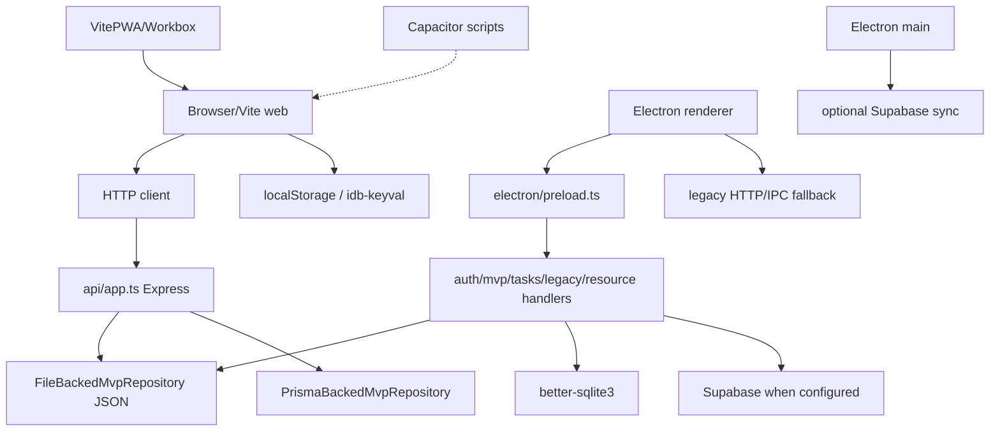

# LifeOS Forensic Architecture and AI-Bloat Audit

Status: working draft for independent review  
Authority: issue #83 under recovery program #82; delivery authorized by draft PR #101  
Owner: repository maintainer  
Executor: read-only terminal analysis agent  
Branch: `agent/forensic-audit-83`  
Audited tree: `7d8093fdf588e99d0893f7b66940b402457bcf22` (pre-update HEAD of this branch) plus verification of `origin/main` at `727ad712ca33e5b3f9d185acb0536d8d8a36dc99`  
Baseline: `main` at `727ad712ca33e5b3f9d185acb0536d8d8a36dc99`  
Last reviewed: 2026-07-16  
Environment: Linux host; Node via nvm `v22.22.0` (npm `10.9.4`); project CI targets Node 20; no production secrets; no remote service writes

> This is an evidence report. It does not choose a product, runtime, persistence technology, dependency set, or implementation plan as approved. It does not authorize debloat, recoding, rebranding, or dependency removal.

## 1. Executive Summary

### 1.1 Scope and method

**Observed fact — high confidence.** Draft PR #101 authorizes changes only to this file. Against `origin/main`, the only tracked difference on this branch is `docs/audits/2026-07-13-lifeos-forensic-audit.md`. Temporary install/build artifacts (`node_modules`, `dist`, `dist-server`) remained untracked.

**Observed fact — high confidence.** The checked-out product route surface is narrow: public `/login`, `/register`, `/reset-password`; authenticated `/settings`; invite-gated `/mvp` plus `/mvp/onboarding`, `/mvp/weekly-review`, `/mvp/today`, `/mvp/reflection`; and internal `/mvp/admin`. Twelve legacy paths in `HIDDEN_MVP_ROUTES` redirect to the authenticated landing route. Twenty-one feature modules remain under `src/features/**` and many still have unit/integration tests or Electron IPC consumers.

**Observed fact — high confidence.** With Node 22, `npm ci --ignore-scripts`, then `npx prisma generate`:

| Command | Exit | Result |
|---|---:|---|
| `npm run typecheck` (after Prisma generate) | 0 | Pass |
| `npm run lint` | 0 | 0 errors, 9 warnings |
| `npm run test` (no session secret) | 1 | 607 passed, 62 skipped; 2 API suites fail without secret / Prisma client when not generated |
| `LIFEOS_SESSION_SECRET=… JWT_SECRET=… npx vitest run api/__tests__/` | 0 | 139 passed, 41 skipped (includes API auth + MVP contract) |
| `npm run build` (web) | 0 | Vite web build + PWA service worker generated |
| `npm run build:server` | 0 | Server compile succeeded |

**Inference — high confidence.** The repository is not one simple product with one adapter. It is a coexistence of: (1) an invite-only weekly MVP framed as React + Express; (2) an Electron desktop path with IPC, SQLite, and optional Supabase; (3) a retained broad feature suite hidden by the router; (4) packaging stubs for PWA and Android/Capacitor; and (5) documentation that partially conflicts with governance freeze rules.

### 1.2 Five largest complexity sources

| Severity | Finding | Classification | Decision dependency |
|---|---|---|---|
| P0 | Web HTTP (`api/app.ts`) and Electron IPC (`electron/ipc/mvpHandler.ts` + preload) both implement the MVP API; release smoke is Electron-only while product docs call web the canonical MVP runtime. | Observed fact | #85 runtime/release contract |
| P0 | JSON MVP files, Prisma/Postgres MVP, SQLite desktop auth/data, Supabase auth/sync/migrations, and browser storage (localStorage/IndexedDB) coexist without a single migration map. | Observed fact | Persistence/identity decisions |
| P0 | Authoritative release smoke is Electron (`playwright.release.config.ts` + `tests/e2e/smoke.spec.ts`); browser E2E is quarantined (`describe.skip`). CI Quality Gate still runs `electron:build` and Electron smoke on every PR. | Observed fact | Release evidence ladder |
| P1 | `src/features/**` retains a broad suite (tasks, habits, finances, AI, gamification, etc.) with tests and IPC while routes redirect. | Observed fact | Product-surface decision before removal |
| P1 | 124 direct packages (69 prod + 55 dev), multi-runtime scripts, and tooling (Storybook, Lighthouse, Capacitor scripts, AI SDKs) accumulate historical product directions. | Observed fact | Product + dependency decisions |

### 1.3 Five principal risks

| Severity | Risk | Classification | Evidence |
|---|---|---|---|
| Critical | Docker image healthcheck/EXPOSE use port **3001** while `docker-compose.yml` and docker acceptance workflow map/check port **3000**. Server default is `PORT \|\| 3001`. | Observed fact | `Dockerfile`, `docker-compose.yml`, `api/server.ts`, `.github/workflows/docker-acceptance-smoke.yml` |
| Critical | Local/demo auth bypasses: invite gate opens on `import.meta.env.DEV`, localhost, `VITE_BYPASS_MVP_INVITE_GATE`, invite metadata; admin opens on DEV/localhost/`VITE_ENABLE_INTERNAL_MVP_ADMIN`; auth repository seeds default invite `partner@lifeos.local` / `LIFEOS-INVITE` when no seeds configured. | Observed fact | `src/config/routes/access.ts`, `api/authRepository.ts` |
| High | `vite-plugin-trae-solo-badge` injects a Trae marketing badge into the **production** web build (`prodOnly: true`); confirmed present in generated `dist/index.html`. | Observed fact | `vite.config.ts`, `dist/index.html` after `npm run build` |
| High | JSON MVP repository does whole-file `readFile` → mutate → `writeFile` with no observed lock, backup, schema versioning, or corruption recovery. | Observed fact | `api/mvpRepository.ts` |
| High | No accepted ADR selects canonical runtime, identity, persistence, or release authority; README/MVP docs assert web canonicality while `AGENTS.md` forbids agents from choosing a runtime and CI treats Electron smoke as the release gate. | Human decision required | `AGENTS.md`, `docs/adr/README.md`, `README.md`, `docs/mvp/canonical-mvp.md`, `ci.yml` |

### 1.4 Highest-impact simplification opportunities

These are **recommendations**, not approvals and not implementation tickets.

1. **Recommendation.** Decide product promise and supported runtime set before removing hidden features or dependencies.
2. **Recommendation.** Define one evidence contract per supported release lane; stop treating Electron smoke as proof of web, or web build as proof of Electron.
3. **Recommendation.** Choose identity and persistence ownership, then document migration/rollback before consolidating JSON, Prisma, SQLite, and Supabase.
4. **Recommendation.** After decisions, classify the broad feature suite by reachable behavior and retained consumers (tests/IPC/data), not by file count.
5. **Recommendation.** Separate local development/demo fallbacks from publishable configuration; remove or gate production Trae badge injection; fix Docker port contract only after runtime decision (#86).

## 2. Authority and Scope

**Observed fact.** Issue #82 freezes product code changes until product, experience, architecture, governance, documentation, migration, and implementation gates are satisfied. Issue #83 requires a reproducible inventory and forbids treating hidden code as dead. PR #101 authorizes only this report and keeps it draft until independent review and maintainer merge authorization.

**Observed fact.** Required reading followed: `AGENTS.md`, `docs/governance/**`, `docs/adr/README.md`, issues #82/#83 and open backlog via `gh`, PR #101 description, then repository tree.

**Human decision required — authority conflict.** Higher-authority sources partially conflict:

| Source | Claim | Authority rank |
|---|---|---|
| Explicit freeze in #82 / `AGENTS.md` | Do not choose web/Electron/PWA/Android as canonical | Highest operational rule for agents |
| `README.md` + `docs/mvp/canonical-mvp.md` | Canonical MVP is invite-only weekly loop in React + Express; Electron is not the default shipped runtime | Canonical product docs (rank 4) |
| CI Quality Gate + release smoke | `electron:build` + Electron Playwright smoke are the release path | Current automation / tests (rank 5–6) |
| Historical architecture docs / PRD / plans | Supabase offline-first suite, broad features, AI | Historical / proposal (rank 7) |

This report **preserves** the conflict. It does not pick a winner.

## 3. Product Reachability Matrix

| Surface | Route/entrypoint | In primary nav | Direct reachability | Runtime | Current status | Classification and evidence |
|---|---|---:|---|---|---|---|
| Login | `/login` | Public | Yes | Browser/Electron renderer | Active | **Observed fact.** Lazy route in `src/config/routes/index.tsx`. |
| Registration | `/register` | Public | Yes | Browser/Electron renderer | Active | **Observed fact.** Lazy route. |
| Password reset | `/reset-password` | Public | Yes | Browser/Electron renderer | Active | **Observed fact.** Lazy route. |
| Settings | `/settings` | Yes | After auth | Browser/Electron renderer | Active | **Observed fact.** `navItems.ts` secondaryNav. |
| MVP home | `/mvp` | Yes | Invite/runtime gate | Browser/Electron renderer | Active | **Observed fact.** Gated by `canAccessMvpInviteOnly`. |
| MVP onboarding | `/mvp/onboarding` | Via MVP | Invite gate | Browser/Electron renderer | Active | **Observed fact.** `MvpSurfacePage`. |
| Weekly review | `/mvp/weekly-review` | Via MVP | Invite gate | Browser/Electron renderer | Active | **Observed fact.** Registered route + API. |
| Daily execution | `/mvp/today` | Via MVP | Invite gate | Browser/Electron renderer | Active | **Observed fact.** Registered route + API. |
| Reflection | `/mvp/reflection` | Via MVP | Invite gate | Browser/Electron renderer | Active | **Observed fact.** Registered route + API. |
| Internal MVP admin | `/mvp/admin` | Secondary nav “Interno” | Invite + admin gate | Browser/Electron renderer | Active, internal | **Observed fact.** `canAccessInternalMvpAdmin`; nav always lists it. |
| Legacy suite | `/tasks`, `/habits`, `/ai-assistant`, `/focus`, `/gamification`, `/design`, `/projects`, `/university`, `/calendar`, `/journal`, `/health`, `/finances` | No | Redirect to landing | Renderer | Hidden, not dead | **Observed fact.** `HIDDEN_MVP_ROUTES` mapped to `<Navigate>`. |
| Feature modules | `src/features/**` (21 modules) | Usually no | Import/test/IPC | Browser/Electron | Residual/retained | **Observed fact.** File and test inventory below. |
| Electron IPC | `window.api.auth`, `window.api.mvp`, `window.api.tasks`, legacy/resource | N/A | Preload only | Electron | Active desktop | **Observed fact.** `electron/preload.ts`, `electron/main.ts` registers 5 handler setups. |
| Service worker/PWA | VitePWA assets | No | Browser build | Browser/PWA | Configured; built | **Observed fact.** Web build emitted `dist/sw.js`, workbox, `manifest.webmanifest`. |
| Android/Capacitor | `android/`, `android:*` scripts | No | Requires external tooling | Mobile | Incomplete path | **Observed fact.** Scripts call `npx cap`; no `capacitor.config.*` in tree; only `android/app` present. |
| Storybook | `storybook` scripts | No | Manual | Tooling | Configured | **Observed fact.** Scripts and `.storybook/` exist. |

**Inference.** User-facing product surface is the MVP loop + settings (+ auth). Hidden modules are **DECISION_REQUIRED**, not **REMOVE**.

### 3.1 Feature module inventory (structural)

| Module | Approx. TS/TSX files | Test files observed | Router status | Notes |
|---|---:|---:|---|---|
| `mvp` | 13 | 3 | Active routes | Canonical loop UI |
| `auth` | 11 | 5 | Active public routes | Login/register/reset |
| `settings` | 6 | 1 | Active | Settings page |
| `tasks` | 19 | 4 | Hidden redirect | Electron `tasks` IPC remains |
| `habits` | 17 | 3 | Hidden | Broad suite residue |
| `journal` | 19 | 4 | Hidden | Integration tests still run |
| `gamification` | 22 | 10 | Hidden | Heavy test surface |
| `dashboard` | 22 | 2 | Not in active routes | Residual |
| `finances` | 16 | 2 | Hidden | Residual |
| `university` | 17 | 1 | Hidden | Residual |
| `ai-assistant` | 10 | 3 | Hidden | AI surface + tests |
| `health` | 9 | 1 | Hidden | Residual |
| `analytics` | 9 | 0 | No route | Widget/residual |
| `rewards` | 10 | 2 | No active route | Integration test remains |
| `calendar` | 5 | 1 | Hidden | Integration test remains |
| `focus` | 5 | 0 | Hidden | Residual |
| `projects` | 5 | 0 | Hidden | Residual |
| `onboarding` | 5 | 1 | Not MVP onboarding routes | Separate from `/mvp/onboarding` |
| `user` | 3 | 0 | N/A | Residual |
| `legal` | 2 | 0 | N/A | Residual |
| `design-system` | 1 | 0 | Hidden `/design` | Residual |

## 4. Runtime, Transport, Identity, and Persistence Matrix

| Runtime | UI | Transport | Identity/session | MVP persistence | Other persistence | Release evidence | Status |
|---|---|---|---|---|---|---|---|
| Browser web | Vite `--mode web` | HTTP `/api/*` | Express auth repo, JWT/cookie; needs `LIFEOS_SESSION_SECRET` or `JWT_SECRET` | File-backed JSON default; Prisma when configured | localStorage, idb-keyval, optional Supabase client | `npm run build` succeeds; browser E2E quarantined | Decision required |
| Express server | Node `api/server.ts` | HTTP | Same | Same | Prisma client when generated | `build:server` succeeds; API tests pass with test secret | Decision required |
| Electron renderer | Vite `--mode electron` | IPC via preload; legacy HTTP fallback exists | Desktop session / Supabase when configured; local fallback | JSON under user data / env path | SQLite, electron-store | Smoke intended; not re-run packaged here | Decision required |
| Electron main | `electron/main.ts` | IPC handlers | `desktopSession` | MVP JSON via handler | better-sqlite3, sync engine | Unit IPC tests pass | Decision required |
| PWA | Service worker from VitePWA | Browser fetch/cache | Same browser auth | Browser storage | Workbox caches | Generated on web build; runtime not exercised | Decision required |
| Android/Capacitor | External wrapper | Unverified | Unverified | Unverified | `android/app` only | Scripts present; config absent; not run | Decision required |

### 4.1 Adapter and transport graph

**Inference.** Duplicate transports and persistences are real. Support parity is not proven for all combinations.

## 5. Persistence and Data Safety

| Mechanism | Implementation | Stored data | Activation | Atomicity/concurrency | Migration/backup/delete | Test evidence | Classification |
|---|---|---|---|---|---|---|---|
| MVP JSON | `api/mvpRepository.ts` | Per-user MVP workspace | Default API/desktop path | Whole-file RMW; no lock observed | Delete endpoint exists; no backup/version protocol observed | API MVP test with secret; Electron smoke reads file | DECISION_REQUIRED |
| Prisma/Postgres | `prisma/schema.prisma`, `api/prismaMvpRepository.ts`, migration `20260319_235500_init_mvp_postgres_contract` | Relational MVP | `DATABASE_URL` / repository selection | DB transactions in repository code | One init migration; rollback not proven | Typecheck needs `prisma generate`; no live DB run | DECISION_REQUIRED |
| SQLite | `electron/db/database.ts`, `BaseRepository.ts` | Auth session + legacy resources | Electron runtime; path differs packaged vs dev | WAL pragma; better-sqlite3 | Local schema create; export/delete contract not proven | Smoke helpers; unit paths | DECISION_REQUIRED |
| Supabase | client libs, `electron/sync`, `supabase/migrations/*` (many historical tables) | Auth/profile/sync + legacy suite schema | Env-dependent | Provider + RLS workflow | Many SQL migrations for broad suite | RLS workflow needs secrets; not run | DECISION_REQUIRED |
| Browser storage | localStorage clears in smoke; `idb-keyval` in `src/shared/stores/**`, react-query persister | Flags, offline/query cache | Browser/Electron DOM | Browser semantics | No repo-wide migration map | Unit/static; browser E2E skipped | DECISION_REQUIRED |
| Electron Store | package + desktop session | Config/credentials | Electron main | Library semantics | No rotation/export contract observed | Static/unit | DECISION_REQUIRED |

**Observed fact.** No single migration contract connects all layers. **Recommendation.** Do not remove or migrate a layer until ownership, inventory, compatibility, rollback, and user export/delete are approved.

## 6. Component Decision Matrix

Preliminary states only: `KEEP`, `SIMPLIFY`, `MERGE`, `REMOVE`, `REWRITE`, `ARCHIVE`, `DECISION_REQUIRED`.  
No item is approved for removal by this audit alone.

| Item | Category | Location | Consumers | Runtime | Preliminary | Evidence | Removal risk | Required before action |
|---|---|---|---|---|---|---|---|---|
| MVP loop UI | Feature | `src/features/mvp/**` | Router, API, tests | Browser/Electron | KEEP pending product confirm | Routes + tests | High | Product decision |
| Auth UI | Feature | `src/features/auth/**` | Public routes | Browser/Electron | KEEP pending identity model | Routes + tests | High | Identity ADR |
| Settings | Feature | `src/features/settings/**` | Nav/routes | Browser/Electron | KEEP | Routes | Medium | — |
| Hidden feature modules | Features | `src/features/{tasks,habits,...}` | Tests, IPC, APIs | Renderer/Electron | DECISION_REQUIRED | Inventory §3.1 | High | Surface-by-surface product decision |
| Route redirects | Routing | `access.ts`, `index.tsx` | Router/tests | Renderer | KEEP | Gate tests pass | High | Reachability matrix |
| HTTP MVP API | Service | `api/app.ts` | Web client, API tests | Express | DECISION_REQUIRED | `/api/mvp/*`, `/api/auth/*`, `/api/health` | High | Runtime decision |
| Electron MVP IPC | Service | `mvpHandler.ts`, preload | Desktop client | Electron | DECISION_REQUIRED | Preload `window.api.mvp` | High | Runtime + parity tests |
| Shared MVP types | Contract | `shared/mvp/**` | API, IPC, UI | All | KEEP | Cross-imports | High | Contract versioning |
| File MVP repo | Persistence | `mvpRepository.ts` | API + Electron | Web/Electron | SIMPLIFY candidate | RMW write path | High | Data safety design |
| Prisma MVP repo | Persistence | `prismaMvpRepository.ts` | API when selected | Server | DECISION_REQUIRED | Schema + import | High | Persistence ADR + DB tests |
| SQLite layer | Persistence | `electron/db/**` | Auth/resources/tasks | Electron | DECISION_REQUIRED | initDb + handlers | High | Desktop data decision |
| Legacy IPC | Adapter | `legacyHandler.ts` | Hidden APIs/tests | Electron | SIMPLIFY candidate | Allowlist blocks nested `/api/mvp` | Medium/high | Consumer inventory |
| Tasks IPC | Adapter | `tasksHandler.ts`, preload | Desktop tasks API | Electron | DECISION_REQUIRED | Preload exposes tasks | High | Feature disposition |
| Supabase stack | Integration | `src/shared/lib/supabase.ts`, sync, migrations | Auth/sync/historical | Multi | DECISION_REQUIRED | Many migrations | High | Identity + sync ADR |
| PWA/Workbox | Packaging | `vite.config.ts` | Web build | Browser | DECISION_REQUIRED | SW generated on build | Medium | Supported targets |
| Capacitor/Android | Packaging | `android/`, scripts | Incomplete | Mobile | DECISION_REQUIRED | No capacitor config | Medium | Support decision |
| AI assistant + SDKs | Integration | feature + `groq-sdk`, `@google/generative-ai` | Hidden feature/tests; empty web backend chunk | Renderer | DECISION_REQUIRED | No source import of groq/gemini; vite manualChunks forces groq | High | AI role decision |
| Trae badge plugin | Build inject | `vite-plugin-trae-solo-badge` | Production HTML | Web build | DECISION_REQUIRED → SIMPLIFY candidate | `prodOnly: true`; present in `dist/index.html` | Medium (brand/security/privacy) | Explicit allow or remove |
| Storybook/Lighthouse | Tooling | scripts/config | Manual/CI | Dev | SIMPLIFY | Missing script/config files (below) | Low/medium | Tool ownership |

## 7. Dependency and Script Inventory

### 7.1 Method limits

Static text search outside `package.json` / lockfile cannot prove absence of consumers (dynamic import, generated code, CLI, ambient types). Zero matches ⇒ `NO_CONSUMER_FOUND`, **not** approved for removal.

Direct package counts: **69** `dependencies`, **55** `devDependencies` (124 total).

### 7.2 Dependency classification (groups)

| Dependency or group | Static / build evidence | Classification | Evidence before removal |
|---|---|---|---|
| React, router, Vite, TS, tsx | Core | ACTIVE_REQUIRED | Keep until product death |
| Express stack (`express`, cors, helmet, rate-limit, cookie-parser, jwt, bcryptjs, axios, supertest) | `api/**`, tests | ACTIVE_REQUIRED for web API | Web support decision |
| Electron stack (`electron`, electron-builder, vite-plugin-electron, electron-store, electron-window-state, better-sqlite3) | `electron/**`, vite electron mode | ACTIVE_REQUIRED for desktop path | Runtime decision + packaged test |
| Prisma (`@prisma/client`, `prisma`) | schema, repositories | ACTIVE_REQUIRED for Prisma path | `prisma generate` needed for typecheck; DB tests |
| Supabase (`@supabase/*`, CLI) | client, auth helpers (deprecated package warning), migrations, types script | ACTIVE_REQUIRED or DECISION_REQUIRED | Identity decision; helpers deprecated at install |
| `groq-sdk` | Only `vite.config.ts` manualChunks; **empty** `backend` chunk in web build | NO_RUNTIME_IMPORT_FOUND / DECISION_REQUIRED | AI decision; build graph shows unused |
| `@google/generative-ai` | No non-audit source import found | NO_CONSUMER_FOUND | Dynamic/config not ruled out |
| `googleapis` | Sparse references | DECISION_REQUIRED | Identify executed path |
| `@sentry/react` | `src/app/main.tsx` | ACTIVE_OPTIONAL | Ops decision |
| `@sentry/node` | No source import found | NO_CONSUMER_FOUND | — |
| PWA (`vite-plugin-pwa`, workbox-\*) | Vite config; SW generated; many workbox packages only documented | ACTIVE for PWA path / DECISION_REQUIRED for individual packages | Support decision |
| State (`zustand`, tanstack query + persist, idb-keyval) | Shared stores, App | ACTIVE_REQUIRED for current tree | Feature disposition |
| UI kits (`@dnd-kit/*`, headlessui, radix, remixicon, tremor, cmdk) | Sparse/low matches for some | DECISION_REQUIRED | Build graph + surface decision |
| Charts/motion/forms/i18n/markdown | Multiple feature consumers | ACTIVE for residual suite | Per-feature reachability |
| Storybook stack | Config/stories | BUILD_OR_TOOLING_ONLY | Tooling decision |
| Playwright/Vitest/Testing Library/msw | Tests | BUILD_OR_TOOLING_ONLY | Keep for validation |
| `lighthouse` | Package present; script/config missing | BROKEN_TOOLING_PATH | Repair or remove after ownership decision |
| `vite-plugin-trae-solo-badge` | Injects production badge | DECISION_REQUIRED | Brand/security decision |
| `@types/*` with zero text matches | Ambient types | DECISION_REQUIRED | Typecheck evidence, not grep |
| Capacitor | Invoked via `npx cap` in scripts; not a direct package entry observed in dependency list scan | INCOMPLETE_INTEGRATION | Support decision |

**Install-time observations (`npm ci --ignore-scripts`, exit 0):** 1647 packages; npm reported **69** vulnerabilities (1 low, 39 moderate, 24 high, 5 critical); deprecation warnings include `@supabase/auth-helpers-react`, `@types/bcryptjs` stub, several `glob` versions. **Does not prove** exploitability in the deployed product.

### 7.3 Scripts inventory

| Script | Declared command | File/tool present? | Classification |
|---|---|---|---|
| `dev` / `dev:web` | concurrently server+client | Yes | ACTIVE web dev |
| `server:dev` / `client:dev` | tsx / vite web | Yes | ACTIVE |
| `build` / `prebuild` | check+lint; tsc+vite web | Yes | ACTIVE; web build verified |
| `build:server` | tsc server | Yes | ACTIVE; verified |
| `electron:dev` / `electron:build` / `electron:full` | vite electron / builder | Yes | ACTIVE desktop path; packaged build not re-run here |
| `android:dev` / `android:build` | build + `npx cap` | **No** `capacitor.config.*` | BROKEN/INCOMPLETE |
| `test` / `test:watch` / `test:integration` | vitest | Yes | ACTIVE; suite mostly green with secrets |
| `test:e2e` / `test:e2e:smoke` | playwright release config | smoke.spec Electron | Desktop evidence only |
| `test:e2e:advisory` | playwright browser config | All specs `describe.skip` | NON_EVIDENCE currently |
| `typecheck` / `check` / `lint` | tsc / eslint | Yes | Verified |
| `prisma:*` | prisma CLI | Yes | ACTIVE optional path |
| `storybook` / `build-storybook` | storybook | Yes | Tooling |
| `lh` | `node scripts/lighthouse.js` | **MISSING file** | BROKEN |
| `generate:robots` / `generate:sitemap` / `seo:generate` | scripts under `scripts/` | **MISSING files** | BROKEN |
| `test:seed-perf-data` | `tsx scripts/seed_perf_test_data.ts` | **MISSING file** | BROKEN |
| `analyze` | `scripts/analyze-bundle.js` | Present | Tooling |
| `types:generate` | supabase gen types | Needs project id/secrets | Env-dependent |

## 8. Workflows and Release Evidence Matrix

| Workflow/command | Trigger | Runtime | Proves when green | Does not prove | Observed state | Recommendation |
|---|---|---|---|---|---|---|
| `ci.yml` Quality Gate | push/PR main | Node 20 | typecheck, lint, test (with secrets), web build, **electron:build**, Electron smoke grep | Web E2E, Docker, Prisma live DB, production security | Configured; overlaps with Test Suite | Make lane authority explicit (#86) |
| `test.yml` Test Suite | push/PR main/staging | Node 20 | unit/integration + coverage artifact | Packaged desktop, browser E2E | Duplicates part of quality gate | Distinguish confidence levels |
| `ci-rls.yml` | push/PR main | Supabase secrets | RLS suite if secrets present | Local fallback, Electron | Not run (no secrets) | Document isolation |
| `docker-acceptance-smoke.yml` | **manual only** | Docker | Intended container health on **port 3000** | Correctness vs Dockerfile 3001 default | Port mismatch with image | Fix only after port decision |
| `lighthouse-scheduled.yml` | cron `0 2 31 2 *` (31 Feb = never) + manual | Node 20 + lhci | Would run if config/script exist | Functional correctness | Cron effectively disabled; **no** `lighthouserc*.json`; `npm run lh` script file missing | Classify advisory vs blocking |
| `sync-labels.yml` | manual | GitHub API | Label sync | Product behavior | Governance-only | Keep separate |
| Local `npm run typecheck` | manual | Node 22 here | Types after `prisma generate` | Runtime | exit 0 | CI runs `npm ci` with scripts so generate may differ |
| Local `npm run lint` | manual | ESLint project | Lint | Runtime | exit 0, 9 warnings | — |
| Local `npm run test` | manual | Vitest | Most unit/integration | API suites without env; browser/Electron package | exit 1 without secret/prisma first | Document required env |
| Local API tests + secrets | manual | Vitest | Auth invite gate + MVP HTTP contract | Electron/Prisma DB | exit 0 | — |
| Local `npm run build` | manual | Vite web | Web bundle + PWA generation | Express runtime, Electron package | exit 0; empty `backend` chunk; Trae badge in HTML | — |
| Local `npm run build:server` | manual | tsc | Server JS emit | Live DB/HTTP deployment | exit 0 | — |
| Electron package / E2E smoke | not re-run | Electron | Would prove packaged smoke | Web | Not executed this session (time/binary risk) | Still declared authoritative in README/CI |
| Android build | not run | Capacitor | — | — | Config missing | Human target decision first |

**Observed fact.** Dockerfile EXPOSE/healthcheck **3001**; compose publishes **3000:3000** and healthchecks **3000**; docker smoke runs `-p 3000:3000` without setting `PORT`; server defaults to **3001**. **Inference.** Default compose/smoke path is very likely unhealthy unless an unobserved entrypoint overrides port.

## 9. Documentation Authority Matrix

| Document | Claim/role | Classification | Conflict / hazard | Proposed action |
|---|---|---|---|---|
| `AGENTS.md` | Freeze + authority order | CANONICAL governance | Forbids runtime selection | Keep |
| `docs/governance/**` | DoR/DoD, policies, labels, protocol | CANONICAL | — | Keep |
| `docs/adr/README.md` | ADR lifecycle | CANONICAL; no accepted runtime ADR | MISSING_REQUIRED decisions | Human ADRs |
| `README.md` | Web MVP canonical; Electron not default | ACTIVE_SUPPORTING product | Conflicts with CI Electron gate and agent freeze neutrality | Reconcile after #85/#88 |
| `docs/mvp/canonical-mvp.md` | Weekly loop contract | ACTIVE_SUPPORTING | Strong product claim, not architecture ADR | Keep pending product confirm |
| `docs/mvp/route-map.md`, telemetry map, checklist | MVP maps | ACTIVE_SUPPORTING | Verify vs router | Reconcile |
| `docs/release-verification-ladder.md` | Authoritative vs advisory tests | ACTIVE_SUPPORTING | Must match CI reality | Keep / update after #86 |
| `docs/MVP_DESKTOP_*` | Desktop readiness | DECISION_PENDING | Can be read as shipped truth | Mark after runtime decision |
| `docs/ARCHITECTURE-FINAL.md`, `architecture-overview.md` | Supabase/offline/AI | CONTRADICTORY / HISTORICAL | Competes with MVP docs | Archive plan (#89) |
| `docs/prd/prd_v2.2.md` | Broad suite proposal | PROPOSAL / HISTORICAL | Not current requirement | Do not implement from PRD |
| `plans/*.md` | Prior plans | HISTORICAL / supporting | Not requirements | Status labels |
| `CHANGELOG.md`, `DESIGN.md`, `setup-guide.md` | Narrative | DECISION_PENDING | Mixed claims | Reconcile |
| This audit | Evidence only | ACTIVE_SUPPORTING | Must not become architecture authority | Review then disposition |
| Issue #68 | Gem integration proposal | PROPOSAL / BLOCKED | size XL, expands legacy, human:decision | Do **not** implement; classify under recovery |

## 10. Security and Operational-Mode Matrix

| Mechanism | Local dev | Controlled demo | Partner beta | Public production | Evidence | Decision |
|---|---|---|---|---|---|---|
| DEV / localhost MVP invite bypass | Open | Possible | Must be explicit | Must be fail-closed | `access.ts` | #87 |
| `VITE_BYPASS_MVP_INVITE_GATE` | Available | Possible | Risky | Unsafe without boundary | `access.ts` | #87 |
| Internal admin DEV/localhost/flag | Open | Possible | Restricted | Restricted | `access.ts`, nav always shows Interno | #87 |
| Default invite seed `LIFEOS-INVITE` | Fixture | Risky if deployed | Risky | Unacceptable as silent default | `authRepository.ts` | #87 |
| Session secret required at API boot | Fail-fast without secret | Fixture secret | Real secret | Real secret + rotation | `api/app.ts`; CI sets test secrets | Identity ops |
| Desktop local auth fallback | Offline useful | Demo | Policy needed | Not ≡ cloud auth | desktop session paths | #85/#87 |
| Supabase anon + service role in compose | Local | Demo | High risk if leaked | Service role never in client | `docker-compose.yml` | Secret policy |
| JSON full-state write | Single-user local | Demo | Data-loss risk | Not proven multi-writer safe | `mvpRepository.ts` | Persistence ADR |
| Redis default password `lifeosredis` | Local | Demo only | Unsafe default | Unacceptable | compose | Secret policy |
| Trae production badge + external click URL | N/A | Unwanted | Unwanted | Privacy/brand leak | `vite.config.ts`, `dist/index.html` | Explicit allow/deny |
| Missing `nginx/nginx.conf` while compose mounts it | Breaks nginx service | — | — | Broken path | compose vs missing dir | Infra decision |
| Smoke mock auth | Tests only | Tests only | Not evidence | Not production | electron smoke helpers | Keep test-only |

**Observed fact.** No real production secrets were used. Synthetic secrets only for local tests.

## 11. AI and Tool Bloat Findings

| Finding | Classification | Evidence | Limit |
|---|---|---|---|
| Broad AI assistant feature remains; route hidden | Observed fact | `src/features/ai-assistant/**`, `HIDDEN_MVP_ROUTES` | Not proof of product irrelevance |
| `@google/generative-ai` no source consumer | Observed fact | Repo text scan | Dynamic load not ruled out |
| `groq-sdk` forced into Vite `backend` manual chunk; web build emitted **empty** chunk (~46 bytes) | Observed fact | `vite.config.ts`, build log “Generated an empty chunk: backend”, dist file size | Strong unused-in-web-bundle signal; not removal approval alone |
| Trae solo badge injected in production HTML | Observed fact | plugin `prodOnly: true`; `dist/index.html` contains `trae-badge` CSS/markup | Tool-vendor residue in product |
| Storybook, Lighthouse, bundle analyze, PWA, Capacitor scripts, dual AI providers, dual monitoring SDKs coexist | Observed fact | package.json + configs | Maintenance cost ≠ automatic delete list |
| Broken script entrypoints (lh, seo, perf seed) still declared | Observed fact | missing files under `scripts/` | Agent/docs may attempt dead commands |
| Lighthouse schedule uses impossible date 31 Feb | Observed fact | `lighthouse-scheduled.yml` | Effectively disabled schedule |
| npm audit 69 vulns on install | Observed fact | `npm ci` summary | Needs triage; not a release blocker classification by itself |
| PR #81 cleanup vs retained multi-runtime tree | Observed fact | History + current tree | Summaries lower authority than code/tests |
| Tests still exercise hidden suite heavily (journal, calendar, rewards, gamification, tasks…) | Observed fact | vitest run output | Tests preserve legacy contracts |

## 12. Human Decision Queue

Ordered by dependency. Not implementation work.

| Order | Decision | Why blocking | Linked issues |
|---:|---|---|---|
| 1 | Product promise, user, MVP boundary, vocabulary, brand | Defines what “legacy” means | #88, #82 |
| 2 | Canonical runtime + supported secondary runtimes + release evidence per lane | Resolves web docs vs Electron CI gate | #85, #86 |
| 3 | Identity/auth model, invite/admin, local fallbacks, session threat model | Demo vs publishable | #87 |
| 4 | Persistence ownership, migration, backup, export, delete, rollback | JSON/SQLite/Prisma/Supabase fate | #85/#87 follow-ons |
| 5 | Operational modes and fail-closed rules | Prevents bypass leakage | #87 |
| 6 | Legacy surface disposition per module | Keep/merge/archive/remove | After 1–2 |
| 7 | AI capability role and provider policy | SDKs, privacy, secrets | After 1 |
| 8 | Documentation authority map + archive | Agent retrieval safety | #89 |
| 9 | Backlog hygiene and label enforcement | Executable issues only | #90 |
| 10 | Main protection, agent environments, merge gates | Safety of automation | #100 |
| 11 | Issue #68 disposition | Blocked XL feature expansion | #68 under #82 |

## 13. Recommended Bounded Backlog

Do **not** auto-open or implement from this table. Maintainer backlog proposal only.

| Order | Proposed work | Type | Blocked by | Risk | Size | Why separate |
|---:|---|---|---|---|---|---|
| 1 | Product promise / rebrand criteria | decision | None | High | S–M | #88 |
| 2 | Runtime + release ADR | decision/ADR | 1 | Critical | S | #85 |
| 3 | Identity + demo/prod boundary ADR | decision/ADR | 1–2 | Critical | M | #87 |
| 4 | Persistence + migration ADR | decision/ADR | 1–3 | Critical | M | data safety |
| 5 | Reconcile CI/Docker/E2E evidence ladder | audit → small fixes | 2 | High | M | #86; Docker port is a later bounded fix |
| 6 | Hidden surface consumer audit (per module) | audit | 1–2 | High | M | avoid deleting retained behavior |
| 7 | Dependency/script classification vs decided surface | audit | 1–2, 6 | Medium | M | includes Trae badge / empty AI chunk |
| 8 | Documentation authority + archive | docs | 1–5 | Medium | M | #89 |
| 9 | Backlog/PR hygiene | governance | labels exist | Medium | M | #90 in-review |
| 10 | Main protection / agent sandbox policy | governance/decision | human | High | M | #100 |
| 11 | Recoding slices with rollback | planning | 1–10 | Critical | M | only after gates |
| — | #68 open-source “gems” expansion | feature | product+debloat | High | XL | **Do not implement**; recommend supersede or rewrite after debloat |

## 14. Open Issues Snapshot (2026-07-16)

| # | Title | Type / status | Executable code? | Notes |
|---:|---|---|---|---|
| 82 | Recovery program tracking | tracking / in-progress / human:decision | No | Parent program |
| 83 | Forensic audit (this work) | audit / in-progress | Docs-only via PR #101 | Complete inventory; await review |
| 85 | Canonical runtime decision | decision / blocked / human:decision | No | Needs #83 evidence |
| 86 | CI/Docker/release reconcile | audit / blocked | No code until unblocked | Depends on runtime evidence |
| 87 | Demo vs publishable security boundary | security / blocked / human:decision | No | Decision + threat model |
| 88 | Product/rebrand | decision / blocked / human:decision | No | Product gate |
| 89 | Doc authority map | docs / blocked | Documentary after gates | Depends on decisions |
| 90 | Backlog/label hygiene | governance / in-review | Meta; no product code | May proceed as process if authorized |
| 100 | Main protection / agent envs | governance / needs-decision / human:decision | No | Human decision |
| 68 | Open-source gems evolution | feature / blocked / human:decision / size XL | **No** | Contradicts debloat; do not implement |

**Observed fact.** No open issue currently carries `status:ready` for product implementation. Only open PR is draft #101 (this audit).

## 15. Evidence Register

| Conclusion | Classification | Evidence | Confidence | Limitation |
|---|---|---|---|---|
| Active routes are auth + settings + MVP (+ internal admin) | Observed fact | `src/config/routes/index.tsx`, `navItems.ts` | High | External deep links / old SW caches not proven |
| Hidden feature code is not proven dead | Inference | Redirects + tests + IPC + file inventory | High | Full dynamic call graph not generated |
| HTTP and IPC both implement MVP | Observed fact | `api/app.ts`, `electron/ipc/mvpHandler.ts`, preload | High | Full parity not executed end-to-end |
| Multiple persistence mechanisms coexist | Observed fact | repositories, prisma, sqlite, supabase, idb | High | Activation is config-dependent |
| Web build succeeds and emits PWA assets | Observed fact | `npm run build` exit 0 | High | Runtime SW behavior not exercised |
| `groq-sdk` not in web module graph | Observed fact | empty backend chunk | High | Electron/server dynamic use not fully traced |
| Trae badge present in production HTML | Observed fact | dist after build | High | Whether desired is a human brand decision |
| Docker port contract inconsistent | Observed fact | Dockerfile 3001 vs compose/smoke 3000 | High | Full `docker build` not required to prove text mismatch |
| Auth demo bypasses exist | Observed fact | access + authRepository | High | Production env values not inspected |
| Browser E2E is non-evidence today | Observed fact | all advisory specs `describe.skip` | High | — |
| Canonical runtime undecided for agents | Human decision required | AGENTS freeze vs README vs CI | High | Maintainer may hold unrecorded intent |
| #68 must not be auto-implemented | Observed fact | labels blocked, XL, human:decision, expands surface | High | — |

## 16. Commands Executed

Read-only against product sources except local dependency install and local build outputs (untracked). No production secrets, no remote DB writes, no issue/PR merges.

| Command | Exit | Result summary | Proves | Does not prove | Limitation |
|---|---:|---|---|---|---|
| `gh repo/pr/issue` inspection for #82, #83, #101, open issues/PRs | 0 | State matches recovery program narrative | Remote metadata | Code truth alone | Network |
| `git clone` / checkout `agent/forensic-audit-83` | 0 | Branch at `7d8093f…` | Source availability | — | Local path under `Documentos/codigo/life-os-repo` |
| `git diff --name-only origin/main...HEAD` | 0 | Only audit markdown differs | PR allowlist | Future commits | — |
| Read governance + routes + package + Docker + workflows + electron/api | 0 | Authority and architecture map | Static structure | Runtime | — |
| Static dependency consumer scan (Python walk) | 0 | Zero/low match list produced | Candidate unused packages | Dynamic/build consumers | Heuristic |
| `nvm use 22`; `node -v` → v22.22.0 | 0 | Toolchain available | Local Node | CI Node 20 equivalence | CI uses 20 |
| `npm ci --ignore-scripts` | 0 | 1647 packages; 69 vuln summary | Install reproducibility on Node 22 | Native postinstall (ignored) | Scripts skipped |
| `npx prisma generate` | 0 | Client generated | Prisma client needed for types | DB connectivity | Generated into node_modules only |
| `npm run typecheck` after generate | 0 | Clean | Types under this toolchain | Runtime | — |
| `npm run typecheck` before generate | 2 | PrismaClient export errors | Generate is required after ignore-scripts | CI default path | — |
| `npm run lint` | 0 | 9 warnings, 0 errors | Lint gate | Style-free runtime | — |
| `npm run test` (no secret, after generate) | 1 | 607 passed / 62 skipped; 2 API suites failed on missing secret | Broad unit/integration health | Full green suite | Needs env for API |
| `LIFEOS_SESSION_SECRET=… JWT_SECRET=… npx vitest run api/__tests__/` | 0 | auth + mvp API contracts pass | HTTP invite gate + MVP persistence path under test | Electron/Prisma live | Synthetic secret |
| `npm run build` | 0 | Web + PWA; empty backend chunk; Trae in HTML | Web compile and inject plugins | Server/Electron package | Dist untracked |
| `npm run build:server` | 0 | dist-server emitted | Server compile | Live listen/health | — |
| `npm audit` summary via JSON | 0 | 69 vulns counted | Advisory inventory | Exploitability | No fix attempted |
| Feature file counts / grep for skip, ports, invites | 0 | Inventory tables | Static facts | Production config | — |
| Docker CLI present (`docker --version`) | 0 | Docker 29.x installed | Tool availability | Image behavior | Full image build not run this session |
| Electron packaged smoke / android / storybook / lighthouse | not run | — | — | Those surfaces | Time, binaries, missing configs |

## 17. What Could Not Be Proven

1. Packaged Electron application behavior and `npm run electron:build` success on this host (not executed this session).
2. Live browser E2E against a running stack (advisory tests skipped by design).
3. Docker image build/run health (text-level port mismatch proven; container not started).
4. Prisma against a real Postgres; Supabase RLS; Redis; nginx (nginx config files absent).
5. Android/Capacitor device behavior (config missing).
6. Real user data volumes, backup quality, multi-process JSON races, production performance.
7. Whether every zero-match dependency is unused at runtime.
8. Hidden reachability via stale service workers, old installed Electron builds, or external bookmarks.
9. Human intent for brand name, runtime winner, or #68 beyond repository labels.

## 18. Issue #83 Acceptance Criteria Checklist

- [x] Material conclusions cite paths, symbols, configs, tests, commits, or PRs.
- [x] Report separates observed fact, inference, recommendation, and human decision required.
- [x] No removal recommendation based only on aesthetics or opinion; removals remain DECISION_REQUIRED or candidates with residual risk.
- [x] Web, Electron, Express, IPC, Supabase, SQLite, Prisma, PWA, and mobile explicitly analyzed.
- [x] Dependencies and scripts classified with method limits stated.
- [x] Legacy vs canonical surfaces separated.
- [x] Issue #68 classified and not altered/implemented.
- [x] Data/migration risks identified.
- [x] No product file outside this report changed in the authorized PR scope.
- [ ] Independent review completed.
- [ ] Maintainer authorized merge.

## 19. Completion Gate

- [x] Baseline commit and audit branch recorded.
- [x] Issues #82, #83, #68 and open recovery issues inspected; structural history #71–#81/#99 noted via prior branch work and GitHub.
- [x] Required matrices completed (reachability, runtime/persistence, components, dependencies/scripts, workflows, docs, security, AI/tooling, decisions, backlog, evidence, commands).
- [x] Toolchain validation executed where possible; failures and skips recorded honestly.
- [x] No product code, tests, snapshots, workflows, configuration, dependencies, schemas, migrations, assets, or canonical docs modified.
- [x] No implementation recommendation executed.
- [ ] Independent review completed.
- [ ] Maintainer authorized merge.

**Process status:** ready for independent human review; **not** mergeable by process until review + explicit maintainer authorization. **Not** a license to begin debloat or implementation.
