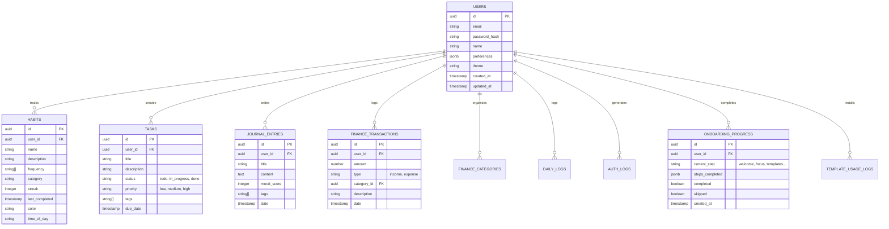

# Life OS - Database Schema

A arquitetura de dados do Life OS foi projetada utilizando **PostgreSQL** administrada pelo Supabase. O sistema é fundamentado no `user_id` servindo como Tenant-Identifier, garantindo Row Level Security (RLS) isolando registros por conta.

## Diagrama Entidade Referência

Abaixo encontra-se a modelagem abstrata em visualização Entity-Relationship.

## Security Model (RLS)
Todas as tabelas críticas possuem políticas RLS (Row Level Security) ativadas na interface do Supabase garantindo que `auth.uid() = user_id`. Nenhuma tabela acima é acessível para leitura ou gravação anônima desprotegida.
