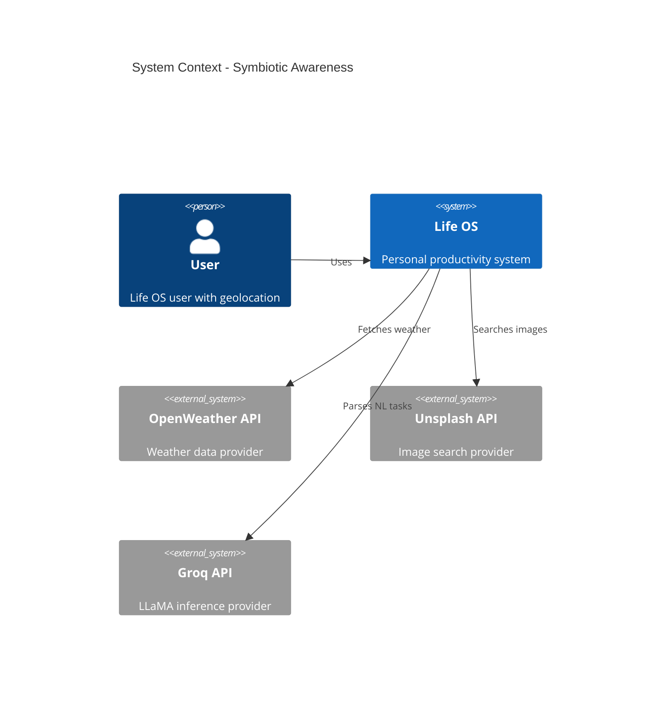
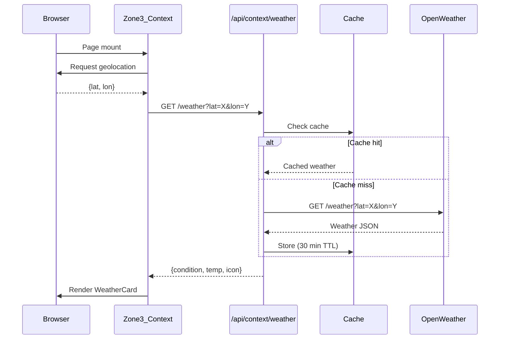
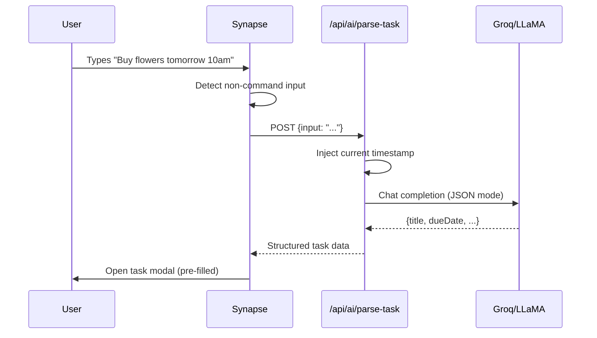

# Design: Symbiotic Awareness Architecture

This document captures architectural decisions for the three symbiotic awareness features.

## System Context



## Key Architectural Decisions

### ADR-001: Server-Side API Proxying

**Context**: External APIs (OpenWeather, Unsplash) require secret API keys.

**Decision**: All external API calls route through the Express backend.

**Consequences**:
- ✅ API keys never exposed to browser (security)
- ✅ Server-side caching reduces API quota usage
- ✅ Consistent error handling and rate limiting
- ⚠️ Adds network hop (mitigated by caching)

---

### ADR-002: Aggressive Caching for Weather Data

**Context**: Weather doesn't change frequently; OpenWeather free tier has limits.

**Decision**: Use `node-cache` with 30-minute TTL. Cache key = `weather:${lat.toFixed(2)}:${lon.toFixed(2)}`.

**Rationale**:
- Rounding coordinates to 2 decimals (~1.1km precision) increases cache hits
- 30 min TTL balances freshness vs API conservation
- In-memory cache is simpler than Redis for single-server deployment

**Alternatives Considered**:
- Redis: Overkill for current scale
- localStorage: Can't cache on server side

---

### ADR-003: Debounced Image Search

**Context**: User types project title; each keystroke could trigger API call.

**Decision**: Frontend implements 800ms debounce before calling `/api/media/images`.

**Rationale**:
- Prevents API spam during typing
- 800ms feels responsive without wasteful calls
- Backend includes `X-Debounce-Recommended` header for discoverability

---

### ADR-004: Groq for NL Task Parsing

**Context**: Need fast inference for natural language → structured JSON extraction.

**Decision**: Use Groq provider with LLaMA 3 8B model (existing GroqProvider).

**Rationale**:
- Groq offers ~300 tokens/second (feels instantaneous)
- LLaMA 3 8B is sufficient for entity extraction
- Already have GroqProvider implemented
- JSON mode prevents hallucinated formats

**System Prompt Strategy**:
```
You are a task entity extractor. Current server time: {ISO_TIMESTAMP}.
Extract the following from the user input:
- title: The core action (without time/date words)
- dueDate: ISO 8601 date or null
- dueTime: HH:MM 24h format or null
- priority: "low" | "medium" | "high" | null

Respond ONLY with valid JSON. No explanations.
```

---

### ADR-005: Graceful Degradation

**Context**: External APIs can fail; AI can misinterpret.

**Decision**: All features implement fallback behavior:

| Feature | Failure Mode | Fallback |
|---------|--------------|----------|
| Weather | API timeout | Hide weather card |
| Images | No results | Show gradient placeholder |
| NL Parse | Groq error | Use raw input as title |

---

## Data Flow Diagrams

### Weather Flow



### NL Task Parsing Flow



## Security Considerations

1. **API Key Protection**: All keys stored in server `.env`, never sent to client
2. **Input Validation**: Zod schemas validate all query parameters
3. **Rate Limiting**: Consider adding per-user rate limits in future
4. **Geolocation Privacy**: Coordinates rounded server-side; never stored permanently

## Performance Considerations

| Metric | Target | Strategy |
|--------|--------|----------|
| Weather load | <200ms | 30-min cache |
| Image search | <500ms | Debounce + w=600 param |
| NL parsing | <800ms | Groq's fast inference |

## Dependencies

**NPM Packages to Add**:
- `node-cache` — Simple in-memory cache

**Existing Packages Used**:
- `groq-sdk` — Already installed
- `zod` — Schema validation
- `cmdk` — Command palette
