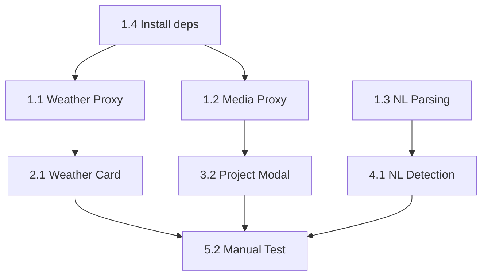

# Tasks: Add Symbiotic Awareness

Ordered by dependency. Items marked `[parallel]` can run concurrently with the previous task.

---

## Phase 1: Backend Infrastructure

### 1.1 Weather Proxy
- [ ] Create `api/services/weatherService.ts`
  - OpenWeather API client with `node-cache` (30 min TTL)
  - `getWeather(lat: number, lon: number)` method
  - Environment variable: `OPENWEATHER_API_KEY`
- [ ] Create `api/routes/context.ts`
  - `GET /api/context/weather?lat=:lat&lon=:lon`
  - Zod validation for lat/lon ranges (-90 to 90, -180 to 180)
  - Return shape: `{ condition, description, temp, icon, cached }`
- [ ] Register route in `api/app.ts`
- [ ] Write `api/tests/routes.context.test.ts`
  - Test valid coordinates return weather
  - Test invalid coordinates return 400
  - Test missing params return 400

### 1.2 Media Proxy `[parallel]`
- [ ] Create `api/services/mediaService.ts`
  - Unsplash API client
  - `searchImages(query: string, page?: number)` method
  - Environment variable: `UNSPLASH_ACCESS_KEY`
- [ ] Create `api/routes/media.ts`
  - `GET /api/media/images?query=:query&page=:page`
  - Return shape: `{ images: string[], total: number }`
  - Add `X-Debounce-Recommended: 800` header
- [ ] Register route in `api/app.ts`
- [ ] Write `api/tests/routes.media.test.ts`
  - Test valid query returns images array
  - Test empty query returns 400

### 1.3 NL Task Parsing `[parallel]`
- [ ] Add `parseTaskFromNaturalLanguage` to `api/services/aiService.ts`
  - System prompt with current timestamp injection
  - JSON mode with Groq provider
  - Return shape: `{ title, dueDate, dueTime, priority }`
- [ ] Add endpoint to `api/routes/ai.ts`
  - `POST /api/ai/parse-task`
  - Zod validation: `{ input: string }`
- [ ] Extend `api/tests/routes.ai.test.ts`
  - Test NL input returns structured JSON
  - Test empty input returns 400

### 1.4 Dependency Installation
- [ ] `npm install node-cache`

---

## Phase 2: Frontend - Atmospheric Awareness

### 2.1 Weather Card Component
- [ ] Create `src/features/dashboard/components/WeatherCard.tsx`
  - `useEffect` with `navigator.geolocation.getCurrentPosition`
  - Loading skeleton state
  - Error state (permission denied, API fail)
  - Map icon codes: `01d`→Sun, `02d`→CloudSun, `09d`→CloudRain, etc.
  - Empathy suggestion logic (switch/case on condition)
- [ ] Add `WeatherCard` to `Zone3_Context.tsx`
- [ ] Manual test: allow location, verify weather displays

---

## Phase 3: Frontend - Auto-Aesthetic

### 3.1 Debounce Hook
- [ ] Create `src/shared/hooks/useDebounce.ts` (if not exists)
  - Generic debounce hook with configurable delay

### 3.2 Project Modal Integration
- [ ] Modify `ProjectModal.tsx`
  - Add state: `coverImage`, `isLoadingCover`
  - Debounce title input (800ms)
  - Fetch `/api/media/images` on debounced change
  - Display cover preview above form
  - Add "Shuffle" button for random page
- [ ] Manual test: type project name, verify image loads

---

## Phase 4: Frontend - Synapse v2

### 4.1 NL Detection Logic
- [ ] Add NL detection to `Synapse.tsx`
  - If input doesn't start with `/` and has multiple words → treat as NL
  - Add state: `isParsingNL`
  - Call `POST /api/ai/parse-task`
  - On success: close Synapse, open task modal with pre-filled data
  - On failure: fallback to title-only

### 4.2 Visual Feedback
- [ ] Add pulsing border animation during AI processing
- [ ] Manual test: type "Buy groceries tomorrow 5pm", verify modal opens with parsed fields

---

## Phase 5: Verification

### 5.1 Automated Tests
- [ ] Run: `npm test -- --grep "context|media|parse-task"`
- [ ] All tests pass

### 5.2 E2E Manual Verification
- [ ] Weather: Dashboard shows current condition
- [ ] Images: Project modal populates cover
- [ ] NL Parse: Synapse extracts task fields

---

## Dependencies Between Tasks

